# 学习周报_6
## 本周具体工作计划
Nova组件的学习

## 本周主要工作内容
### 已完成工作
### 1.Nova简介
OpenStack官方对于Nova的定义：
>To implement services and associated libraries to provide massively scalable, on demand, self service access to compute resources, including bare metal, virtual machines, and containers.

可以简单地理解为Nova专注于提供统一的计算资源抽象，这些计算资源可以是物理机、虚拟机，甚至是容器。

### 2. Nova体系结构
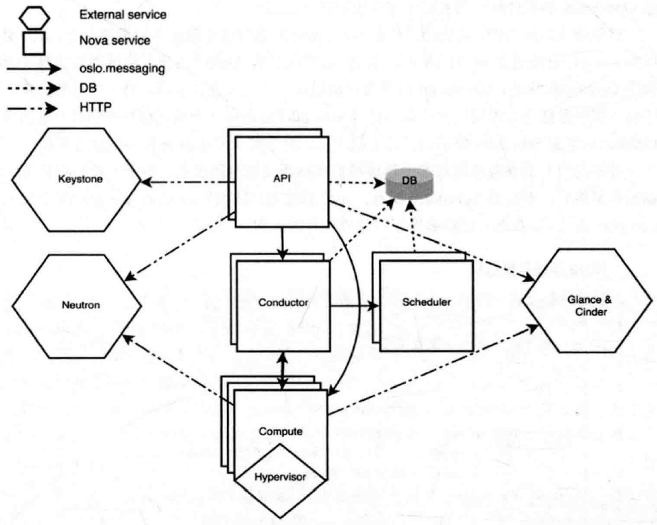

Nova主要由API、Compute、Conductor、Scheduler 4个核心组件组成。每个组件都可以部署一个或者多个来实现横线扩展。API是进入Nova的HTTP接口。API依据请求是长时任务或者是短时任务，将请求发送给Conductor或者Compute。长时任务被发送到Conductor，Conductor负责对其全程跟踪和调度。对于新建虚拟机或者迁移类需要调度的请求，Conductor会向Scheduler请求一台符合要求的计算结点，随后Conductor会把请求最终发送到合适的计算结点上。Conductor除了长时任务还负责代理其它结点的DB访问。这主要是为了安全问题和实现在线升级功能。最终对于虚拟机操作的请求都会发送到Compute组件，Compute负责与Hypervisor进行通信，实现虚拟机的生命周期管理。
 
 
为了简化用户对RESTful API的使用，Nova提供官方的API封装python-novaclient作为Client，它提供命令供用户直接访问Nova，也提供了SDK供用户编写客户端应用程序。
 
 
以创建虚拟机为例，首先用户执行novaclient提供的用于创建虚拟机的命令，API服务监听到novaclient发送的HTTP请求并且API将它转换成AMQP消息，通过消息队列调用Conductor服务，Conductor服务通过消息队列接受到任务之后，做一些准备工作（例如汇总虚拟机参数等），再通过消息队列告诉Scheduler去选择一个满足虚拟机创建要求的主机，Conductor拿到Scheduler提供的目标主机后，会去要求Compute服务创建虚拟机。并不是所有的业务流程都像创建虚拟机那样需要所有的服务，对于一些短时任务，比如删除虚拟机时，不需要Scheduler服务，API通过消息队列告诉Compute删除指定虚拟机，Compute通过Conductor更新数据库即完成业务的流程。

### 3. Nova源码目录结构
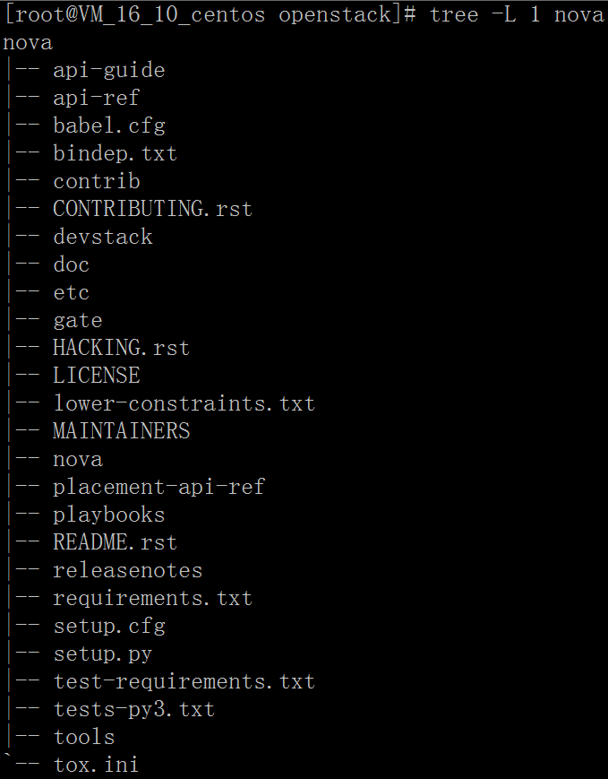

需要特别关注的是setup.cfg文件的“entry_points”中有一个叫“console_scripts”的命名空间，其中的每一项都表示一个可执行的脚本，这些脚本在部署时会被安装，这就是Nova各个组件的入口。

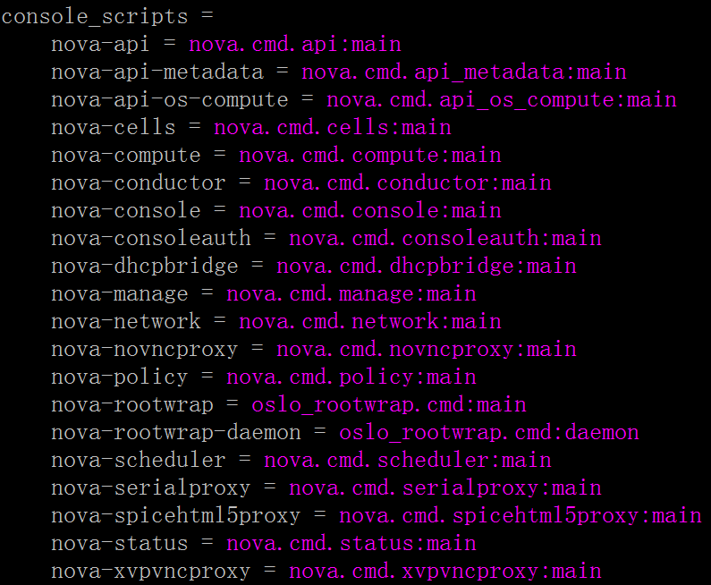

对于Nova来说，我们可以看到，它提供了很多服务。但我们主要关注的服务是API、Conductor、Scheduler与Compute。其中nova-api会读取api-paste.ini，从中加载整个WSGI stack。最终API的入口点都位于nova.api.openstack.compute路径中。我们如果希望研究某个API的实现细节，可以将这些入口点中指定的代码路径作为突破口切入进行，从而更为有效地理清Nova的脉络。
 
 
Nova中各个服务之间的通信使用了基于AMQP实现的RPC机制，其中nova-compute、nova-conductor和nova-scheduler在启动时都会注册一个RPC Server，而nova-api因为Nova内部并没有服务会调用它提供的接口，所以无需注册。下面以nova-compute服务为例：

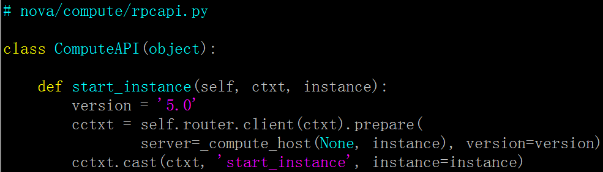

类nova.compute.rpcapi.ComputeAPI中的函数即为Compute服务提供给RPC调用的接口，其它服务调用前需要首先import这个模块，比如：

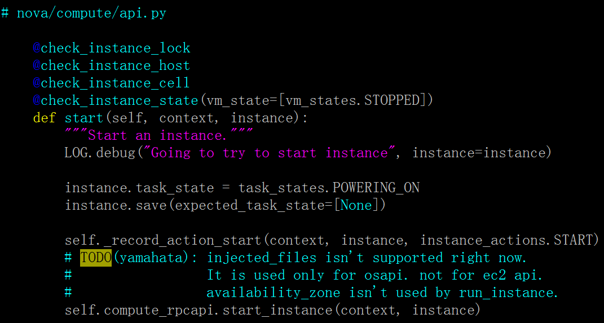

nova.compute.rpcapi.ComputeAPI只是暴露给其它服务的RPC调用接口，Compute服务的RPC Server接受到RPC请求后，真正完成任务的是nova.compute.manager模块。

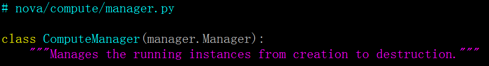

从nova.compute.rpcapi.ComputeAPI到nova.compute.manager.ComputeManager的过程即是RPC调用过程。

### 4. Nova API
### 4.1 Nova v2.1 API
Nova v2 API是Nova自诞生以来就存在的API，但其中存在的一些问题不能满足OpenStack的发展。因此Nova v2.1 API诞生了，Nova v2.1 API改进了错误处理方式，覆盖掉了不同DB之间的差异。其中最重要的是它引入了一个新的机制来扩展Nova API，就是Microversion。Microversion是单调递增的，表现为X.Y的形式。X从来只有在非常重大的改变并影响了整个API才会变化，实际上这种情况会很少发生。而其它任何API的改变都需要改变Y，无论是API的请求，返回或是语义改变。只有bug才不需要Microversion的变化。系统拥有一个最小版本和最大版本号，只要请求在这个范围之内都会被接受。最小和最大版本号可通过version API来查询。

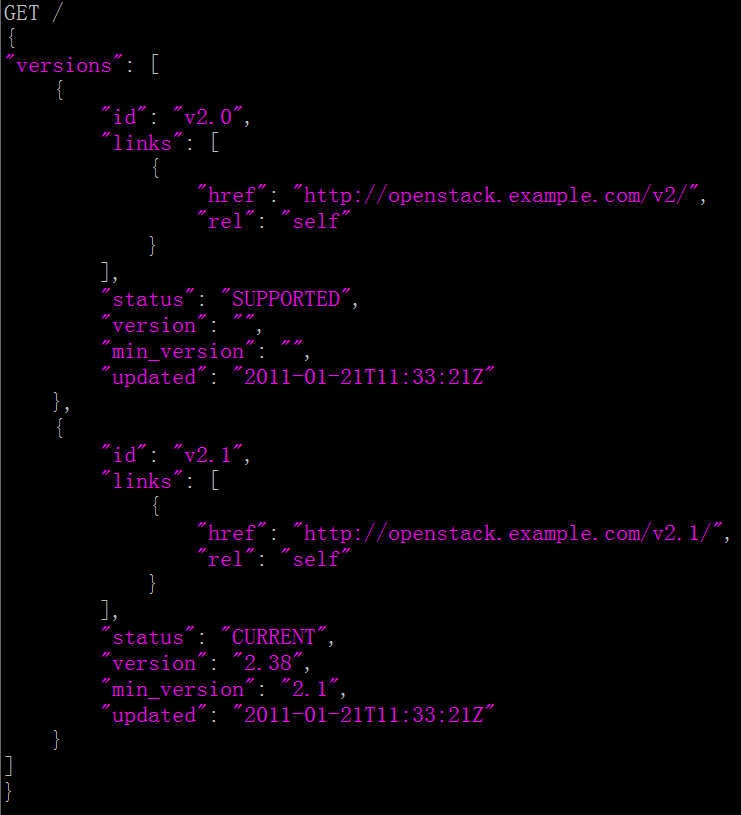

从以上请求可以看出，系统中有两个API。“id”是这个API的标示。可以看出“v2.0”状态是SUPPORTED。version和min_version为空，代表着这个API不支持Microversion。“v2.0”就是我们所说的旧的v2 API。“v2.1”的状态则为“CURRENT”，version表示最大的Microversion版本号为“2.38”，最小的Microversion版本号为“2.1”。这就是Nova当前所支持的API。
 
 
在编写客户端程序的时候，可以通过此version API来识别出所访问的API的信息，所支持的Microversion范围。Microversion “2.1”是一个与Nova v2 API所兼容的API。当客户请求的时候，可以通过发送以下HTTP头：
>OpenStack-API-Version: compute 2.25

“compute”代表所请求的服务类型。“2.25”代表请求所对应的Microversion。如果没有发送此HTTP头这代表请求最小版本。如果超出了最大和最小版本，系统则会返回“HTTP Not Acceptable 406”。这里还有一个特殊的关键字“latest”，代表请求最新的版本。

### 4.2 Nova API源码目录结构
Nova API的代码位于nova/api/目录下，目录结构如下：

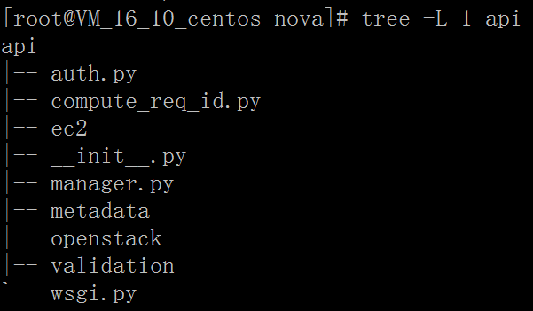

metadata目录下对应的是Metadata API，这是提供给所创建的虚拟机来获得一些配置信息的API。Nova API是基于WSGI实现的。nova/api/openstack/下包含着WSGI基础架构的代码，其中包含一些Nova WSGI stack中所需要的middleware，以及如何解析请求与分发请求的核心代码。在nova/api/openstack/compute中可以找到对应每个API的入口点。当前Nova API使用JSON-Schema来验证输入，这些JSON-Schema都位于nova/api/openstack/compute/schemas下，并使用与相应API所在文件相同的模块名称。对于JSON-Schema的验证实现则位于nova/api/validation/。

### 4.3 Nova API请求路由
Nova使用Python Paste作为工具来加载WSGI stack。WSGI stack通过文件etc/nova/api-paste.ini来配置。

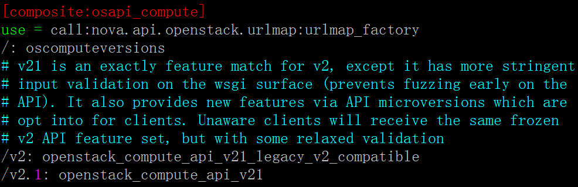

从以上配置，可以看出Nova API都提供了哪些endpoints。“/”对应的就是前面说过的version API。“/v2”是Nova v2 API，当前它通过一个兼容模式在v2.1代码上运行。“/v2.1”就是Nova当前的API。

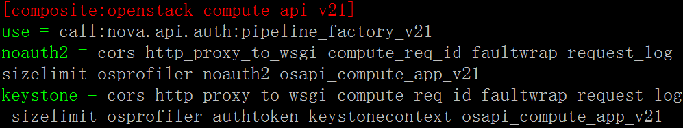

nova.api.auth.pipeline_factory_v21是这个API stack的一个工厂函数，负责加载每一个middleware。根据配置可以选择没有验证的noauth2 stack或者Keystone stack。noauth2一般是被funtinal测试来使用，在实际生产环节中，都是使用Keystone来做验证的。这里可以看到整个stack当中都包含了哪些middleware。最后一个middleware “osapi_compute_app_v21”就是v2.1本身。在这之前的middleware都会对请求或返回做一些处理，比如添加请求id用来帮助调试，对错误返回进行统一的包装，以及对请求token的验证等等。

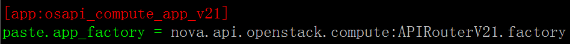

最后我们就可以找到Nova v2.1 API的入口了。nova.api.openstack.compute:APIRouterV21.factory又是一个工厂函数，用来创建Nova v2.1 API。APIRouterV21继承自nova.api.openstack.APIRouterV21，主要完成对所有资源的加载以及路由规则的创建，自此WSGI Routes模块开始参与进来。

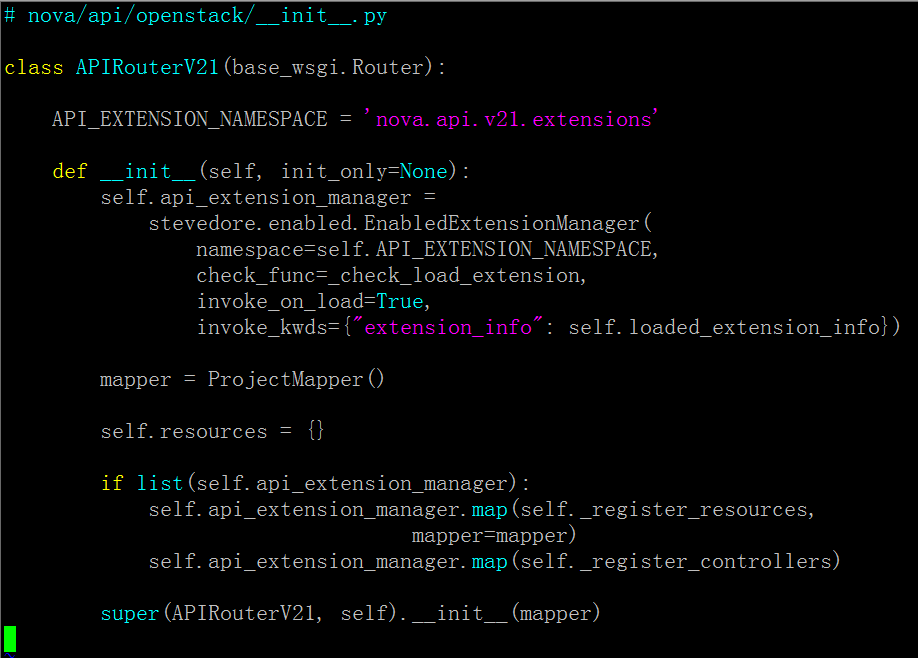

从上面的代码可以看出来，APIRouterV21通过stevedore加载各个API实现模块。然后Nova使用Python Routes模块作为URL映射的工具。APIRouterV21将各个模块所实现的API对应的URL注册到mapper当中。并把每个资源都封装成一个nova.api.openstack.wsgi.Resource对象。当解析每个URL请求的时候，可以通过URL映射找到API对应的Resource object。

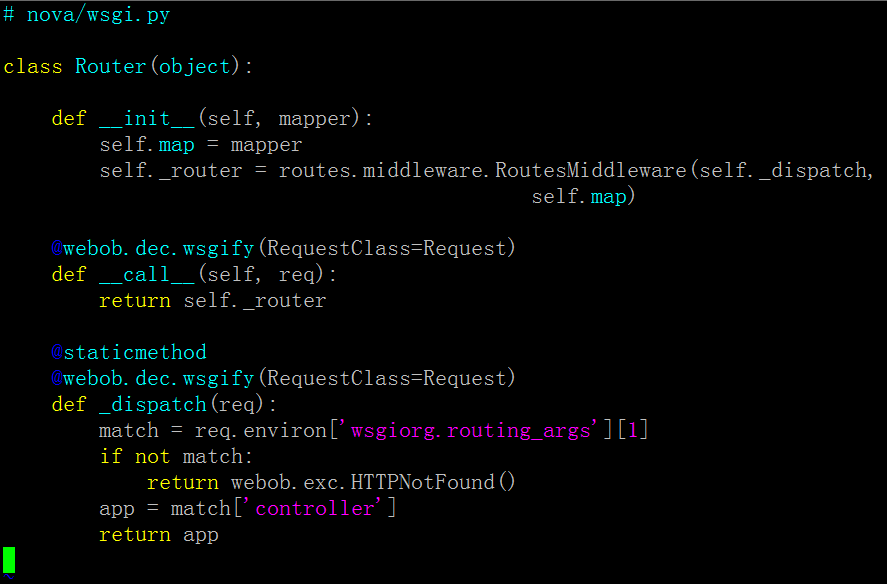

再追溯到nova.api.openstack.APIRouterV21的父类，可以看到，请求调用Python Routes提供的RoutesMiddleware来解析之前创建的URL mapping，最后通过_dispatch函数回调回来，取出其中的Resorces对象。再调用Resource对象的__call__方法，这其中做了一些API所需的处理，比如Microversion解析，请求数据类型的解析。最终Resource对象会将请求的API映射到对应的Controller方法上，以及根据请求找到对应Microversion的Controller方法。

### 未完成工作
无

### 问题与困难
无

## 下周工作计划
无

## 建议与意见（如有）
无
