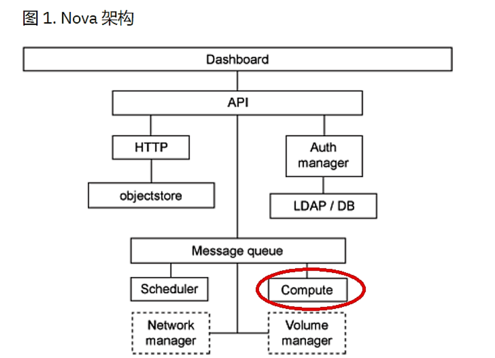

# Nova架构之Compute节点介绍



## nova-compute 的功能
nova-compute 的功能可以分为两类：
* 定时向 OpenStack 报告计算节点的状态
* 实现 instance 生命周期的管理

### 定期向 OpenStack 报告计算节点的状态

我们知道 nova-scheduler 中的很多 Filter 是根据算节点的资源使用情况进行过滤的。比如 RamFilter 要检查计算节点当前可以的内存；CoreFilter 检查可用的 vCPU 数量；DiskFilter 则会检查可用的磁盘空间。那么OpenStack 是如何得知每个计算节点的这些信息然后实现调度的呢？

答案就是：**nova-compute 会定期向 OpenStack 报告。**

每隔一段时间，nova-compute 就会报告当前计算节点的资源使用情况和 nova-compute 服务状态。具体的实现是 nova-compute 通过 Hypervisor 的 driver 拿到当前节点上所有 instance 的资源占用信息。

举个例子，当我们的实验环境的 Hypervisor 是 KVM，用的 Driver 是 LibvirtDriver。LibvirtDriver 可以调用相关的 API 获得资源信息，这些 API 的作用相当于在 CLI 里执行 virsh nodeinfo、virsh dominfo 等命令。

### 管理虚拟机实例的生命周期
这也是Nova组件中最核心的服务，实现虚拟机管理的功能。包括在计算节点上创建、启动、暂停、关闭和删除虚拟机、虚拟机在不同的计算节点间迁移、虚拟机安全控制、管理虚拟机磁盘镜像以及快照等功能。

下面就重点介绍一下虚拟机的创建过程。
虚拟机的创建过程在真个nova架构中的流程如下：
nova-api接收到客户端请求后，经过 nova-scheduler 调度，当 nova-scheduler 选定了部署虚拟机实例的计算节点后，会通过消息中间件 rabbitMQ 向选定的 nova-compute 发送命令，nova-compute模块经过一系列的动作之后将命令下发到真正的hypervisor进行虚拟机的创建。

nova-compute 创建 instance 的过程可以分为 4 步：
1. 为 instance 准备资源
2. 创建 instance 的镜像文件
3. 创建 instance 的 XML 定义文件
4. 创建虚拟网络并启动虚拟机

### 为 instance 准备资源
nova-compute 首先会根据指定的 flavor 依次为 instance 分配内存、磁盘空间、vCPU 和网络资源。
### 创建 instance 的镜像文件
资源准备好之后，nova-compute 会为 instance 创建镜像文件。
OpenStack 启动一个 instance 时，会选择一个 image，这个 image 由 Glance 管理。
nova-compute 上的处理包括：

**首先将该 image 下载到计算节点**
nova-compute 首先会检查 image 是否已经下载（比如之前已经创建过基于相同 image 的 instance）。如果没有，就从 Glance 下载 image 到本地。

**然后将其作为支持文件创建虚拟机的镜像文件**
有了 image 之后，instance 的镜像文件直接通过 qemu-img 命令创建，支持文件就是下载的 image。

这里我们区分一下上面所说的 image 和镜像文件两个概念。
* image，这里指的是 Glance 上保存的镜像，作为 instance 运行的模板
* 镜像文件，指的是 instance 启动盘所对应的文件
> 二者的关系是：image 是镜像文件的支持文件。image 不会变，而镜像文件会发生变化。比如安装新的软件后，镜像文件会变大，也就是我们之前实验要求我们手动创建的那个镜像文件。

### 创建虚拟机实例的 XML 定义文件
XML定义文件定义了一些虚拟机的参数，包括虚拟机的类型、名称和一些配置信息等，下面是一个 kvm 类型虚拟机的XML定义文件。

```
<domain type='kvm'>  //如果是Xen，则type=‘xen’
  <name>ubuntu</name> //虚拟机名称，同一物理机唯一
  <uuid>fd3535db-2558-43e9-b067-314f48211343</uuid>  //同一物理机唯一，可用uuidgen生成
  <memory>524288</memory>
  <currentMemory>524288</currentMemory>  //memory这两个值最好设成一样
  <vcpu>2</vcpu>            //虚拟机可使用的cpu个数，查看物理机可用CPU个数：cat /proc/cpuinfo |grep processor | wc -l 
  <os>
   <type arch='x86_64' machine='pc-i440fx-vivid'>hvm</type> //arch指出系统架构类型，machine 则是机器类型，查看机器类型：qemu-system-x86_64 -M ?
   <boot dev='hd'/>  //启动介质
   <bootmenu enable='yes'/>  //表示启动按F12进入启动菜单
  </os>
  <features>
   <acpi/>  //Advanced Configuration and Power Interface,高级配置与电源接口
   <apic/>  //Advanced Programmable Interrupt Controller,高级可编程中断控制器
   <pae/>   //Physical Address Extension,物理地址扩展
  </features>
  <clock offset='localtime'/>  //虚拟机时钟设置，这里表示本地本机时间
  <on_poweroff>destroy</on_poweroff>  //突发事件动作
  <on_reboot>restart</on_reboot>
  <on_crash>restart</on_crash>
  <devices>   //设备配置
   <emulator>/usr/bin/kvm</emulator> //如果是Xen则是/usr/lib/xen/binqemu-dm
   <disk type='file' device='disk'>
      <driver name='qemu' type='raw'/>
      <source file='/opt/vm/vmdev/ubuntu-15.10.raw' />
      <target dev='vda' bus='virtio'/>
      <address type='pci' domain='0x0000' bus='0x00' slot='0x06' function='0x0'/> //slot值同一虚拟机上唯一
   </disk>
   <disk type='file' device='disk'>  
      <driver name='qemu' type='raw'/> 
      <source file='/opt/vm/vmdev/ubuntu-15.10_2.raw' />  
      <target dev='vdb' bus='virtio'/>  
   </disk>
   <disk type='file' device='cdrom'>
      <driver name='qemu' type='raw'/>
      <source file='/opt/vm/vmiso/ubuntu-15.10-server-amd64.iso'/>
      <target dev='hdc' bus='ide'/>
      <readonly/>
   </disk>
   <interface type='bridge'>  //利用网桥连接网络  
      <mac address='fa:92:01:33:d4:fa'/> //可用命令生成：见下面的补充
      <source bridge='br100'/>  //配置的网桥网卡名称
      <target dev='vnet0'/>     //同一网桥下相同
      <alias name='net0'/>      //同一网桥下相同
      <address type='pci' domain='0x0000' bus='0x00' slot='0x03' function='0x0'/>  //注意slot值唯一
   </interface>
   <interface type='network'>   //基于虚拟局域网的网络
      <mac address='52:54:4a:e1:1c:84'/>  //可用命令生成，见下面的补充
      <source network='default'/> //默认
      <target dev='vnet1'/>  //同一虚拟局域网的值相同
      <alias name='net1'/>
      <address type='pci' domain='0x0000' bus='0x00' slot='0x04' function='0x0'/>  //注意slot值
   </interface>
   <graphics type='vnc' port='5900' autoport='yes' listen='0.0.0.0' keymap='en-us'  //vnc配置，基本不用改
/>
   <listen type='address' address='0.0.0.0'/>
  </graphics>
  </devices>
</domain>
```
### 创建虚拟网络并启动虚拟机
实验环境用的是 linux-bridge 实现的虚拟网络，当一切就绪，接下来可以启动 instance 了，然后就可以通过OpenStack 图形界面或者 KVM CLI 查看到 instance 的运行状态。

## Nova如何实现与Hypervisor对接
OpenStack 提供了一个开放的云计算管理架构，Openstack 自身不提供服务器虚拟化功能，但是支持与不同服务器虚拟化 Hypervisor 对接。我们熟悉的Hyervisor，例如 KVM/Xen 和基于此衍生出来的 Hypervisor，在 openstack社区中也提到 Nova-compute 也支持LXC(如Docker)，UML,VMware vSphere,Hyper-V等虚拟化软件。

由于KVM在openstack社区中代码贡献非常高，所以在Openstack中首选和默认的Hypervisor就是KVM。接下来我们就重点介绍下Nova与KVM是怎么工作的。


Nova-Computer通过driver并且通过Libvirt来与KVM对接。Libvirt，简单的说，就是一个C的函数库，Libvirt 库是一种实现 Linux 虚拟化功能的 Linux API。libvirt 本身不是一种工具，它是一种可以建立工具来管理客户操作系统的 API。libvirt 本身构建于一种抽象的概念之上。它为受支持的虚拟机监控程序实现的常用功能提供通用的 API。

简单概括一下，Openstack Nova与Hypervisor对接整个过程。虚拟机创建等需要提交后，通过安装了Nova-scheduler等模块的控制节点找到Nova-computer，然后通过Libvirt在发送消息给具体的KVM Hypervisor，在Openstack KVM方案中，Nova-scheduler根据不同调度策略通过Nova-computer找到一台满足要求且安装了KVM的服务器，当然还需要Driver和Libvirt的协助。