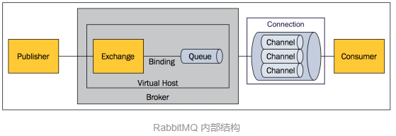
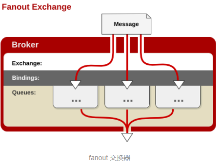

# Nova消息队列学习

## 什么是消息队列
+ 消息队列是一种应用间的通信方式，消息发送后可以立即返回，由消息系统来确保消息的可靠传递。消息发布者只管把消息发布到MQ中而不用管谁来取。消息使用者只管从MQ中取消息而不管是谁发布的。即消息发布者和使用者不用知道对方的存在。

## RabbitMQ
+ RabbitMQ是一个由Erlang语言开发的AMQP的开源实现。
+ AMQP: 高级消息队列协议。它是应用层协议的一个开放标准，为面向消息的中间件(MOM)设计，基于协议的客服端与消息中间件可传递消息。
+ MOM：面向消息的中间件。指利用高效可靠的消息传递机制进行平台无关的数据交流。   
+ RabbitMQ中的概念模型
    + 消息模型：消费者(consumer)订阅某个队列。生产者(producer)创建消息，然后发布到队列中，最后将消息发送到监听的消费者。
    + RabbitMQ基本概念
      
        + 消息： 由消息头和消息体组成。消息体不透明，消息头由很多属性组成，包括routing-key(路由键),priority,delivery-mode(指出该消息可能需要持久性存储)等。
        + Publisher：消息生产者，也是一个向交换器发布消息的客户端应用程序。
        + Exchange：交换器，用来接收生产者发送的消息并将这些消息路由给服务器中的队列。
        + Binding： 绑定，用于消息队列和交换器之间的关联。
        + Queue： 消息队列，用来保存消息直到发送给消费者。
        + Connection：网络连接。如TCP连接。
        + Channel：信道。多路复用连接中的一条独立的双向数据流通道，以减少建立和销毁TCP的开销。
        + Consumer：消费者。从消息队列中取得消息的客户端应用程序。
        + Virtual Host： 虚拟主机，共享相同的身份认证和加密环境的独立服务器域。
        + Broker： 消息队列服务器实体。
    + Exchange类型
        + direct
        
        消息头中的routing-key如果和Binding中的binding-key一致，交换器就将消息发送到对应的队列中。
        + fanout
        
        每个发到fanout类型的交换器的消息都会分到所有绑定的队列上去。
        + topic
        
        topic交换器通过模式匹配分配消息的路由键属性。
    + RabbitMQ集群
        + RabbitMQ 最优秀的功能之一就是内建集群，这个功能设计的目的是允许消费者和生产者在节点崩溃的情况下继续运行，以及通过添加更多的节点来线性扩展消息通信吞吐量。RabbitMQ 内部利用 Erlang 提供的分布式通信框架 OTP 来满足上述需求，使客户端在失去一个 RabbitMQ 节点连接的情况下，还是能够重新连接到集群中的任何其他节点继续生产、消费消息。

## openstack中消息队列的使用
+ openstack中使用的是前面说过的RabbitMQ消息中间件模型。openstack使用消息队列的好处是可以使模块之间最大程度的解耦，客服端不需要关注服务端的位置和是否存在，只需要通过消息队列进行信息的发送。
+ nova中的每个组件都会连接消息服务器，每个组件都可能作为发送者或者消息接收者。如下图：

+ 在openstack中常用的两种发送消息方式：同步调用rpc.call和异步调用rpc.cast
    + RPC.call: 发送消息到消息队列，等待返回最终结果
    
    名词解释：  
        + Topic Publisher：该对象在进行rpc.call或rpc.cast时创建，每个对象都会连接同一个topic类型的交换器，消息发送完毕后对象被回收。
        + Direct Publisher： 该对象在进行rpc.call调用时创建，用于向消息发送者返回响应。该对象会根据接收到的消息属性连接一个direct类型的交换器。
        + Direct Consumer： 该对象在进行rpc.call调用时创建，用于接收响应消息。每一个对象都会通过一个的队列连接一个direct类型的交换器。
        + Topic Consumer： 该对象在内部服务初始化时创建，在服务过程中一直存在。用于从队列中接收消息，调用消息属性中指定的函数。该对象通过一个共享队列或一个私有队列连接一个topic类型的交换器。每一个内部服务都有两个topic consumer，一个用于rpc.cast调用（此时连接的是binding-key为“topic”的共享队列）；另一个用于rpc.call调用（此时连接的是binding-key为“topic.host”的私有队列）。
        + Topic Exchange：topic类型交换器，每一个消息代理节点只有一个topic类型的交换器。
        + Direct Exchange：direct类型的交换器，存在于rpc.call调用过程中，对于每一个rpc.call的调用，都会产生该对象的一个实例。
        + Queue Element：消息队列。可以共享也可以私有。routing-key为“topic”的队列会在相同类型的服务中共享（如多个compute节点共享一个routing-key为“topic”的队列）  
  
        以nova-compute服务调用nova-network服务分配网络为例： 
        1. nova-compute服务向消息队列服务的compute.node队列发送RPC请求，并等待请求的最终回复。 
        2. nova-network服务通过nova exchange（topic exchange）从compute.node队列中获取消息并作出相应的处理。 
        3. nova-network服务消息处理完了之后，向reply_XXX队列发送一条回复消息 
        4. nova-compute服务通过reply_XXX exchange（direct exchange）接受从nova-network发送的RPC消息。

    + RPC.cast：发送请求到消息队列，不需要等待最终返回的结果
    
    以nova-conductor服务调用nova-compute服务build_and_run_instance为例： 
        1. nova-conductor服务向消息队列服务的compute队列发送RPC请求，请求结束，不需要等待请求的最终回复。 
        2. nova-compute服务通过nova exchange（topic exchange）从compute队列中获取消息并作出相应的处理。

+ 可以说OpenStack使用这种MOM模式的消息队列机制无疑是一个聪明的选择。其松耦合性以及动态可扩展性都非常符合开源云的要求。无论是开发还是运行，都会带了很多好处。唯一的缺点就是它是一个single point failure，如果RabbitMQ出错了，那整个OpenStack也就无法运行了。虽然RabbitMQ有一些持久化的机制，但其实效果一般，还影响效率。一般的做法是用HA（RabbitMQ官网提到了这样HA机制），做一个mirror，用两个RabbitMQ来保证系统的可靠性。