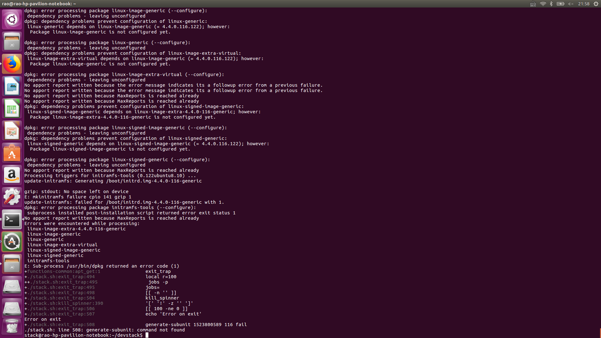

# 项目周报

项目名称：基于openstack的云桌面项目 
填写人：饶宇熹 
项目成员：饶宇熹、明友芬 
项目阶段：（第一周）openstack部署 

## 项目进度

项目进度状况：处于openstack部署阶段 
项目质量状况：一般 
项目总体表现：一般 

## 本周具体工作计划

* 部署openstack，能打开dashboard

## 本周主要工作内容 

| 编号 | 工作内容 | 完成情况（％）| 未完成原因 | 措施
| :-------------- | :------------ | :------------ | :------------ | :------------ |
| 1 | 部署openstack环境准备 | 100% | / | / |
| 2 | 下载devstackOcata版 | 100% | / | / |
| 3 | 创建stack用户 | 100% | / | / |
| 4 | 配置pip源 | 100% | / | / |
| 5 | 配置local.conf文件 | 100% | / | / |
| 6 | 安装 | 50% | 详见“问题与困难” | 重新安装

### 已经完成工作

* 部署openstack环境准备
* 下载devstackOcata版
* 创建stack用户
* 配置pip源
* 配置local.conf文件

### 未完成工作

安用`./stack.sh`安装

### 问题与困难

**问题1**

**问题2**

### 其他说明

先采用手动配置，在第一步

## 项目下周计划

### 下周主要工作内容

镜像

### 下周工作重点

镜像

### 工作建议及其它事宜

尽早动手
有错误可以在群里讨论

