# 第一次学习周报

## 本周具体工作计划
+ 了解openstack
+ 着手部署openstack

## 本周主要工作内容  
1. 已经完成的工作  
    ### 了解openstack
    + 走进openstack
        + 很多人觉得”云”这个东西太高大上，只有大公司才会去玩，对于普通开发人员来说，只有使用的份。OpenStack的出现，降低了小公司搭建自己云平台的门槛。OpenStack是开源的，你可以用它来搭建IaaS平台。
        + OpenStack最初是由NASA和RackSpace贡献的。它不是一个独立的软件项目，而是一系列项目的集合。历史就不多说了，现在OpenStack基金会有好几百个会员，包括很多知名的大公司。企业可以用它来搭建面向互联网的公有云，比如阿里云。也可以用它搭建私有云。比如企业内部有一大批性能一般的服务器，可以把这些机器的资源统一管理起来，然后按需要创建虚拟机。虚拟机的性能完全可以超过其中任何一台主机。

    + openstack架构  
    三个核心组件：
        + Nova-计算服务
        + Swift-存储服务
        + Glance-镜像服务

    ### 部署openstack
    + 配置controller的管理网络接口(ens33)和提供者接口(ens34)
      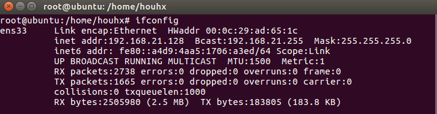
      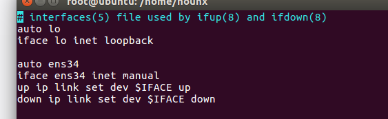

    + 修改时钟，安装时钟同步软件chrony
      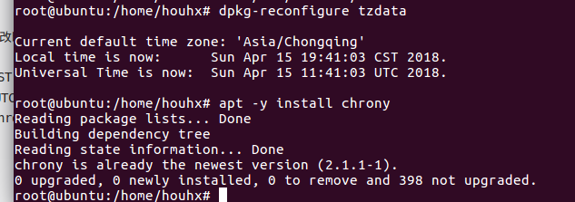

    + 设置允许网段与自己同步时间
      

    + 启用openstak库,安装openstack客户端
      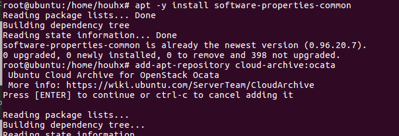
      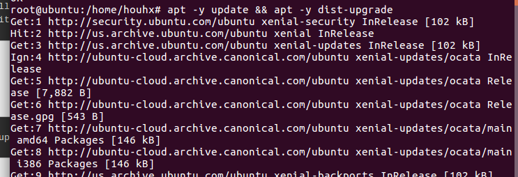
      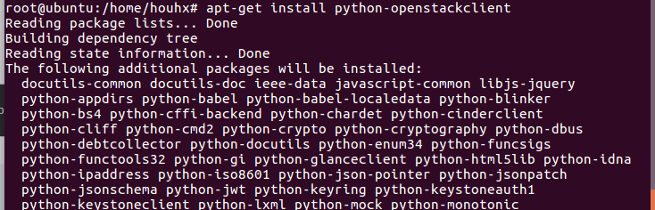

    + 安装配置数据库
      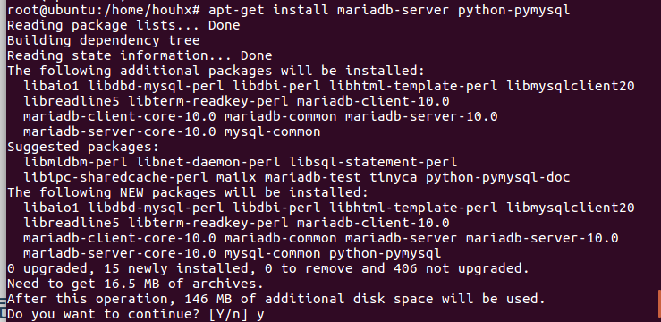
      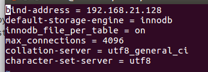
      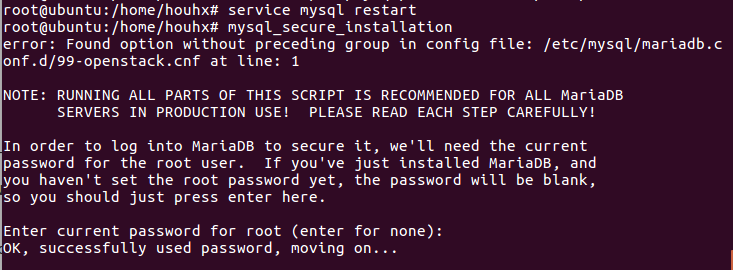
    
    + 安装并配置Rabbitmq消息队列服务
      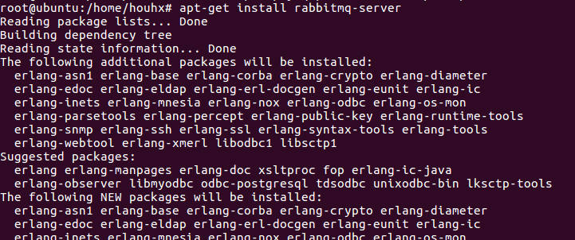
      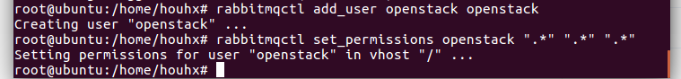
      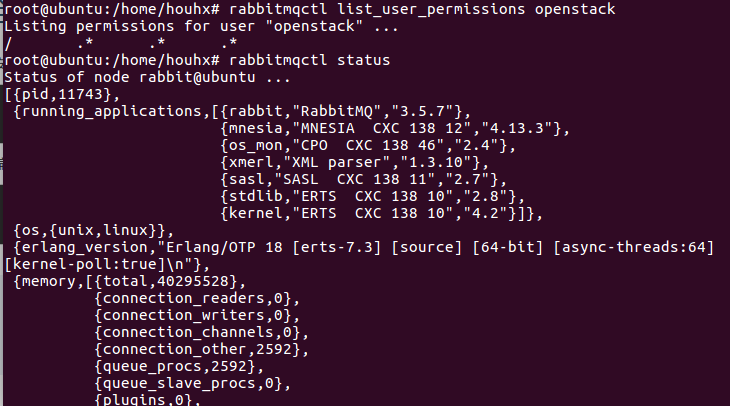
      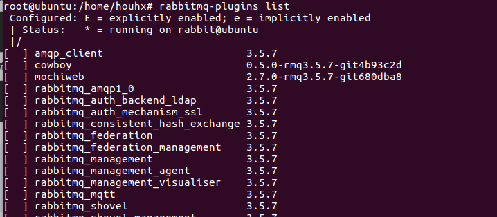
      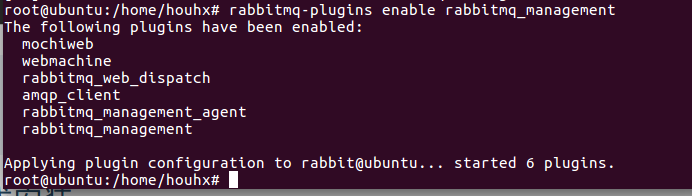

    + 安装并配置Memcached缓存服务
      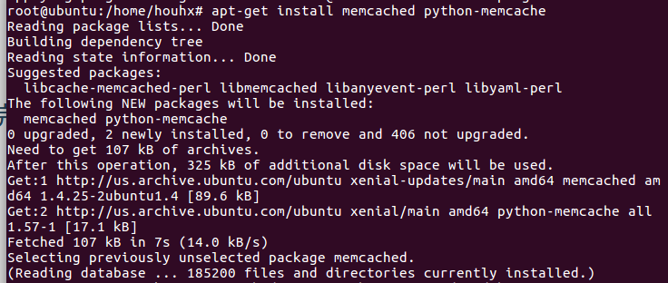
      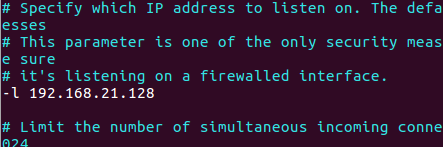
      
    
    

2. 未完成工作  
    openstack尚未部署完成，目前只部署了controller结点的一部分内容。

3. 问题与困难  
    遇到的error：
    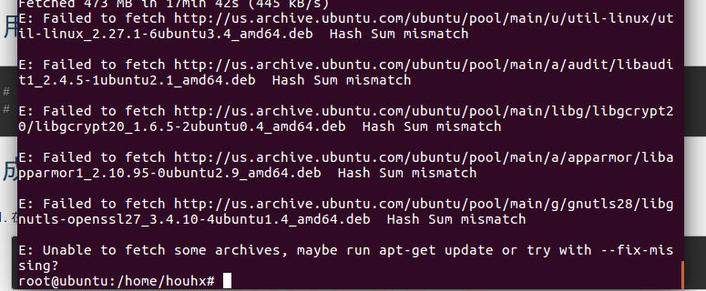  

    解决：
    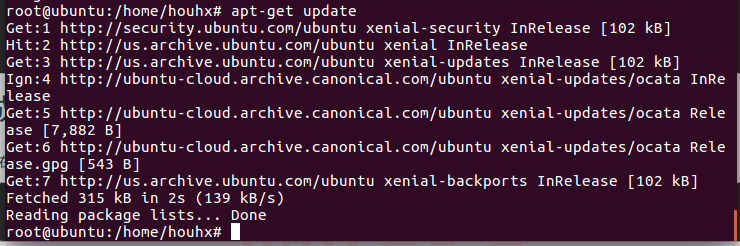

## 下周工作计划
    + 接着完成controller后面认证部分的部署
    + 完成其他所需要结点的部署

