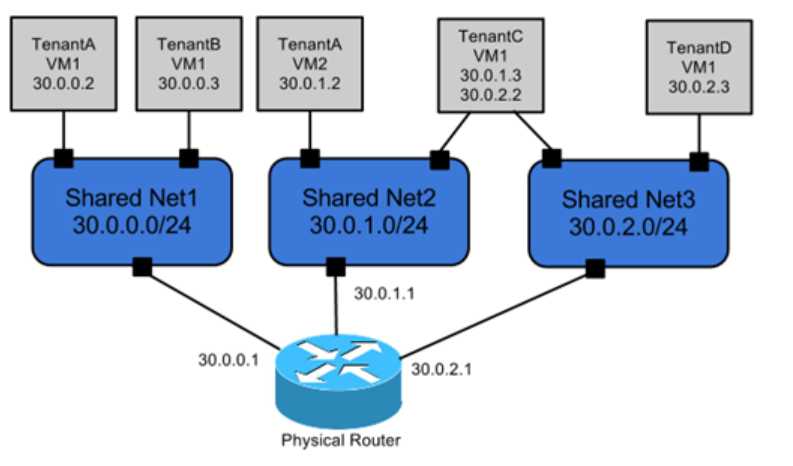
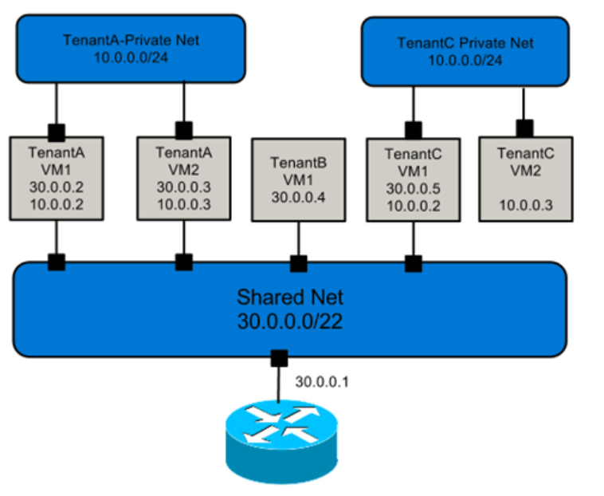
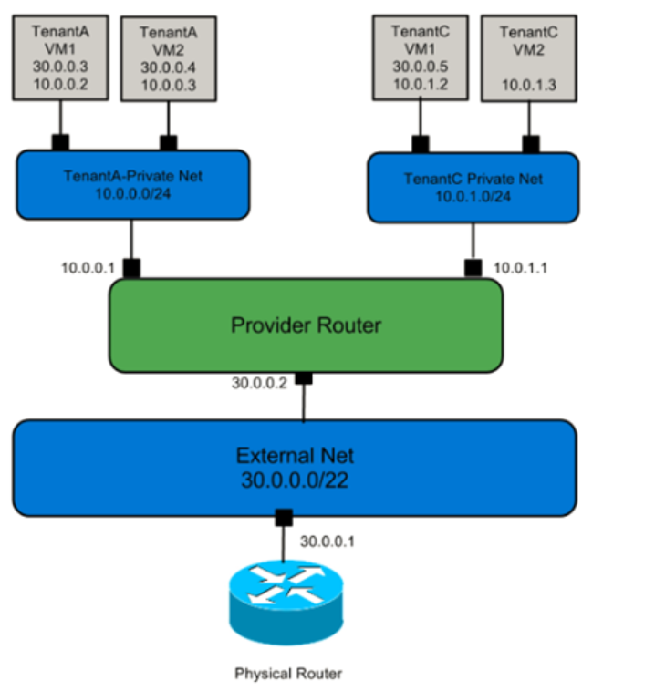
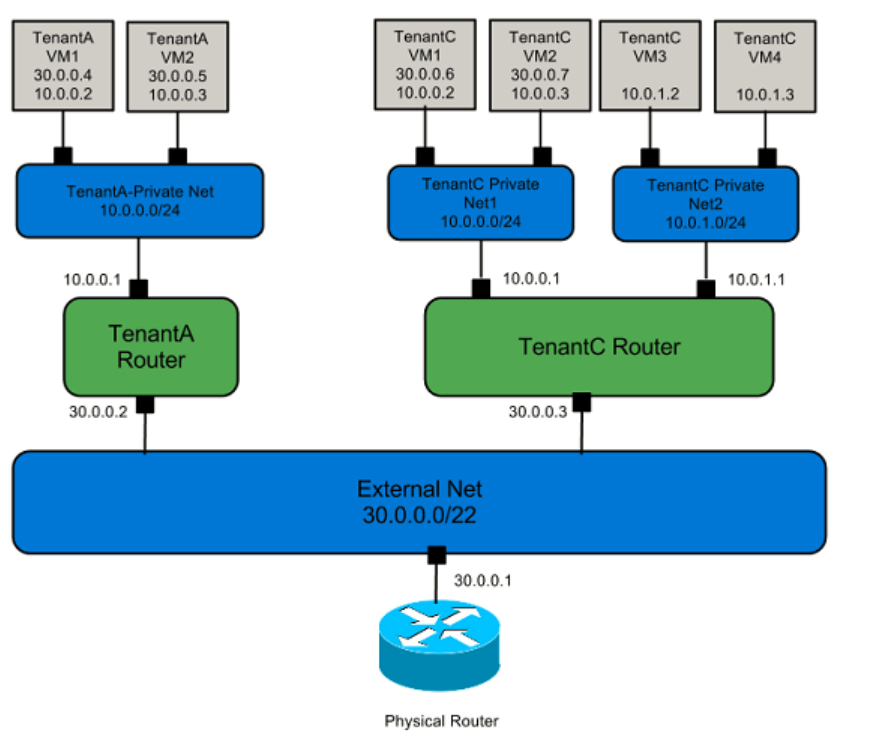
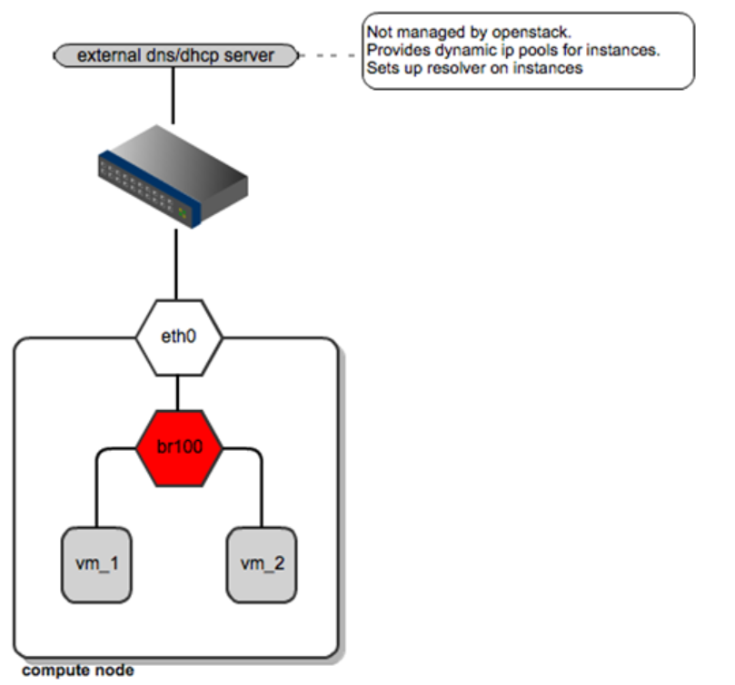
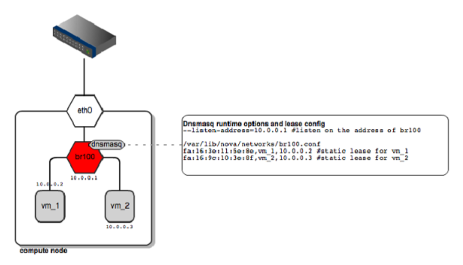

# Openstack网络学习报告
## 1.按网络模型划分
#### OpenStack的网络模型:
- 多平面网络

- 混合平面私有网络

- 通过私有网络实现运营商路由功能

- 通过私有网络实现每个租户创建自己专属的网络区段

## 2.OpenStack服务网络管理的三种模式:
#### FlatDHCP 模式
- 这种模式下与 Flat 模式不同的地方在于有一个 DHCP 进程，每一个运行 nova-network 进程的节点（网络控制节点/nove-network 主机）就是一个单独的网络。
Nova 会在 nova-network 主机建立网桥（默认名称 br100，配置项 flat_network_bridge=br100），并给该网桥指定该网络的网关 IP，同时 Nova 在网桥处起一个 
DHCP 进程，最后，会建立 iptables 规则（SNAT/DNAT）使虚拟机能够与外界通信，同时与一个 metadata 服务器通信以取得 cloud 内的信息。
- 计算节点负责创建对应节点的网桥，此时的计算节点网卡可以不需要 IP 地址，因为网桥把虚拟机与 nove-network 主机连接在一个逻辑网络内。
虚拟机启动时会发送 dhcpdiscover 以获取 IP 地址。虚拟机通往外界的数据都要通过 nova-network 主机，DHCP 在网桥处监听，分配 fixed_range 指定的 IP 段。
- FlatDHCP 网络拓扑

### Flat 模式
- Flat 模式和 FlatDHCP 模式其实区别不大，都是基于网桥网络，只是 FLat 模式需要管理员手动配置（包括配置网桥和外部的 DHCP 设备).
- Flat 网络拓扑

### VLAN 模式
- VLAN（Virtual Local Area Network）的中文名为"虚拟局域网"。VLAN 是一种将局域网设备从逻辑上划分成一个个网段，从而实现虚拟工作组的新兴数据交换技术。

## 3.Openstack的网络类型：
### VLAN network
- 基于物理 VLAN 网络实现的虚拟网络。多个 VLAN 网络相互隔离，甚至可以使用重叠的 IP 地址空间。每个支持 VLAN network 的物理网络可以被视为一个分离的 VLAN trunk，
使用一组独占的 VLAN ID（VLAN ID 有效范围 1 到 4094）。
### Flat network
- Flat network：基于不使用 VLAN 的物理网络实现的虚拟网络。每个物理网络最多只能实现一个Flat虚拟网络。
### Local network
- Local network：本地网络，只允许在本服务器内通信的虚拟网络，不支持跨服务器的通信。主要用于单节点上测试。
### GRE network
- GRE network：使用 GRE 封装网络包的虚拟网络。GRE 封装的数据包基于 IP 路由表来进行路由，因此 GRE network 不和具体的物理网络绑定。
### VXLAN network
- VXLAN network：基于 VXLAN 实现的虚拟网络。同 GRE network 一样， VXLAN network 中 IP 包的路由基于 IP 路由表，不和具体物理网络绑定。
