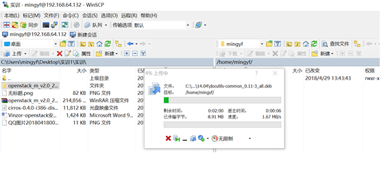
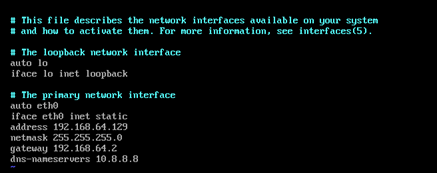
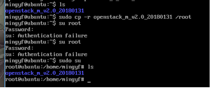
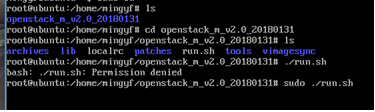
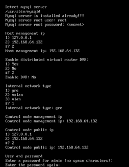
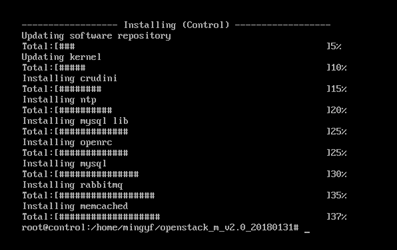

# 任务2学习周报
## 本周任务：
- 用集成脚本安装openstack，能够成功打开dashboard
- 制作镜像
- 虚拟网络

## 具体描述：
1. 成功搭建openstack环境后，通过dashboard登录。
2. 登陆后查看系统信息（看启动了什么服务）
3. 测试网络配置是否正确
    - 上传cirros镜像、创建flavor、创建vxlan网络、ext_net网络、路由
    - 创建实例
    - 添加安全组规则（ssh、icmp）
    - 尝试从不同实例之间互相ping。看是否成功
    具体参考这篇博客的后半部分：
    https://blog.csdn.net/dylloveyou/article/details/77148560  

## 本周任务完成情况
| 编号  | 项目内容 | 完成情况  | 未完成原因  | 措施  |
| :--- | :--------| :--------|:------------|:------|
| 1    | 安装Ubuntu server虚拟机 |  100%  | / | /|
| 2    |   安装部署OpenStack|  90%  |安装大部分之后失败 |详见“问题与解决办法”
| 3    |    测试网络配置| 0%  | / | /|

## 详细部署步骤
#### 安装Ubuntu Server
	安装教程网上有很多，具体的就不再赘述
#### 上传文件到Ubuntu Server
	使用软件WinCSP，建立本地和Ubuntu server之间的连接，上传文件：
	

	
####  按照文档一步一步的配置
	配置网络

	准备安装脚本
	

	准备安装
	

	具体的安装配置

	效果展示

#### 问题与解决方案
	
