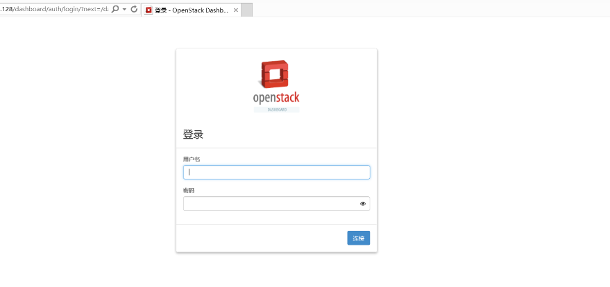
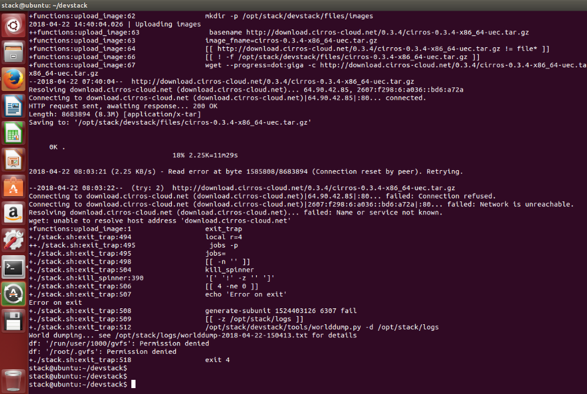
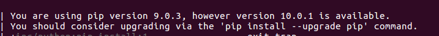
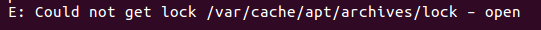
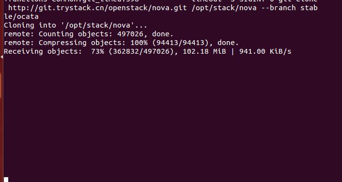
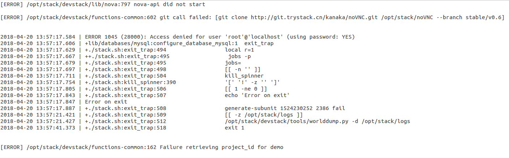

# 项目周报

项目名称：基于openstack的云桌面项目</br>
填写人：饶宇熹</br>
项目成员：饶宇熹、明友芬</br>
项目阶段：4.16-4.29


## 项目进度

项目进度状况：完成制作镜像并上传和部分虚拟网络配置</br>
项目质量状况：良好</br>
项目总体表现：良好</br>


## 本周具体工作计划

* 用集成脚本安装openstack，能够成功打开dashboard
* 制作镜像
* 虚拟网络配置
* 创建实例


## 本周主要工作内容 


| 编号 | 工作内容 | 完成情况（％）| 未完成原因 | 措施
| :-------------- | :------------ | :------------ | :------------ | :------------ |
| 1 | 部署openstack | 100% | / | / |
| 2 | 按Vinzor-openstack安装手册安装 | 100% | / | / |
| 3 | 上传cirros镜像 | 100% | / | / |
| 4 | 创建flavor | 50% | 对虚拟网络不熟悉 | 看文档，继续学习 |
| 5 | 创建vxlan网络 | 0 | 没有完成创建虚拟网络，无法继续 | 继续完成创建虚拟网络 |
| 6 | 创建ext_net网络 | 0 | 没有完成创建虚拟网络，无法继续 | 继续完成创建虚拟网络 |
| 7 | 创建ext_net路由 | 0 | 没有完成创建虚拟网络，无法继续 | 继续完成创建虚拟网络 |
| 8 | 创建实例 | 0 | 没有完成创建虚拟网络，无法继续 | 继续完成创建虚拟网络
| 9 | 添加安全组规则 | 0 | 没有完成创建虚拟网络，无法继续 | 继续完成创建虚拟网络


### 已经完成工作

(截图请移步本周部署文档.md)

* 部署openstack



* 按Vinzor-openstack安装手册安装


* 上传cirros镜像


### 未完成工作

创建flavor、创建vxlan网络、ext_net网络、路由
创建实例
添加安全组规则（ssh、icmp）


### 问题与困难

task1的部署遇到了很多问题，在这里总结一下，避免以后再踩坑。

1.permission denied问题




/run/user/1000/gvrs是个空文件，删除就行。但是直接remove是不行的，即使是root也没有权限。


解决：
```
// 这一步很重要
umount /run/user/1000/gvrs
// 然后remove
rm -rf /run/user/1000/gvrs
```


2. pip版本问题



没什么，按照提示更新pip就行。


3.上锁问题



由于上一次部署失败，重新再来过时已经被上锁了。

解决：
先找到与stack.sh相关的进程号，再kill掉相关进程即可。
```
ps -e | grep stack
(显示一堆相关进程)

kill -9 进程号
```

4.未解决问题汇总
虽然这些问题都未解决，但是这些问题也没有复现，重新部署之后似乎消失了。






### 其他说明

上上周的任务一失败分析：
task1部署失败后，我们继续尝试，但是始终没有成功。向成功部署的同学请教之后，同学提醒更新Ubuntu和VMWare版本。将Ubuntu更新至16.04LTS桌面版、VMWare升级至VMWare 之后，部分错误消失。


### 鸣谢
感谢屈了飞、刘亚男同学的帮助


## 项目下周计划

### 下周主要工作内容

虚拟网络
虚拟机多网卡环境

### 下周工作重点

虚拟网络

### 工作建议及其它事宜

将VMWare升级至最新版本</br>
多换几种操作系统试试</br>
多交流</br>


