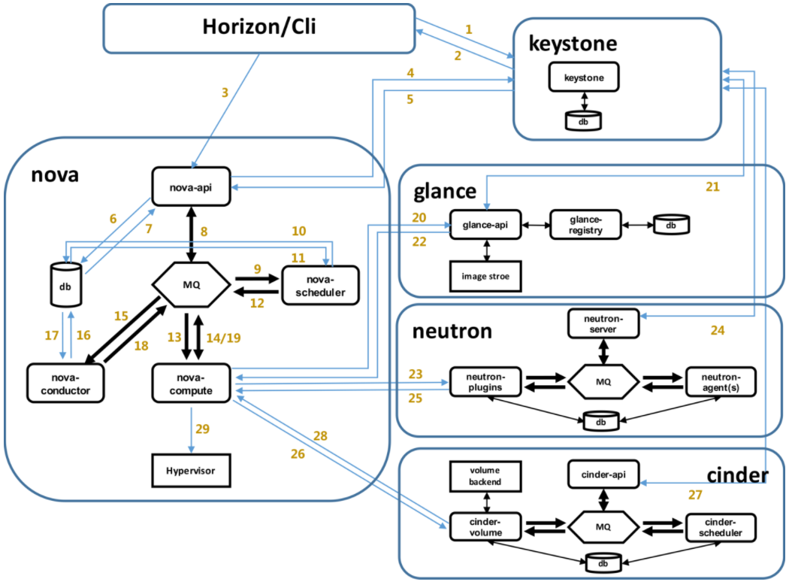
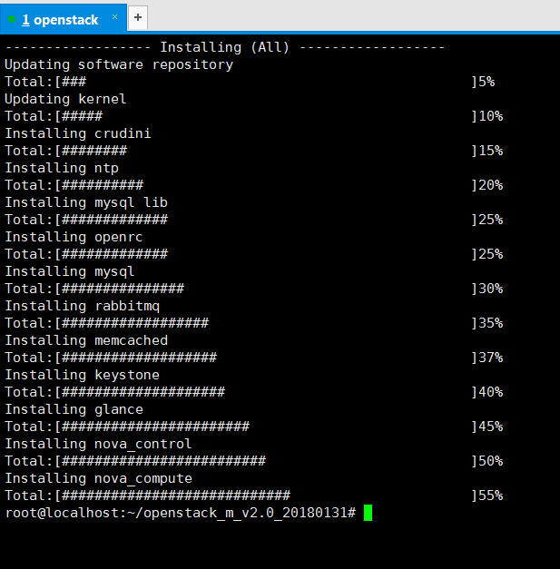
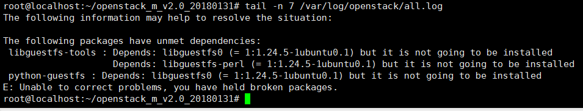

# 学习周报_2
## 本周具体工作计划
- 用集成脚本安装openstack，能够成功打开dashboard
- 制作镜像
- 虚拟网络

## 本周主要工作内容
### 已完成工作
#### 1. OpenStack网络分类
<quoteblock>
参考链接：https://docs.openstack.org/mitaka/networking-guide/intro-os-networking.html
</quoteblock>

#### 1.1. Provider network
<quoteblock>
提供商网络。管理员或其他特权用户必须创建此网络，因为它直接连接到物理网络基础结构。
</quoteblock>

#### 1.2. Self-service networks
#### 1.2.1. Flat
<quoteblock>
所有实例驻留在同一个网络上，也可以与主机共享。没有VLAN标记或其他网络隔离发生。
</quoteblock>

#### 1.2.2. VLAN
<quoteblock>
网络允许用户使用与物理网络中存在的VLAN相对应的VLAN ID（802.1Q标记）来创建多个提供商或租户网络。这允许实例在整个环境中彼此通信。 它们还可以与专用服务器，防火墙，负载均衡器和其他网络基础架构在同一个第2层VLAN上进行通信。
</quoteblock>

#### 1.2.3. GRE and VXLAN
<quoteblock>
VXLAN和GRE是封装协议，它们创建覆盖网络来激活和控制计算实例之间的通信。要求网络路由器允许流量流出GRE或VXLAN租户网络。还需要路由器才能将直接连接的租户网络与包括Internet在内的外部网络相连。路由器提供了使用浮动IP地址直接从外部网络连接到实例的功能。
</quoteblock>

#### 2. 浮动IP的作用
<quoteblock>
默认情况下，我们启动一个实例后，该实例的IP是固定的。你将该实例关闭后再重新启动，得到的IP保持不变。对此，OpenStack引入了“floating ip”的概念。用户可以手动地从地址池中获取一个IP，一旦获取成功，便可以将其与任意一个实例关联。即使与其相关联的实例被销毁，这个IP仍然存在，用户可以继续将其与其他实例关联。浮动IP的作用是让外网直接访问租户网络中的 instance。这是通过在路由器上应用 iptables 的 NAT 规则实现的。 值的注意的是，浮动IP是配置在路由器的外网接口上的，而不是实例。
</quoteblock>

#### 3. 在界面创建一个实例会用到的组件：Horizon、Keystone、Nova、Glance、Neutron、Cinder
 

<quoteblock>
(上周周报中总结了启动一个云主机时各组件之间的工作流程，为了方便阅读，这里再次贴出) 
1、Horizon/Cli通过Keystone的RESTful API拿到认证的token，并通过RESTful API向Nova-API发送一个boot instance的请求（携带auth-token）。 
2、Nova-API向Keystone认证token是否有效。一旦token验证通过，就和数据库通讯，初始化新建虚拟机的数据库记录。然后，通过RPC向Nova-scheduler请求是否有创建虚拟机的资源。 
3、Nova-scheduler进程侦听消息队列，获取Nova-API的请求。Nova-scheduler通过查询Nova数据库中计算资源的情况，并通过调度算法计算符合虚拟机创建需要的主机。对于有符合虚拟机创建的主机，Nova-scheduler更新数据库中虚拟机对应的物理主机信息。Nova-scheduler通过RPC向Nova-compute发送对应的创建虚拟机请求的消息。 
4、Nova-compute会从对应的消息队列中获取创建虚拟机请求的消息。 
5、Nova-compute通过RPC向Nova-conductor请求获取虚拟机消息。 
6、Nova-conductor从消息队队列中拿到Nova-compute的请求消息，并根据消息从数据库中获得虚拟机对应信息。接着把虚拟机信息通过消息的方式发送到消息队列中。 
7、Nova-compute从对应的消息队列中获取虚拟机信息消息。紧接着，Nova-compute通过Keystone的RESTful API拿到认证的token，并通过HTTP请求Glance-API获取创建虚拟机所需要镜像。 
8、Glance-API向keystone认证token是否有效。一旦token验证通过，就向Nova-compute返回虚拟机镜像信息(URL)。 
9、Nova-compute通过keystone的RESTful API拿到认证的token，并通过HTTP请求Neutron-server获取创建虚拟机所需要的网络信息。 
10、Neutron-server向Keystone认证token是否有效。一旦token验证通过，就向Nova-compute返回虚拟机网络信息。 
11、Nova-compute通过keystone的RESTful API拿到认证的token，并通过HTTP请求Cinder-API获取创建虚拟机所需要的持久化存储信息。 
12、Cinder-API向Keystone认证token是否有效。一旦token验证通过，就向Nova-compute返回虚拟机持久化存储信息。 
13、Nova-compute根据instance的信息调用配置的虚拟化驱动来创建虚拟机。 
</quoteblock>

### 未完成工作
无

### 问题与困难
#### 1. 集成脚本安装到一半时自动退出
 

<quoteblock>
查看日志
</quoteblock>

 

<quoteblock>
从日志中可以看出，在安装libguestfs-tools和python-guestfs包时遇到了依赖的问题。实际上，这两个包可以通过apt-get直接安装，如果遇到依赖问题，就执行“apt-get -f install”来自动修复。
</quoteblock>

#### 2. 集成脚本安装到一半时卡住
<quoteblock>
这个问题困扰了我很久。因为安装时卡住，整个虚拟机都动不了，也无法中断。强制重启后看日志也看不出有什么问题。后来意识到，原来只是因为内存分配太少了。不得不说，OpenStack真是一个庞大的系统。
</quoteblock>

#### 3. 集成脚本安装到一半时自动退出
<quoteblock>
这次是虚拟机没有开启硬件支持虚拟化这个功能orz
</quoteblock>

## 下周工作计划
未分配
