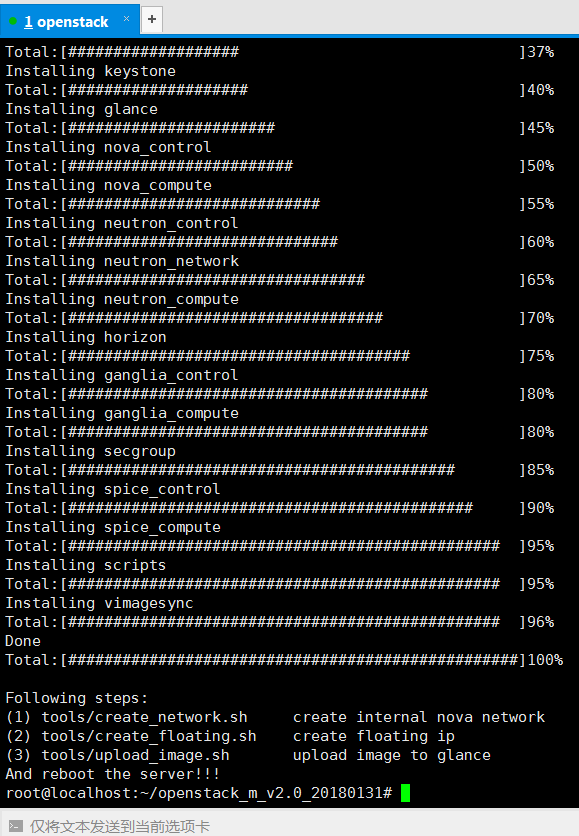
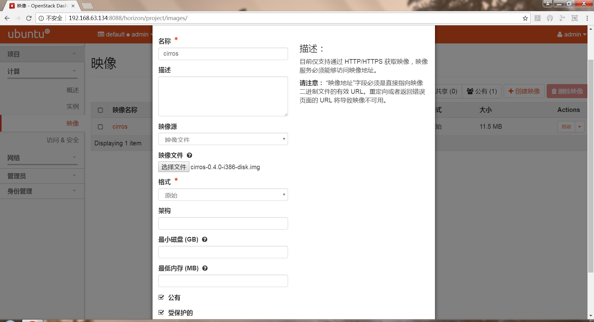
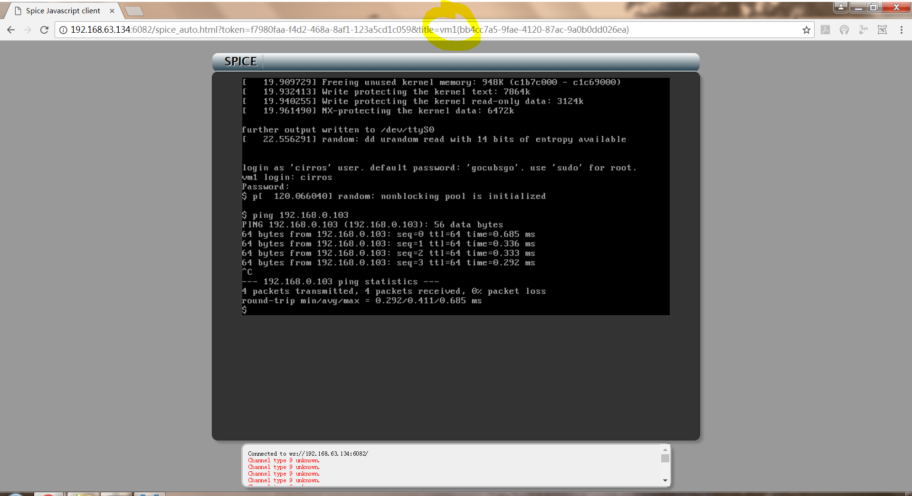

# 操作文档
## 1. 用集成脚本安装OpenStack
### 1.1. 安装
#### 1.1.1. 运行脚本
<quoteblock>
运行脚本：
</quoteblock>

 

<quoteblock>
按照部署文档的指引一步步安装直至：
</quoteblock>

 

([完整的安装过程截图点这](./asset/install)) 

<quoteblock>
按要求打补丁：
</quoteblock>

 

### 1.2. 验证：打开Dashboard
 

### 1.3. 验证：登陆主页面
 

## 2. 查看系统信息
### 2.1. 查看服务
 

### 2.2. 查看计算服务
 

### 2.3. 查看网络代理程序
 

## 3. 测试网络配置
### 3.1. 创建镜像
#### 3.1.1. 配置信息
<quoteblock>
注：之前忘记截图，又无法删除镜像重来，因此截图展示一下之前创建镜像时填的内容。
</quoteblock>

 

<quoteblock>
注：“公有”的意思是让其他用户也可以使用该镜像。
</quoteblock>

#### 3.1.2. 效果
 

### 3.2. 创建flavor
<quoteblock>
注：“flavor”相当于“套餐”，提供给我们创建云主机时选择不同的配置。
</quoteblock>

#### 3.2.1. 配置信息
 

<quoteblock>
注：每个“flavor”的标识必须是唯一的，可以填“auto”让系统随机分配一个。
</quoteblock>

#### 3.2.2. 效果
 

### 3.3. 为admin用户创建一个VXLAN类型的外部网络并建立子网
#### 3.3.1. 创建网络
#### 3.3.1.1. 配置信息
 

#### 3.3.1.2. 效果
 

#### 3.3.2. 创建子网
#### 3.3.2.1. 基本配置信息
 

<quoteblock>
注：外部网络的网络地址不能随便填。
</quoteblock>

#### 3.3.2.2. 详细配置信息
 

#### 3.3.2.3. 效果
 

<quoteblock>
注：刚才创建子网时勾选了启动DHCP，因此创建子网后就自动创建了一个DHCP代理程序。
</quoteblock>

### 3.4. 为demo用户创建一个内部网络并建立子网
#### 3.4.1. 网络配置信息
 

#### 3.4.2. 子网配置信息
 

#### 3.4.3. 子网详细配置信息
 

#### 3.4.4. 效果
 

### 3.5. 为demo用户创建一个路由器
#### 3.5.1. 配置信息
 

#### 3.5.2. 效果
 

### 3.6. 给路由器添加接口
#### 3.6.1. 查看网络拓扑
 
 

#### 3.6.2. 接口配置信息
 

<quoteblock>
注：将刚才创建的内部网络的子网接到路由器的接口上。
</quoteblock>

#### 3.6.3. 效果
 

### 3.7. 创建实例
#### 3.7.1. 详细信息
 

#### 3.7.2. 源（选择刚才创建的那个镜像）
 

#### 3.7.3. flavor（选择刚才创建的那个“flavor”）
 

#### 3.7.4. 网络（选择刚才创建的那个内部网络）
 

<quoteblock>
注：云主机通常都是连接到内部网络，并通过路由器与外部网络通信。
</quoteblock>

#### 3.7.5. 效果
 
 

#### 3.7.6. 创建第二个云主机
 

### 3.8. 添加安全组规则
#### 3.8.1. 新建安全组
 

#### 3.8.2. 添加SSH安全组规则
 

<quoteblock>
注：只允许192.168.0.0/24 IP地址块里的主机通过SSH（22号端口）连接云主机。
</quoteblock>

#### 3.8.3. 添加ICMP安全组规则
 

<quoteblock>
注：只允许192.168.0.0/24 IP地址块里的主机通过ICMP访问云主机。
</quoteblock>

#### 3.8.3. 效果
 

### 3.9. 尝试从不同实例之间互相ping
#### 3.9.1. 实例信息
 
#### 3.9.2. 互相ping
 
 

<quoteblock>
可以成功ping通。
</quoteblock>
