# 操作文档
## 通过dashboard登陆openstack
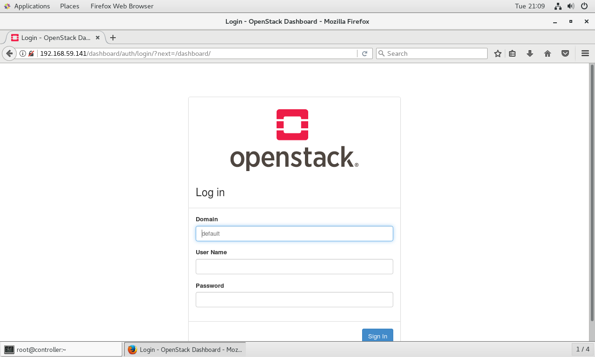  
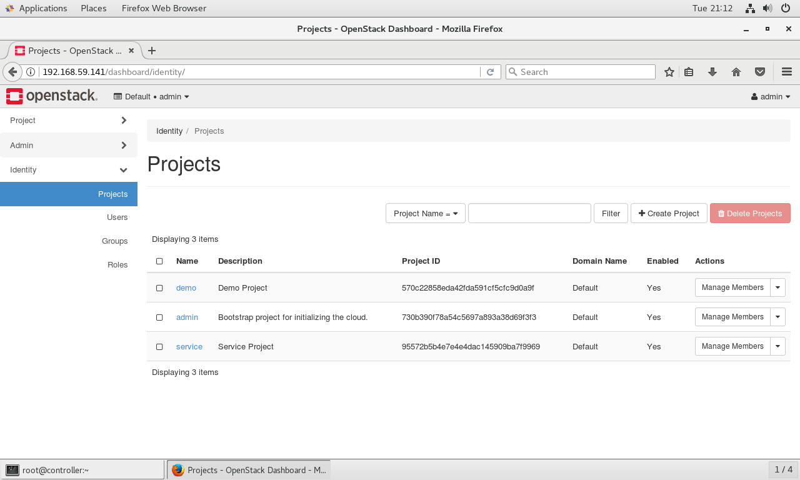
## 查看系统信息
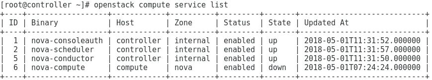
## 测试网络配置
### 上传cirros镜像
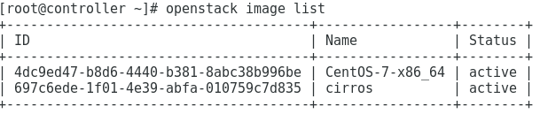
### 创建flavor及配置网络
**创建网络**\
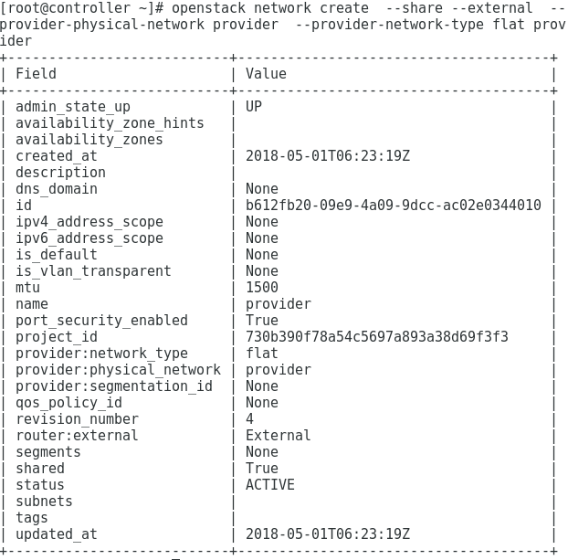\
**创建子网**\
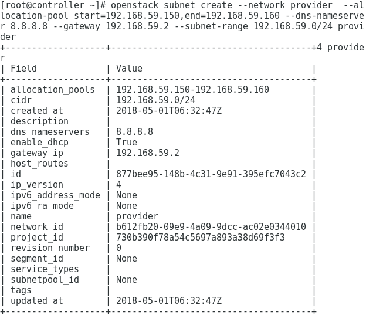\
**创建flavor**\
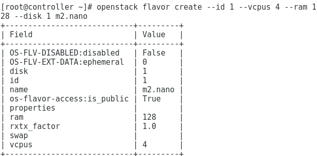
### 创建实例  
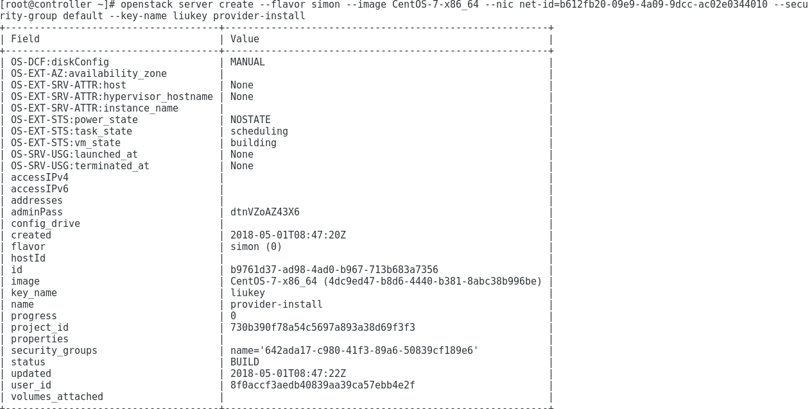
### 增加安全规则
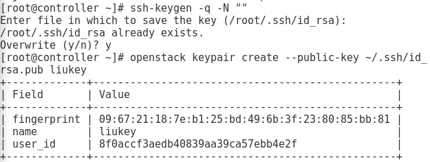
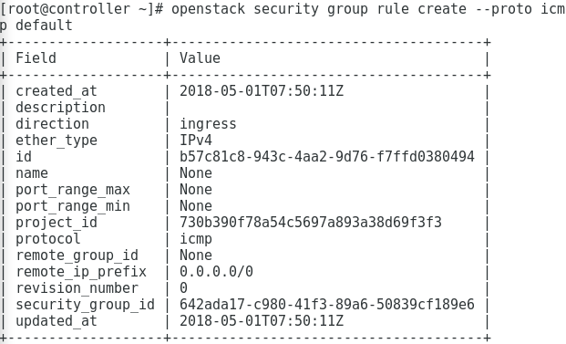
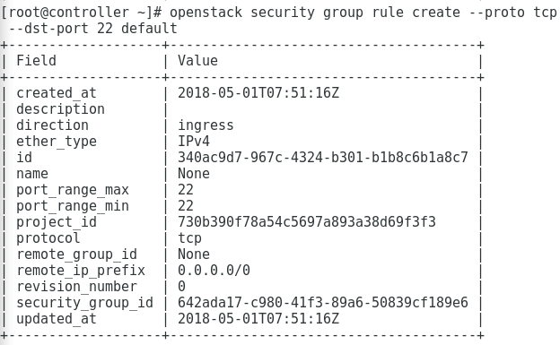
### 实现实例之间的互ping
由于电脑太lag的关系，这个步骤并不能很顺畅的操作，画面经常卡死
