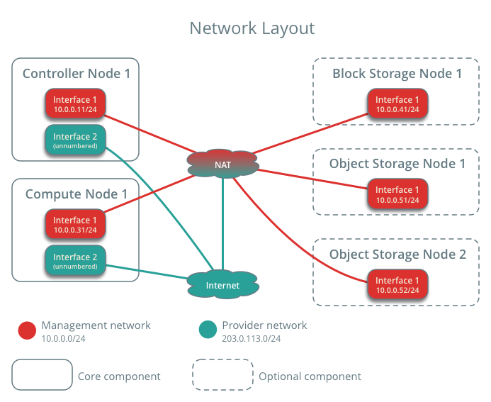

操作文档

**完成上周没有完成的任务**

上周尝试使用devstack搭建OpenStack环境，由于不清楚内部是如何搭建的，安装过程中报错了也无从下手解决。所以，我们决定安装官网上的文档，手动搭建环境。

搭建的是[OpenStack Ocata版](https://docs.openstack.org/ocata/install/ubuntu-services.html)

搭建环境：ubuntu 16.04

虚拟机分配：

| 虚拟机名称   | 内存 | 磁盘  | Role  | 所使用系统 | 备注              |
| ---- | ---- | ---- | ---- | --------------------- | ----------------- |
| ubuntu1    | 4GB | 9GB   | Controller Node   | ubuntu 16.04 |  |
| ubuntu2    | 1GB | 9GB  | Compute Node   | ubuntu 16.04 | |


Example:


因为配置步骤过长，因此只列举重要的配置点、易出错点和我认为重要有参考意义的部分。

### 配置网络
ubuntu1:
在VBox里启动第二块虚拟网卡，选择桥接模式，桥接到本地的一张物理网卡上


ubuntu2:
同样在VBox里启动第二块虚拟网卡，选择桥接到本地的同一张物理网卡上


```vim
ubuntu1$ vim /etc/network/interfaces
```


```vim
ubuntu2$ vim /etc/network/interfaces
```


> 注意，不要设置网管gateway，否则会使得虚拟机里无法ping通外界网络

检验：
ubuntu1:

```shell
ubuntu1$ ping -c 4 www.baidu.com
ubuntu1$ ping -c 4 10.0.0.31
```


ubuntu2:

```shell
ubuntu2$ ping -c 4 www.baidu.com
ubuntu2$ ping -c 4 10.0.0.11
```


### 实体认证服务

验证操作


### 镜像服务

验证操作


### 计算服务

验证操作


### 网络服务

按教程配置，验证操作


> 第一次检验时，我发现显示不正确，本该显示4个agent的，只显示了3个。重新配置，发现仍然存在。经查阅网上解答后，发现是controller和compute的时间不同步导致.

时间同步后：


### 安装并运行Dashboard

按照教程配置，并第一次验证，发现无法打开dashboard

经[查阅](http://www.talkwithtrend.com/Question/208145#li_1302677)，需要在/etc/apach2/conf-available/openstack-dashboard.conf里添加一行代码

```shell
WSGIApplicationGroup %{GLOBAL}
```


### Projects


### Images


### Services


...最后的最后，我想说我的电脑真的资源不足。内存总共8G，双系统ubuntu下只有70G。以后如果可以，还是希望可以使用机房的环境。

2. 使用集成脚本安装openstack，成功打开dashboard

此部分请查看```昌贵```的学习周报