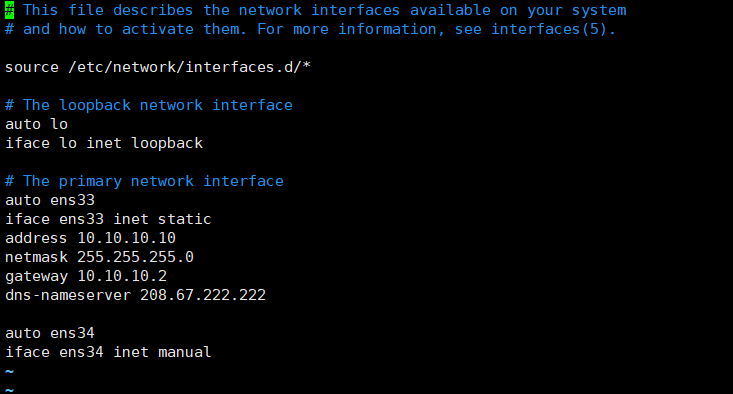
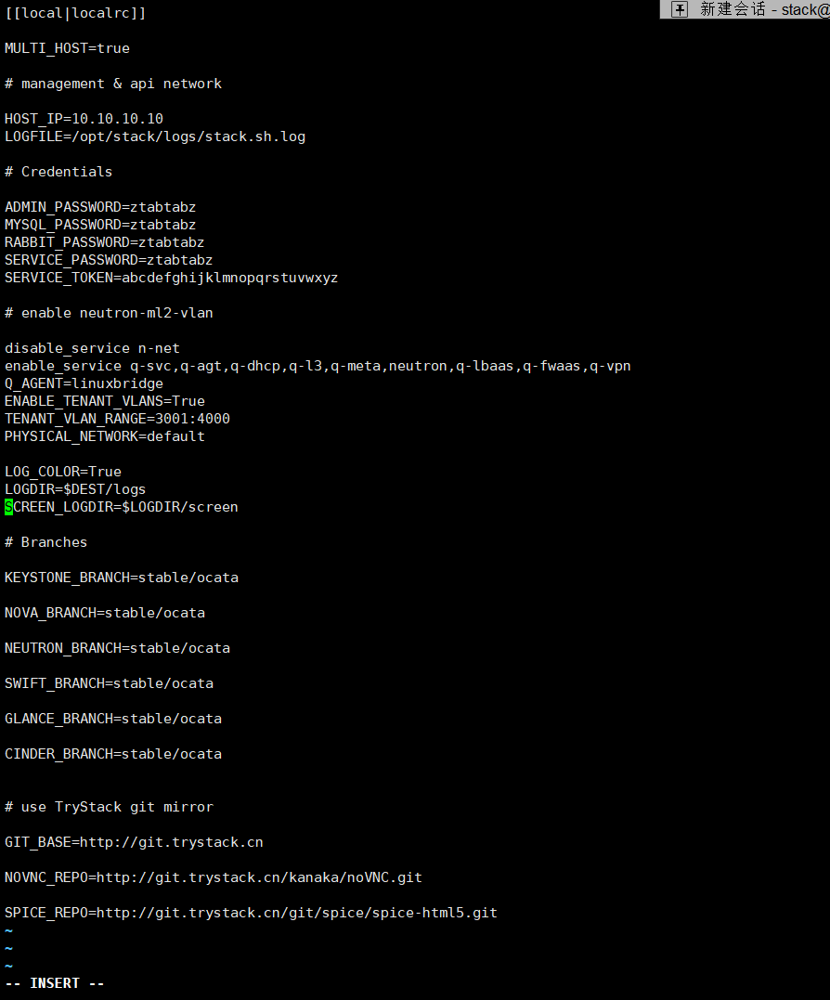
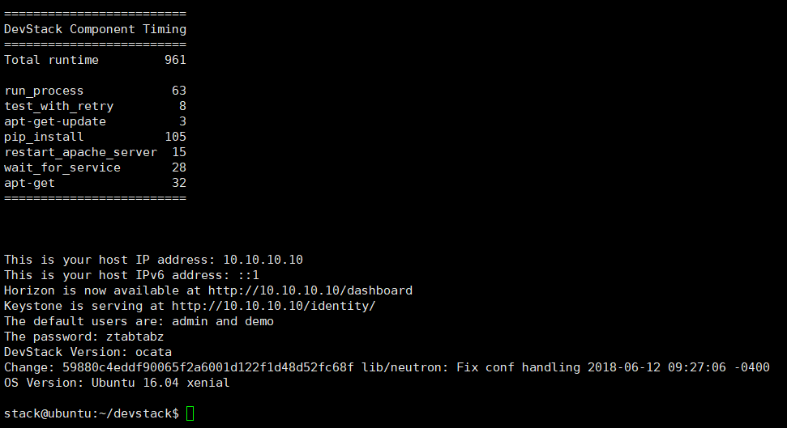
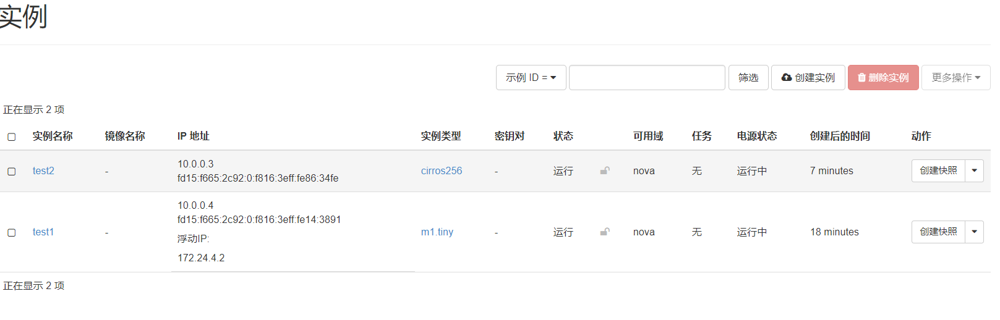
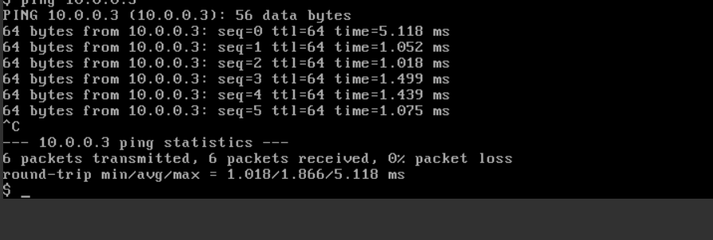
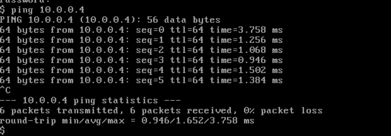

# 本次部署未采用群文件脚本，自行使用devstack部署
## 创建虚拟机
采用vmware14，系统镜像选择Ubuntu16.04 server,部署过程中一定要给虚拟机分配40G存储及4G内存和cpu虚拟化，如果没有指定CPU虚拟化会造成flavor组件部署
出错，如果存储分配不够会导致cinder组件部署出错。
## 配置网络信息
```bash
vi /etc/network/interfaces
```


## stack用户下下载devstack及配置local.conf文件
```bash
sudo useradd -s /bin/bash -d /opt/stack -m stack

echo "stack ALL=(ALL) NOPASSWD: ALL" | sudo tee /etc/sudoers.d/stack

sudo su - stack

cd /opt/stack

git clone https://github.com/openstack-dev/devstack -b stable/ocata

cd devstack
```


## 执行stack.sh脚本，等待部署完成


使用devstack部署还是比较简单的，但需要注意的是虚拟机的配置要配好，之前分配的存储不够以及未开启cpu虚拟化等等都让部署过程不顺利。

## 内部网络外部网络配置
因为使用allinone的devstack配置，已经配置好了public（外部）和private（内部）

## 实例之间ping
test1 10.0.0.4绑定浮动ip 172.24.4.2
test2 10.0.0.3

test1 ping test2

test2 ping test1

