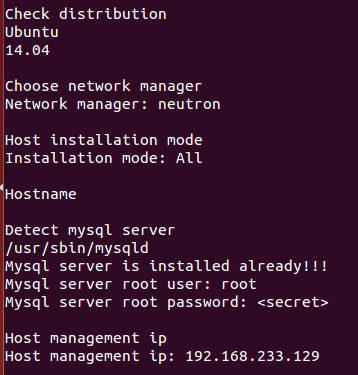
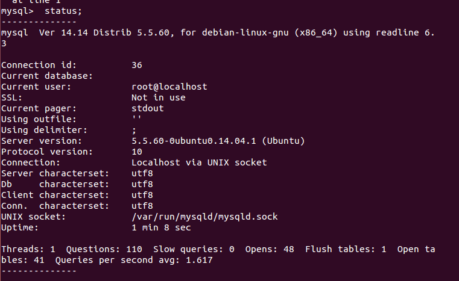

# vinzor_openstack部署文档

## **部署环境：**
- VMware ubuntu server 14.04.5
- 安装包 openstack_m_v2.0_20180131

## **网络：**
- IP静态分配
- 可以访问外网

## 部署过程

1. 准备neutron模式单节点安装脚本

操作系统：
```
root@localhost:/# cat /etc/issue
Ubuntu 14.04.5 LTS \n \l
```

网络配置：
```
auto eth0
iface eth0 inet static
address 192.168.233.129
netmask 255.255.255.0
gateway 192.168.233.254
dns-nameservers 10.8.8.8
```

2. 运行neutron模式单节点安装脚本



3. 运行结果
按教程配置后无法成功安装
失败图片：


查找log：
```
Reading package lists...
Building dependency tree...
Reading state information...
python-pymysql is already the newest version.
0 upgraded, 0 newly installed, 0 to remove and 3 not upgraded.
!includedir /etc/mysql/conf.d/
stop: Unknown job: mysql
start: Unknown job: mysql
```
日志显示安装mysql时失败

测试mysql



显示mysql正常，失败原因待查

## 是否完成配置
未完成

## 其他问题
