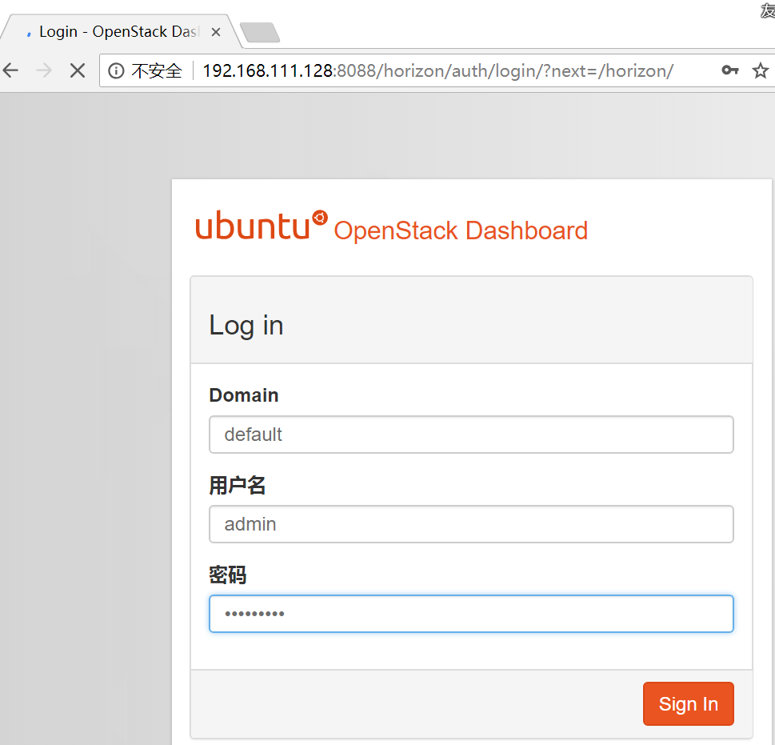

# 一、任务2学习周报（补上周的锅）
## 任务：
- 用集成脚本安装openstack，能够成功打开dashboard
- 制作镜像
- 虚拟网络

## 具体描述：
1. 成功搭建openstack环境后，通过dashboard登录。
2. 登陆后查看系统信息（看启动了什么服务）
3. 测试网络配置是否正确
    - 上传cirros镜像、创建flavor、创建vxlan网络、ext_net网络、路由
    - 创建实例
    - 添加安全组规则（ssh、icmp）
    - 尝试从不同实例之间互相ping。看是否成功
    具体参考这篇博客的后半部分：
    https://blog.csdn.net/dylloveyou/article/details/77148560    
## 任2务完成情况
| 编号  | 项目内容 | 完成情况  | 未完成原因  | 措施  | 如何解决安装过程中遇到的问题 |
| :--- | :--------| :--------|:------------|:------| :-----------|
| 1    | 安装Ubuntu server虚拟机 |  100%  | / | /| / |
| 2    |   安装部署OpenStack|  100%  | / |/ | 详见"问题与解决方法" |
| 3    |   网络配置| 100%  | / | /| /|
| 4    |   制作镜像| 100% |  / | /| /|
| 5    |   虚拟网络| 100% |  / | /| /|

### 详细部署步骤 
### 1、用集成脚本安装OpenStack
#### 1.1安装
运行安装脚本：

按照要求打补丁

这里就只放一个补丁的运行过程了
#### 1.2验证：打开Dashboard

#### 1.3验证：登陆主界面

### 2、查看系统服务
#### 2.1 查看服务

#### 2.2 查看计算服务

#### 2.3 查看网络代理服务

### 3、测试网络配置
#### 3.1 创建镜像
（1）配置信息

（2）配置效果

#### 3.2 创建flavor
（1）配置信息

（2）配置效果

#### 3.3 为admin用户创建一个VXLAN类型的外部网络
（1）创建网络的配置信息

（2）创建网络效果

（3）创建子网的基本配置信息

（4）创建子网的详细配置信息

（5）效果

#### 3.5 创建路由
（1）基本配置信息

（2）添加接口

注：这里添加的接口将刚才创建的内部网络的子网接到路由器的接口上。

（3）并且给test1添加浮动ip

（4）添加安全组规则

#### 3.6 不同实例之间的互ping
（1）打开test1和test2的控制台

（2）test1 ping tets2

（3）test2 ping test1

# 二、任务3学习周报
## 任务：
- 制作windows7或者centos7或者ubuntu的镜像，格式为qcow2
- 利用openstack上传镜像
- 能够成功创建、开启实例

## 具体描述：
上周主要是利用一个比较小的镜像来测试虚拟网络，这次尝试制作我们常用的一些镜像。
1. 制作镜像：先下载要制作镜像的iso文件，启动系统
2. 用命令行/dashboard创建镜像
3. 查看镜像的信息、服务
4. 创建实例
5. 尝试用xshell或者桌面远程连接实例（安全组）
参考链接：
https://blog.csdn.net/liuhui_charmingglobe/article/details/60142973
https://blog.csdn.net/liuhui_charmingglobe/article/details/59110406 
https://blog.csdn.net/oyuk06cm/article/details/55259913

## 本周任务完成情况
| 编号  | 项目内容 | 完成情况  | 未完成原因  | 措施  |
| :--- | :--------| :--------|:------------|:------|
| 1    | 安装Ubuntu server虚拟机 |  100%  | / | /|
| 2    |   安装部署OpenStack|  90%  |安装大部分之后失败 |详见“问题与解决办法”
| 3    |    测试网络配置| 0%  | / | /|

## 详细部署步骤
#### 安装Ubuntu Server
	安装教程网上有很多，具体的就不再赘述
#### 上传文件到Ubuntu Server
	使用软件WinCSP，建立本地和Ubuntu server之间的连接，上传文件：
	

	
####  按照文档一步一步的配置
	配置网络

#### 问题与解决方案
	

