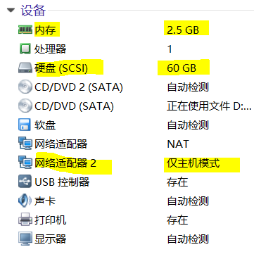

# 项目周报

项目名称：基于openstack的云桌面项目</br>
填写人：饶宇熹</br>
项目成员：饶宇熹、明友芬</br>
项目阶段：（4.30-5.6）制作镜像</br>


## 项目进度

项目进度状况：完成cirror镜像上传和虚拟网络配置</br>
项目质量状况：良好</br>
项目总体表现：良好</br>


## 本周具体工作计划

* 虚拟网络配置（任务二）
* 制作windows7或者centos7或者ubuntu的镜像，格式为qcow2
* 利用openstack上传镜像
* 创建、开启实例


## 本周主要工作内容 


| 编号 | 工作内容 | 完成情况（％）| 未完成原因 | 措施
| :-------------- | :------------ | :------------ | :------------ | :------------ |
| 1 | 虚拟网络配置 | 100% | / | / |
| 2 | 创建vxlan网络 | 100% | / | / |
| 3 | 创建ext_net网络 | 100% | / | / |
| 4 | 创建ext_net路由 | 100% | / | / |
| 5 | 创建vxlan网络 | 100% | / | / |
| 6 | 制作格式为qcow2的镜像 | 0 | dashboard突然打不开 | 详见“问题与困难”任务三
| 7 | 创建实例 | 0 | .qcow2镜像未制作完成 |  | 


## 具体说明

上周完成了任务二的上传cirros镜像，这周将上周虚拟网络配置的锅补完了。

（图为上周完成的任务）


### 任务二

* 创建flavor、创建vxlan网络、ext_net网络、路由


### 任务三


* 制作windows7或者centos7或者ubuntu的镜像，格式为qcow2
* 创建、开启实例

#### 1. iso和qcow2、img格式的区别

ISO是一种光盘镜像文件，无法直接使用，需要利用一些工具进行解压后才能使用。
它形式上只有一个文件，可以真实反映光盘的内容，可由刻录软件或者镜像文件制作工具创建。

IMG是软盘镜像文件,像一种文件压缩格式（archive format），.img 这个文件格式可视为 .iso 格式的一种超集合。
 
看qemu官方的文档：
A qcow2 image file is organized in units of constant size, which are called(host) clusters.
A cluster is the unit in which all allocations are done,both for actual guest data and for image metadata.
Likewise, the virtual disk as seen by the guest is divided into (guest) clusters of the same size.
All numbers in qcow2 are stored in Big Endian byte order.
qcow2 镜像文件是由多个固定大小的单元组织构成，这些单元被称为（host）clusters 。
无论是实际用户数据（guest data）还是镜像的元数据（metadata），都在一个 cluster 单元中进行存储。
同样的，用户所见到的虚拟磁盘也是被分割为多个同样大小的 cluesters 。
qcow2里所有的数都是大端的。

qemu加载的镜像格式为：.img，而一般从镜像对应的官网下载的都是.iso格式


#### 2. 为什么要自己制作镜像

OpenStack 的 instance 是通过 Glance 镜像部署的，所以准备镜像是必须要做的工作。

#### 3. 镜像制作到启动的步骤总结

**Linux 镜像的制作方法:**

1. 下载cloud 镜像

一些cloud镜像的下载地址：


[CentOS6](http://cloud.centos.org/centos/6/images/ )

[CentOS7](http://cloud.centos.org/centos/7/images/ )

[Ubuntu14.04](http://cloud-images.ubuntu.com/trusty/current/) 

[Ubuntu16.04](http://cloud-images.ubuntu.com/xenial/current/ )


2. 创建Glance镜像

3. 定制镜像

* 通过 cloud 镜像部署出一个实例。 
* 定制该实例。 
* 创建该实例的快照，该快照将保存在Glance中。 
* 通过该快照部署新的实例。


**Windows 镜像的制作方法:(本次没有实践，参考的是[CloudMan](http://www.cnblogs.com/CloudMan6/p/6407638.html)的博客，有机会可以试试)**

1. 创建并运行 windows2008 KVM 虚拟机
2. 安装 virtio 驱动
3. 安装 cloudbase-init
4. 其他定制工作
5. 创建 Glance 镜像
6. 通过镜像部署新 instance


#### 4. 跟镜像相关的openstack的一些命令

用`glance help  | grep image`命令查看openstack跟镜像相关的命令


```
    add                 DEPRECATED! Use image-create instead.  
    delete              DEPRECATED! Use image-delete instead.  
    details             DEPRECATED! Use image-list instead.  
    image-create        Create a new image.  
    image-delete        Delete specified image(s).  
    image-download      Download a specific image.  
    image-list          List images you can access.  
    image-members       DEPRECATED! Use member-list instead.  
    image-show          Describe a specific image.  
    image-update        Update a specific image.  
    index               DEPRECATED! Use image-list instead.  
    member-create       Share a specific image with a tenant.  
    member-delete       Remove a shared image from a tenant.  
    member-images       DEPRECATED! Use member-list instead.  
    member-list         Describe sharing permissions by image or tenant.  
    show                DEPRECATED! Use image-show instead.  
    update              DEPRECATED! Use image-update instead. 

```


可以看看[Terry_Tsang ](https://blog.csdn.net/signmem/article/details/19420025)的“openstack 命令行管理”系列。（不想找官方文档可以看这个，嘻嘻）


## 问题与困难

### 上周的任务二网络配置失败分析：
1. 我是按照《Vinzor-openstack安装手册Neutron模式》里Neutron模式单节点方式部署的，需要两块网卡。在为虚拟机添加一块网络适配器之后，把原来的一块命名为eth0，新增的另一块命名为eth1。在设置eth1的模式时选择的是默认的NAT模式。</br>
之后虽然按照《安装手册》的完成了部署的步骤，但是进行虚拟网络配置的时候总是出错。</br>


解决：</br>
后来重新部署了一遍，发现《安装手册》上要求外部网络网卡不可配置IP，也就是说eth1不可配置IP。于是我将eth1的模式改成了“仅主机模式”，解决了上周的一些错误。

2. 按照openstack官方文档建议的最低配置，一开始给虚拟机分配的是最基本的硬件需求：1GB内存，20GB硬盘存储。</br>
但是虚拟机会降低实例的性能，继续配置到后面发现实在带不动。为了获得最好的性能，于是将内存和硬盘存储设置得尽可能大。</br>

解决：</br>
按下图进行配置。




### 本周任务三遇到的问题

dashboard突然打不开，挣扎一天了毫无进展，任务三无法继续。


1. 尝试apt-get update和安装一系列依赖包，失败


2. 正在考虑重装。


## 项目下周计划

### 下周主要工作内容

虚拟网络</br>
虚拟机多网卡环境</br>

### 下周工作重点

虚拟网络

### 工作建议及其它事宜

尽量把虚拟机设置到最高配置</br>
多交流</br>
