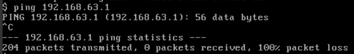

# 学习周报_3
## 本周具体工作计划
- 制作windows7或者centos7或者ubuntu的镜像，格式为qcow2
- 利用openstack上传镜像
- 能够成功创建、开启实例

## 本周主要工作内容
### 已完成工作
- 制作镜像：先下载要制作镜像的iso文件，启动系统
- 用命令行/dashboard创建镜像
- 查看镜像的信息、服务
- 创建实例

(操作文档见*显茁*)

### 未完成工作
尝试用xshell或者桌面远程连接实例（安全组）

### 问题与困难
#### 云主机无法访问物理网络
<quoteblock>
外部网络的情况：
</quoteblock>

 

<quoteblock>
路由器的接口信息：
</quoteblock>

 

<quoteblock>
看起来似乎没什么问题，但是，当尝试用云主机ping百度时：
</quoteblock>

 

<quoteblock>
起先是认为可能是DNS的问题，尝试用云主机ping路由器的外部网关：
</quoteblock>

 

<quoteblock>
继续尝试用云主机ping外部网络子网的网关：
</quoteblock>

 

<quoteblock>
现在发现不是DNS的问题了。进一步尝试发现物理主机可以ping通外部网络子网的网关，但是进一步就ping不通了。因此，认为问题出现在外部网络子网的网关上。但是这个网关IP之前就是直接采用默认的，无从得知为什么会出错。可能出错的地方也许就是安装OpenStack之前网络配置有问题。有一种说法是网卡要配置静态IP，于是我就把动态IP改成了静态IP，并重新装了一次OpenStack。遗憾的是，问题并没有得到解决。虚拟机的网卡有不同的模式，也有可能是网卡的模式不对。在无法得知那种模式是正确的情况下，我采用了最笨的枚举法，重装了好几次OpenStack。但是问题都没有得到解决。在没有看到任何突破口的情况下，我决定用之前装的3结点的OpenStack做个实验，看看云主机能否ping通物理网络：
</quoteblock>

 

<quoteblock>
现在就有点怀疑集成脚本安装过程中是不是又出了什么错误。查看结点上的网络命名空间：
</quoteblock>

 

<quoteblock>
可以看到第3个是路由器。进入路由器并查看它的网络配置：
</quoteblock>

 

<quoteblock>
发现接口的信息与在Dashboard上看到的不太一样，少了一个与外部网络连接的接口。初步认为问题出在了路由器身上。但是实在找不到相关的解决方案。至此，在这个问题上已经折腾了2天了。由于精力有限，在看不到解决突破口的情况下，我选择优先做其他作业。
</quoteblock>

## 下周工作计划
继续尝试解决云主机无法连接物理网络的问题。
