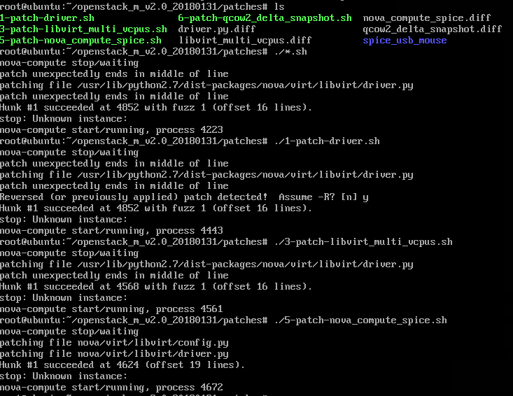

# 学习周报

## 1. 本周具体工作计划
1. 制作镜像：先下载要制作镜像的iso文件，启动系统
2. 用命令行/dashboard创建镜像
3. 查看镜像的信息、服务
4. 创建实例
5. 尝试用xshell或者桌面远程连接实例（安全组）
6. 完成上周未完成工作

## 2. 本周主要工作内容

### 2.1 学习内容
> iso和qcow2、img格式的区别

- ISO映像是一种光盘的存档文件，是磁盘映像的类型之一，数据由一张光盘的每个扇区组成，这包括光盘的文件系统。ISO映像文件通常采用文件扩展名.iso。名称ISO取自用于CD-ROM介质的ISO 9660文件系统，但ISO映像也可包含DVD和蓝光光盘使用的UDF（ISO/IEC 13346）文件系统。ISO映像可以使用三种方式创建：使用磁盘映像软件从光盘创建，使用光盘制作软件从一系列文件创建，从另一个磁盘映像文件转换而成。在可引导光盘上分发的软件很多都有可下载的ISO映像格式，并且类似的ISO映像大多可以写入光盘（例如CD或DVD）中。
- qcow是QEMU处理器支持的磁盘映像文件的文件格式，代表“QEMU Copy On Write”，使用了磁盘存储优化策略，在实际需要时延迟分配存储。qcow格式的文件可以包含许多与特定客户操作系统相关的磁盘映像。此映像在文件中的固定大小块设备中表示。在一般情况下，QCOW2支持COW，并且会有更小的文件大小，也支持快照和zlib压缩。
- ISO是一个光盘映像文件，而qcow2是一个已经安装了操作系统的分区/文件系统，可以作为同一个OS类型的旋转实例的模板。

> 为什么要自己制作镜像

> 镜像制作到启动的步骤总结
- 创建映象
- 创建flavor
- 创建网络
- 创建子网
- 创建路由器
- 创建接口
- 创建安全组规则

> 镜像相关的openstack的一些命令了解

### 2.2 已经完成工作

#### 2.2.1 完成上周工作
**解决上周无法安装的bug：**不要用desktop，server的图形化界面也不能

1. 运行./run.sh

2. 运行补丁包

3. 打开dashboard

主页面

系统信息

创建映象

创建flavor

创建admin网络

创建admin子网

创建demo网络

创建路由器

查看拓扑并添加接口

创建实例

相似的，创建另一个实例

创建安全组规则

互相ping通

#### 2.2.2 完成本周工作
1. 用dashboard创建镜像

2. 查看镜像的信息、服务

3. 创建实例

### 2.3 未完成工作
尝试用xshell或者桌面远程连接实例（安全组）

### 2.4 问题与困难
1. 按安装手册内容配置interface后，无法识别eth1
> 在interface文件中为eth1配置dhcp

## 3. 下周工作计划
完成未完成工作

## 4. 建议与意见（如有）
