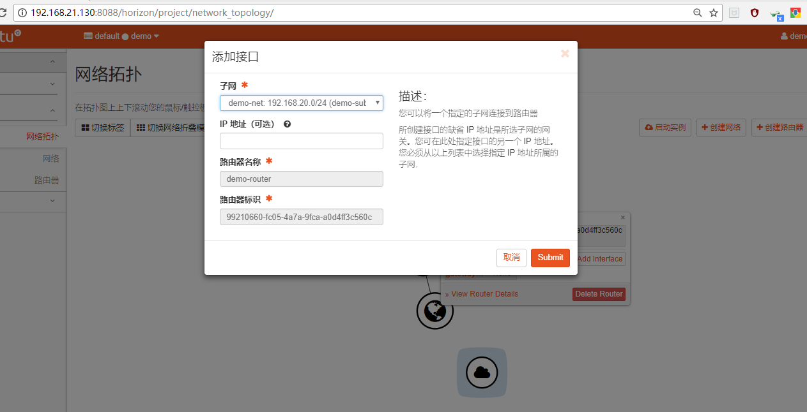

# 学习周报
* [本周具体工作计划](#本周具体工作计划)
* [本周主要工作内容](#本周主要工作内容)
* [下周工作计划](#下周工作计划)
* [建议与意见](#建议与意见)

---

<h3 id="本周具体工作计划">本周具体工作计划</h3>

+ 制作一个ubuntu镜像，格式为qcow2
+ 利用openstack上传镜像
+ 能够成功创建、开启实例  

<h3 id="本周主要工作内容">本周主要工作内容</h3>

+ 本周已完成工作  
    + iso、qcow2和img格式的区别
        是三种镜像的格式，用来压缩不同文件系统，创建镜像文件
        + iso只能拿来压缩CD或DVD
        + img是iso格式的一种超集合，既可以和iso一样压缩光盘，也能压缩磁盘
        + qcow2是qcow的扩展版本，全称Qemu Copy On Write。支持写时拷贝，支持对镜像历史的多重快照，支持AES加密。相比与qcow，文件更小

    + 镜像制作到启动的过程
        - 创建映象
        - 创建flavor
        - 创建网络
        - 创建子网
        - 创建路由器
        - 创建接口
        - 创建安全组规则

    + 与镜像相关命令
        +  导入镜像：glance image-create --name xxx --disk-format=qcow2 --container-format=bare --is-public=True --file=路径

        + 查询镜像信息: glance image-show name

        + 删除镜像:nova image-delete cirros

    + 完成上周未完成工作
        + 上传映像
            
            

        + 创建flavor
            
            

        + 创建一个外部网络和子网
            
            
            
            
            

        + 为demo创建一个内部网络和子网
            
            
            

        + 创建路由器
            
            

        + 添加接口
            
            
            

        + 创建实例
            
            

        由于自己电脑太卡、太慢了，跑不动，在苦苦的坚持下自己只做到了这里。后面的内容在队友的电脑上和队友一起完成的，基本完成了上周任务加本周的镜像创建。

+ 本周未完成工作
    没有成功使用ssh登录自己创建的实例

+ 问题与困难  
    + 遇到的问题见部署文档

<h3 id="下周工作计划">下周工作计划</h3>

+ 继续学习了解openstack

<h3 id="建议与意见">建议与意见</h3>

+ 自己电脑做不了，希望提供实验室电脑