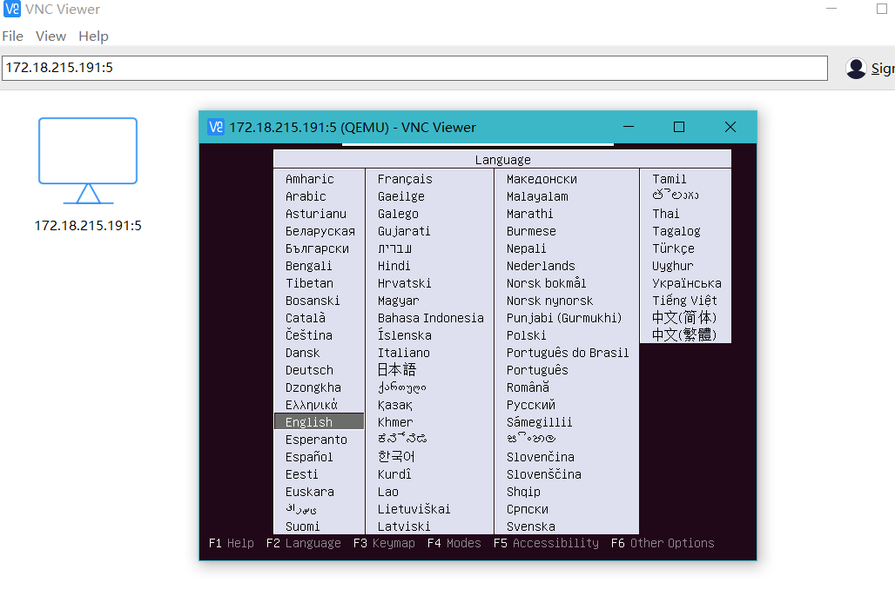

# Task3操作文档

##制作Ubuntu14.04.0server的镜像

利用xshell连接虚拟机，输入下面命令创建空镜像

    qemu-img create -f qcow2 source_image.qcow2 20G
    
利用rz上传镜像

    rz
启动kvm一个虚拟机实例。输入如下命令，稍后在端口5开放vnc服务。

    qemu-system-x86_64 -m 512 -smp 4 --enable-kvm -boot d -hda /home/revnos/source_image.qcow2 -cdrom /home/revnos/ubuntu-14.04.5-server-amd64.iso -vnc :5

VNCviewer连接并完成安装

利用sz下载镜像

    sz source_image.qcow2
    
##上传至openstack验证安装
