# 操作文档

(已完成)
1、用集成脚本安装OpenStack 
1.1安装 
1.2验证：打开Dashboard 
1.3验证：登陆主界面 

2、查看系统服务 
2.1 查看服务 
2.2 查看计算服务 
2.3 查看网络代理服务 

3、测试网络配置 
3.1 创建镜像 
3.2 创建flavor 

任务三遇到的问题 

------

## 1、用集成脚本安装OpenStack
### 1.1安装
运行安装脚本：

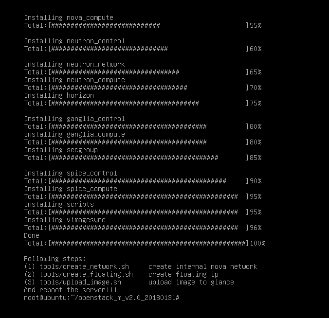

按照要求打补丁

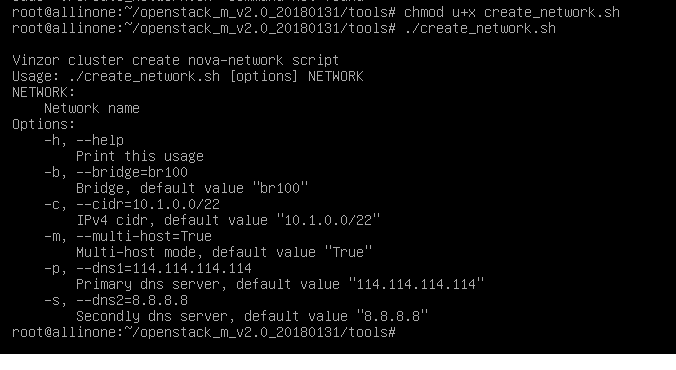

这里就只放一个补丁的运行过程了
### 1.2验证：打开Dashboard

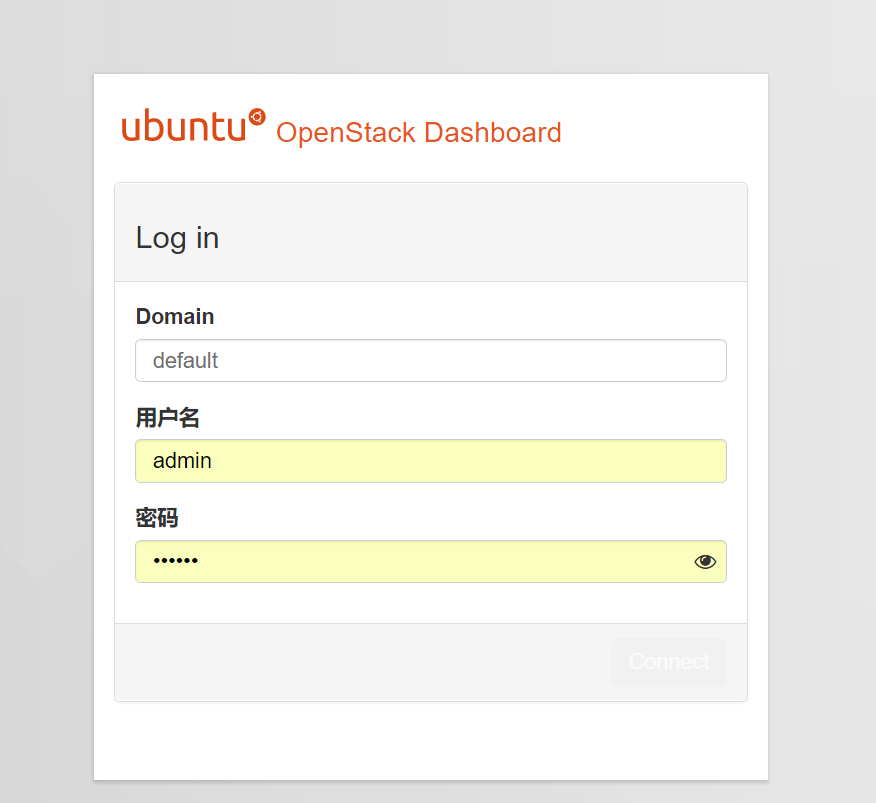

### 1.3验证：登陆主界面

## 2、查看系统服务

### 2.1 查看服务

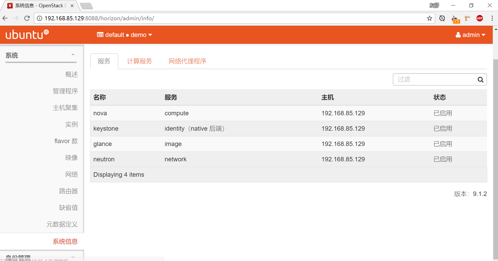

### 2.2 查看计算服务

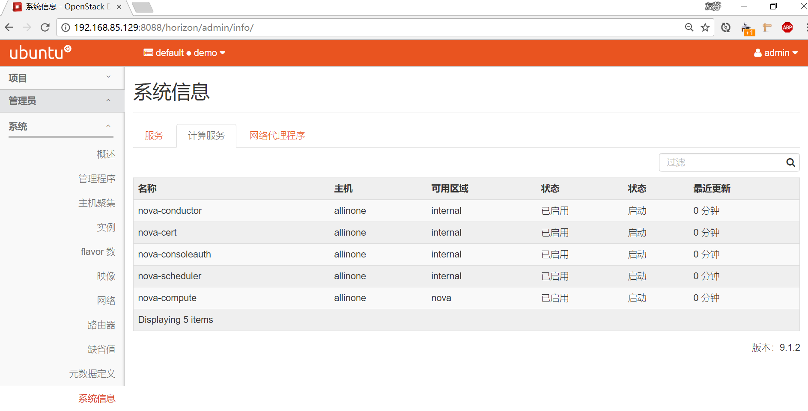

### 2.3 查看网络代理服务

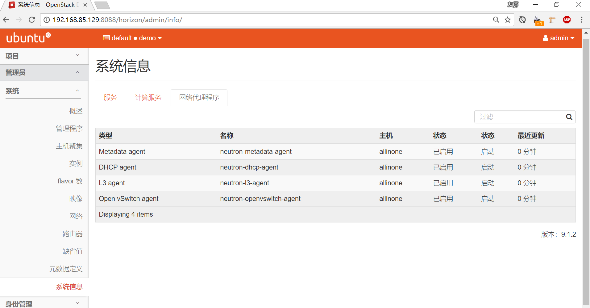

## 3、测试网络配置
### 3.1 创建镜像
（1）配置信息

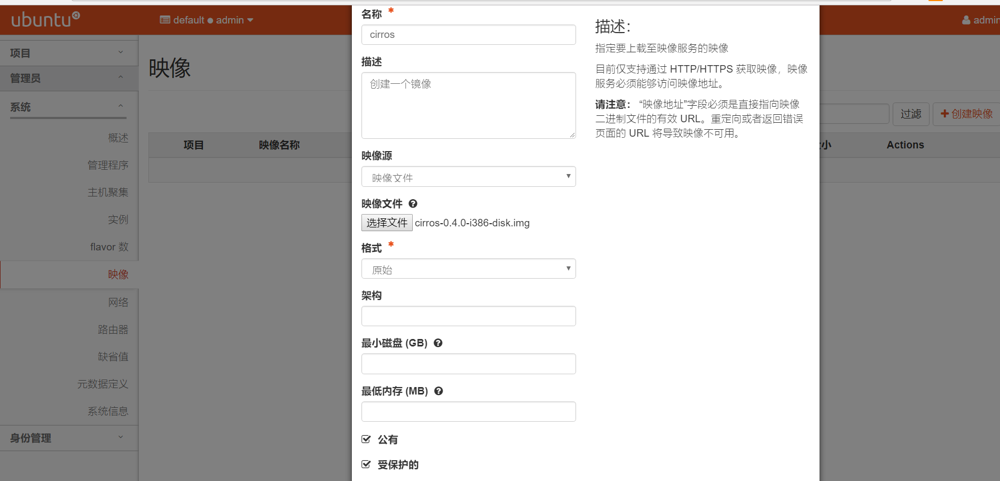

（2）配置效果

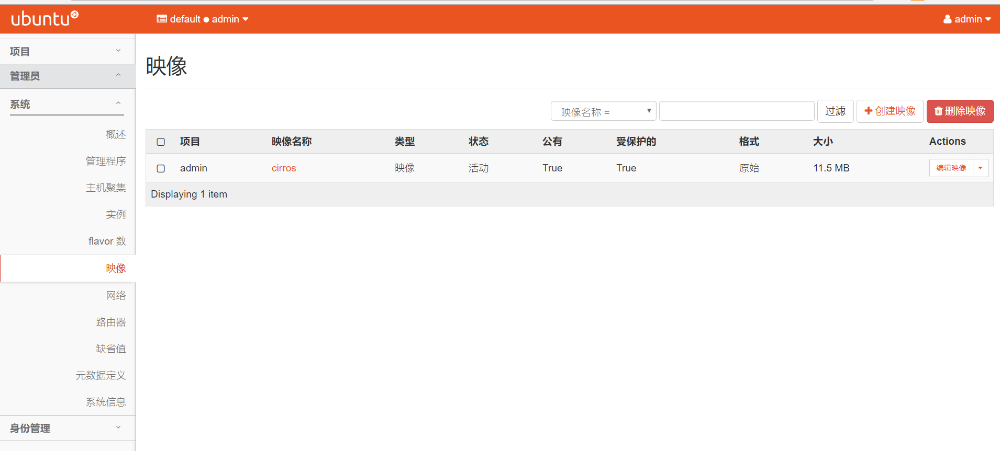

### 3.2 创建flavor
（1）配置信息

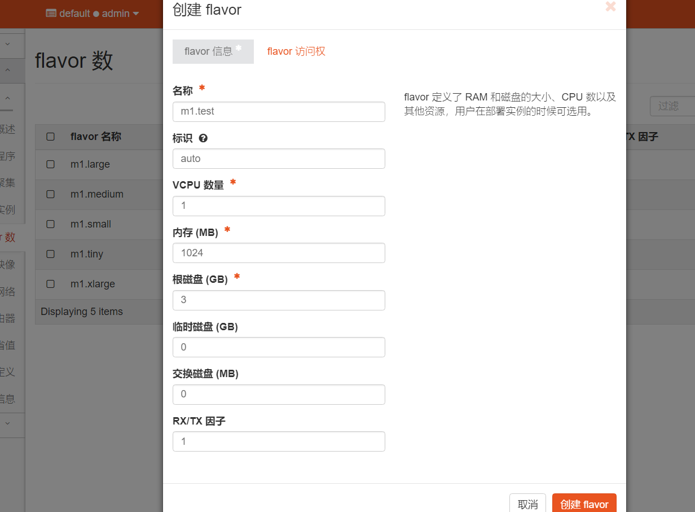

（2）配置效果

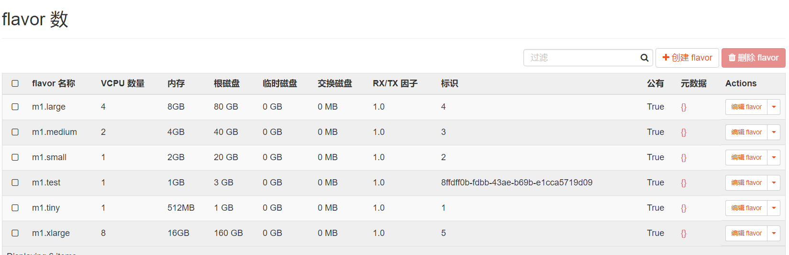

### 3.3 为admin用户创建一个VXLAN类型的外部网络
（1）创建网络的配置信息

（2）创建网络效果

（3）创建子网的基本配置信息

（4）创建子网的详细配置信息

（5）效果

### 3.5 创建路由
（1）基本配置信息

（2）添加接口

（3）并且给test1添加浮动ip

（4）添加安全组规则

### 3.6 不同实例之间的互ping
（1）打开test1和test2的控制台

（2）test1 ping tets2

（3）test2 ping test1

## 任务三遇到的问题

dashboard突然打不开，挣扎一天了毫无进展，任务三无法继续。

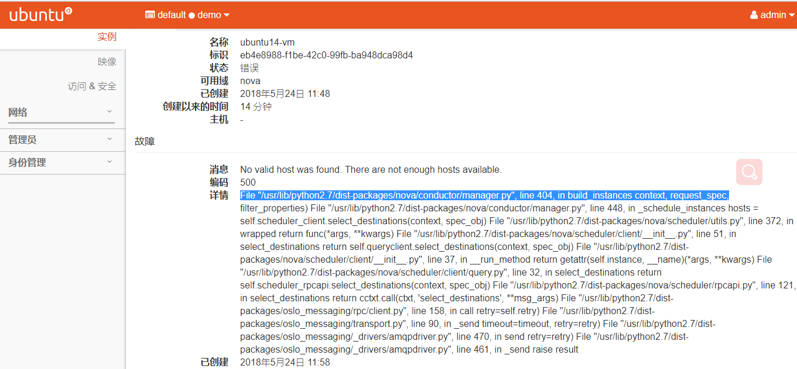

1. 尝试apt-get update和安装一系列依赖包，失败

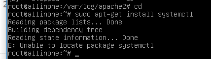

2. 正在考虑重装。

	

