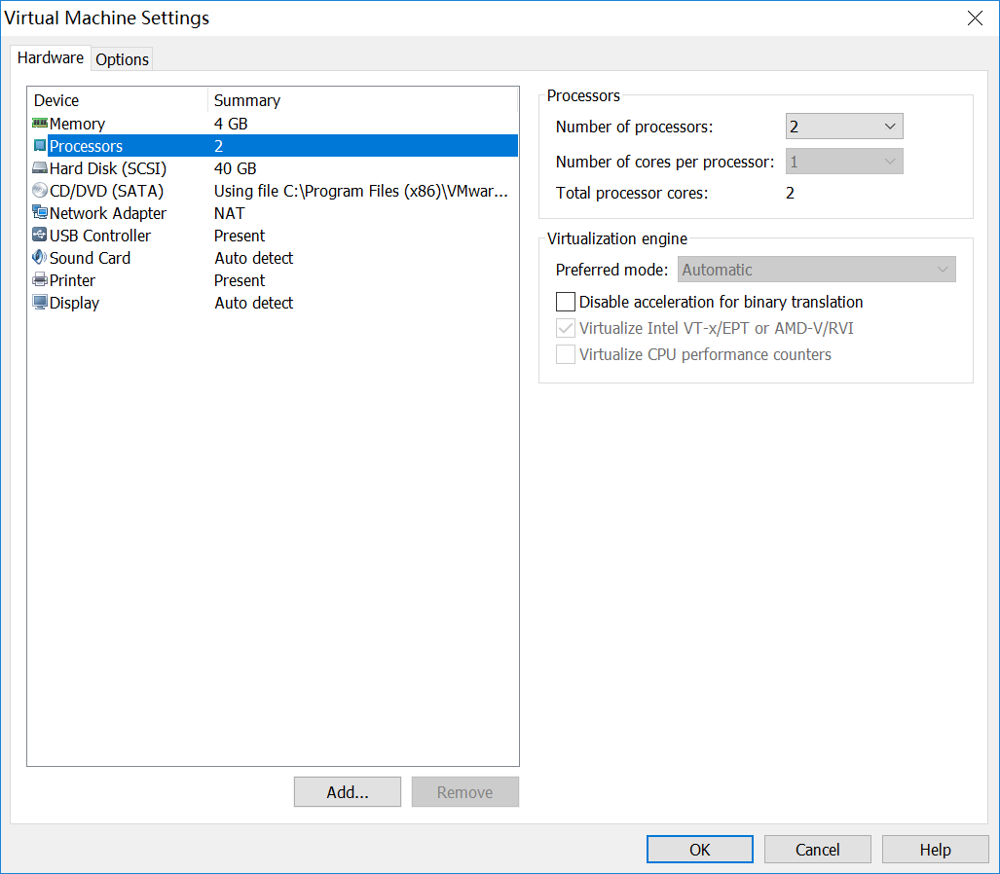
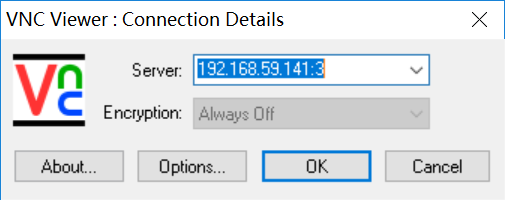
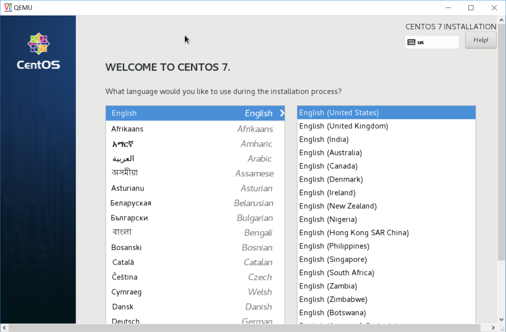
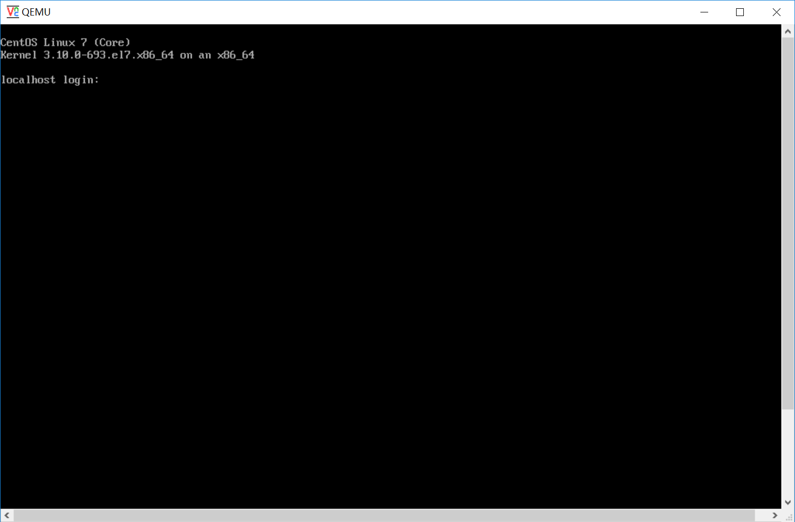
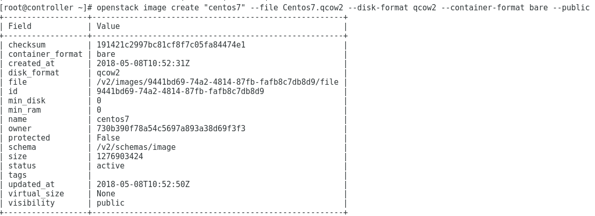
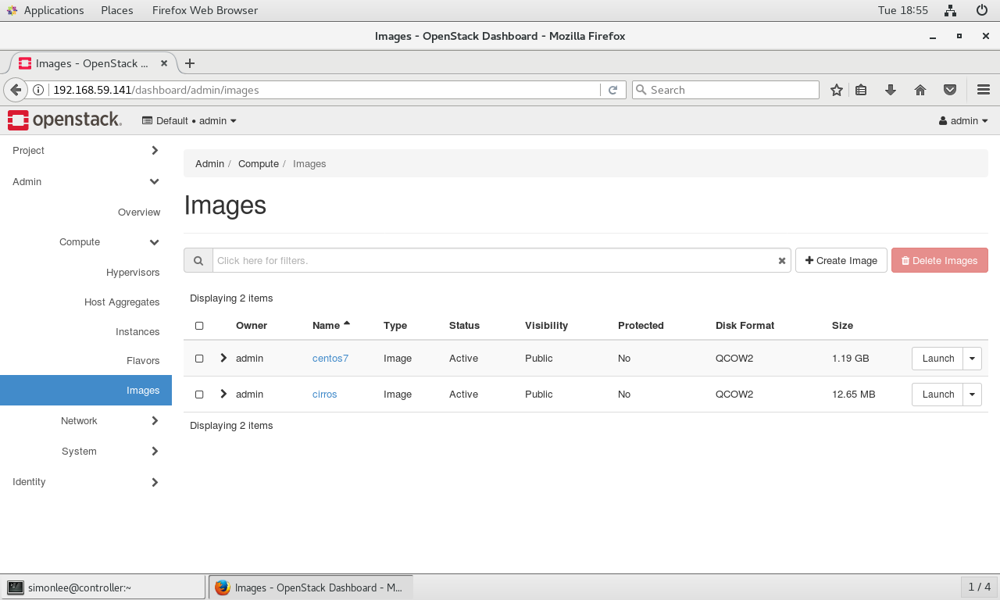

# task3操作文档
## 实验准备
### 1.配置虚拟机支持KVM

### 2.下载KVM所需包
## 创建系统盘
```
qemu-img create -f qcow2 Centos7.qcow2 20G
```
## 启动虚拟机instance
```
/usr/libexec/qemu-kvm -m 1024 -cdrom centos7.iso -drive file=Centos7.qcow2 -boot d -net nic -net user -nographic -vnc :3
```
## 下载VNC Viewer并对instance进行连接

## 对instance进行安装
 \
安装结束后重启instance 
```
/usr/libexec/qemu-kvm -m 1024 -drive file=centos7.qcow2 -boot c -net nic -net user -nographic -vnc :3
```
透过VNC Viewer重新对instance进行连接


## 在Openstack上创建镜像文件
```
openstack image create "centos7" --file Centos7.qcow2 --disk-format qcow2 --container-format bare --public
```


## 在Openstack上创建instance
网络部分出问题啦！卡住中...
