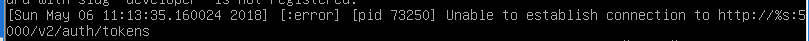

# 操作文档
## **一、首先把任务2完成，然后才是任务3的部署**

## **二、任务三**
(已完成) 
1、用集成脚本安装OpenStack 
1.1安装 
1.2验证：打开Dashboard 
1.3验证：登陆主界面 

2、查看系统服务 
2.1 查看服务 
2.2 查看计算服务 
2.3 查看网络代理服务 

3、测试网络配置 
3.1 创建镜像 
3.2 创建flavor 

任务三遇到的问题 

## **三、问题与解决办法**
### 1、任务二遇到的问题与解决办法
1、安装OpenStack失败

### 2、任务三遇到的问题与解决办法

1、dashboard突然打不开，挣扎一天了毫无进展，任务三无法继续。

2、尝试apt-get update和安装一系列依赖包，失败

2. 正在考虑重装。

	

