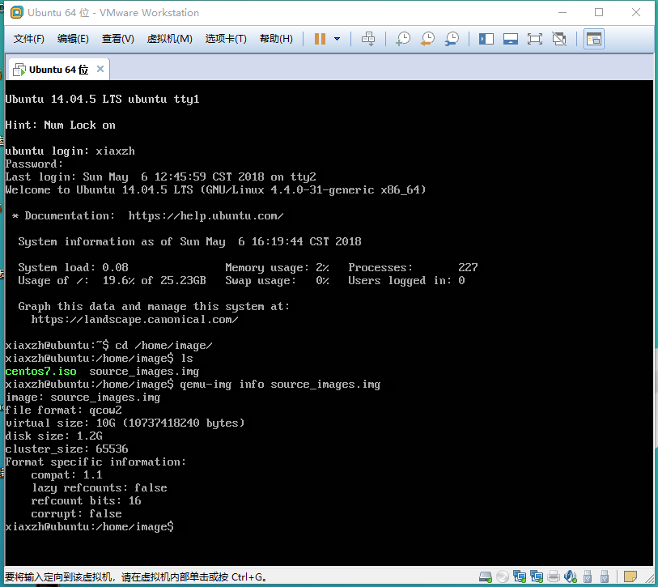
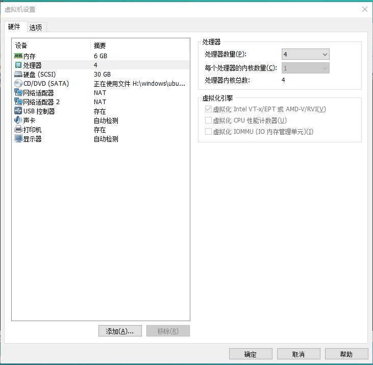
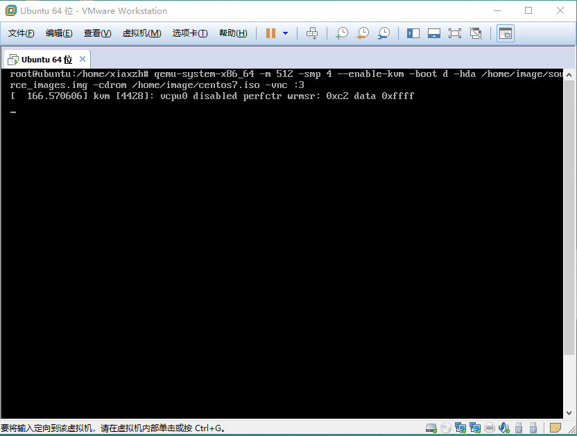
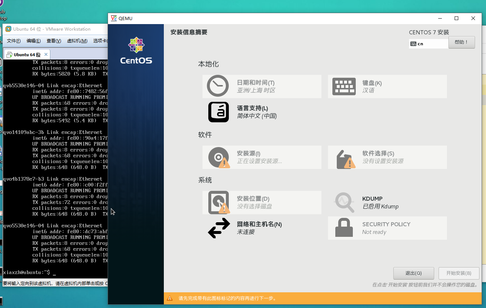
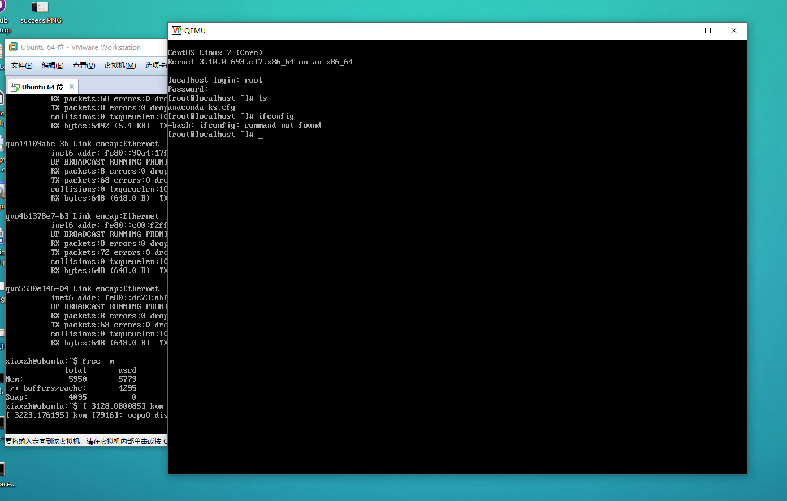

操作文档


**制作镜像**

```shell
$ qemu-img create -f qcow2 sourece_images.img 10G
```

创建了一个大小为10G的名为```source_images.img```的系统盘

**查看镜像信息**

```shell
$ qemu-img info source_images.img
```




**创建实例**

1. 开启CPU VT-X功能

   

2. 创建实例

   ```shell
   $ qemu-system-x86_64 -m 512 -smp 4 --enable-kvm -boot d -hda /home/image/source_images.img -cdrom /home/image/centos7.iso -vnc :3
   ```

   

**使用VncViewer远程连接实例**




完成安装



