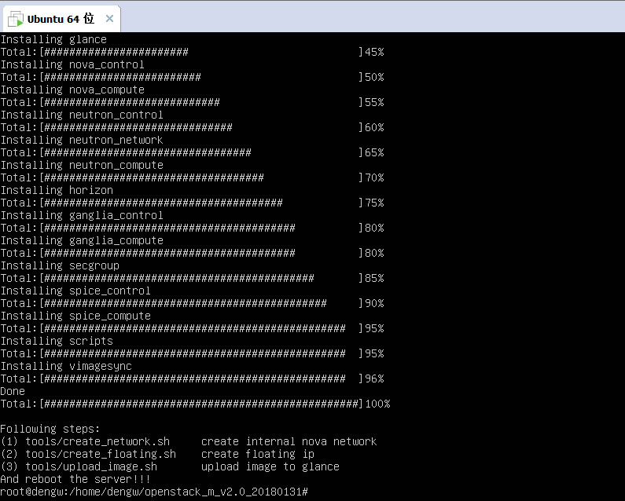
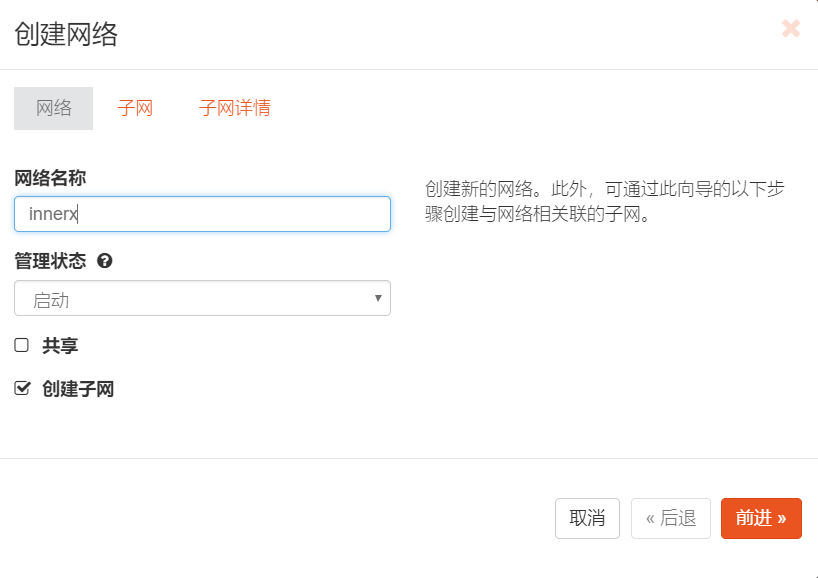
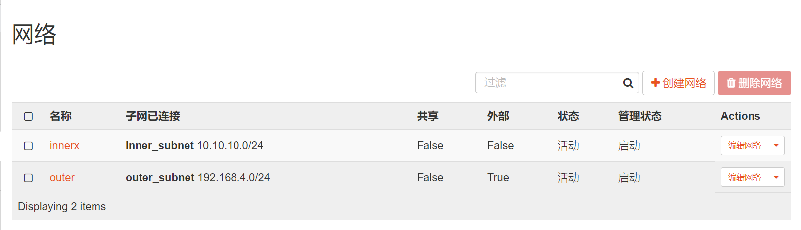
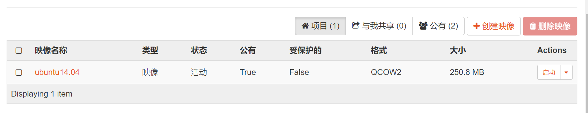
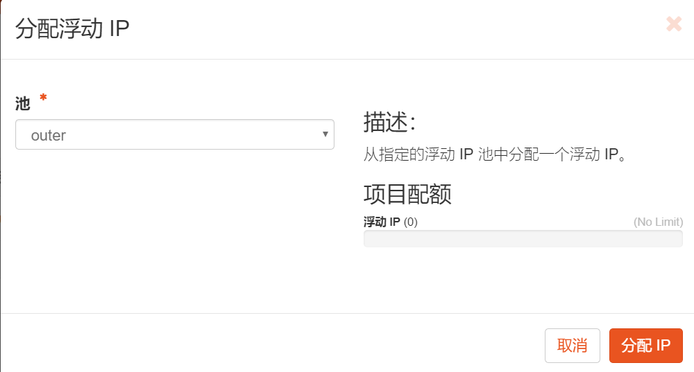

# 重新部署上周的内容

## **部署环境：**
- VMware ubuntu server 14.04.5
- 安装包 openstack_m_v2.0_20180131

## **网络配置：**
```
auto eth0
iface eth0 inet static
address 192.168.17.129
netmask 255.255.255.0
gateway 192.168.17.2
dns-nameservers 10.8.8.8

auto eth1
iface eth1 inet dhcp
```

##  部署过程

1. 安装虚拟机并配置网络

2. 使用winscpz将安装包传导虚拟机上

3. 运行安装脚本进入安装过程，安装完成后如下图：



4. 运行`./patches`目录下的所有脚本


5.  此时可以查看dashboard


6. 使用demain:`default`、用名`admin`、以及自己设置的密码登录，进入主界面


7. 查看系统信息

服务：


计算服务：


网络代理程序：


8. 使用提供的`iso`文件创建一个镜像


9. 创建一个flavor


10. 创建一个`vxlan` 网络


11. 为上一步骤创建网络设置子网


12. 创建一个 `ext_net` 网络并设置路由


此时的网络拓扑图如下：


13. 在 `ext_net` 网络下创建两个实例`vm_test` 和 `vm_test2`，具体的配置如下：


14. 访问安全设置，添加`icmp`和`ssh`协议


15. 不同实例之间互相ping


**实验成功！**

# Task3部署过程

## 配置环境

使用镜像：[trusty-server-cloudimg-amd64-disk1.img ](http://cloud-images.ubuntu.com/trusty/current/)


## 配置过程
### 创建映像
在dashboard中c创建`ubuntu14.01`的镜像，具体配置如下：


映像的详细信息如下：


### 配置网络

> 创建外部网络，项目选择Service,模式指定为Flat


> 为上面的外部网络差创建一个子网,网段为`192.168.4.0/24`，具体设置如下：


> 创建一个内部网络，，并为其创建子网，子网的网段为`10.10.10.0/24`,具体设置如下：




> 此时一个外网和内网就创建完成了



> 私有网络连接到外网需要路由,接着创建路由


> 为路由添加接口


> 路由的接口信息如下:


**网络配置完成！**

### 添加 访问 & 安全

> 添加名为 `ping&ssh`的安全组，以允许ping操作以及ssh登录，添加如下规则


> 添加密钥对


### 添加实例
上面的步骤都是创建实例的准备工作，现在开始创建实例工作。

> 创建一个名为`ubuntu14.04`的实例，镜像选择我们上面创建的镜像，flavor系统提供的选择`m1.small`，网络选择我们上面的内部网络，密钥对选择上面创建的`task3`的密钥对，然后创建。



> 为实例关联floating IP,允许外网访问，将创建的外网资源池中的某个IP分配给该实例



> 该实例获得外网IP:192.168.4.101


**实例创建完成！**

### ssh登录
当我配置好实例启动控制台后，提示我使用账号密码登录，wtf？我在配置的过程中没有输入过账号密码啊，而且上周的作业中打开控制台有提示账号和密码是什么，但是这周我使用的这个镜像根本就没有提示，所以说现在创建的这个实例自己都登录不上，使用控制台都不行。


在私钥的目录下使用ssh登录的命令`ssh -i task3.pem username@192.168.4.101`,其中`task3.pem`为私钥，`username`是账号，未知，后面的是实例的公网IP，根据实例的有关信息，我尝试使用了下面几个username,但是同样登录不上。


# 遇到的问题
ssh登录不上实例，原因待查
想到的解决方案：使用不同的镜像或者使用上周的镜像创建一个实例，在知道账号和密码之后尝试使用`ssh`登录，看是否可以登陆上，如果可以，那应该就是用户名这个问题，但是如果也不可以，其他可能的原因就只有网络配置了，但是我觉得我上面配置的网络没有问题，还是待验证吧。

# 已完成的内容
初除ssh登录之外的全部内容

# 待完成
使用ssh远程登录