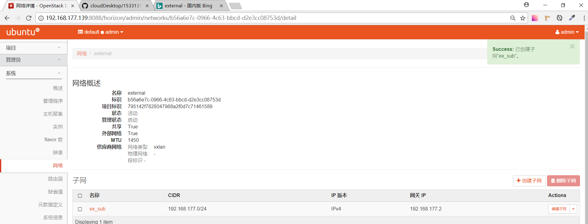
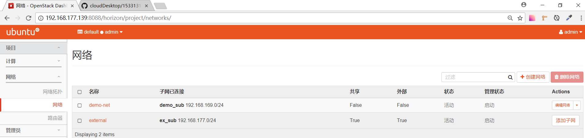
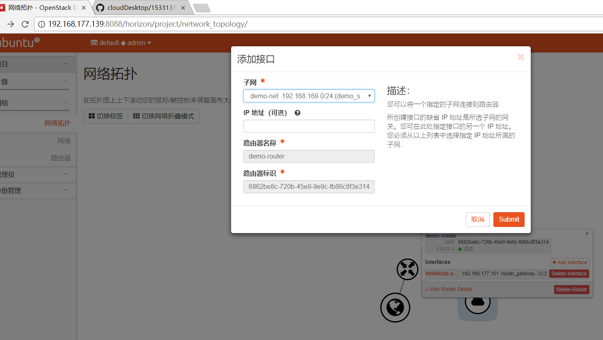
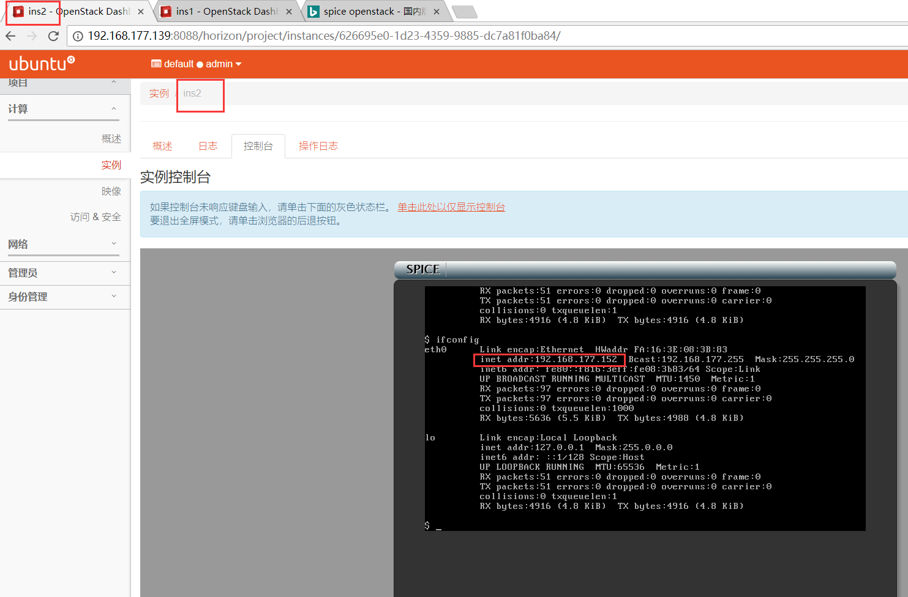

# 项目周报

项目名称：基于openstack的云桌面项目</br>
填写人：饶宇熹</br>
项目成员：饶宇熹、明友芬</br>
项目阶段：（5.7-5.25）安装云桌面</br>


## 项目进度

项目进度状况：完成安装云桌面</br>
项目质量状况：良好</br>
项目总体表现：良好</br>


## 本周具体工作计划

* 子任务1：虚拟网络部分配置</br>
虚拟机实例能够ping通外网</br>
能够用xshell或者putty或者SSH命令来连接实例</br>

* 子任务2：镜像制作</br>
制作一个centos或者ubuntu或者windows镜像，镜像中创建一个文件，文件内容写入小组的branch名称</br>
要求开机就能启动镜像，无需重复安装过程，并且开启实例后可以看到之前创建的文件</br>

* 子任务3：安装云桌面</br>
提供vindesk部署安装包，根据安装文档来安装</br>
安装完成无报错，并且能够打开系统并截图即为任务成功</br>
可以自行探索下相关的功能（重点操作下：如何创建一个课程桌面或者固定桌面）</br>


## 本周主要工作内容 


| 编号 | 工作内容 | 完成情况（％）| 未完成原因 | 措施
| :-------------- | :------------ | :------------ | :------------ | :------------ |
| 1 | 虚拟网络配置 | 100% | / | / |
| 2 | 制作一个ubuntu的qcow2镜像 | 100% | / | / |
| 3 | 安装云桌面 | 100% | / | / |


## 具体说明

> **本周我们小组两个人都完成了任务，部署文档一人写了一部分，我写的是“安装云桌面”部分。**

> **在学习周报中补充“虚拟网络配置”和“qcow2镜像”部分。**


### 虚拟网络配置


用集成脚本安装OpenStack，安装成功后按要求操作。


登陆openstack dashboard


创建cirros镜像


创建flavor


创建一个VXLAN类型的外部网络并建立子网


根据DHCP设置决定分配池范围。（128-254）




创建子网


创建一个内部网络并建立子网





创建路由器


接口配置



添加安全组规则


创建实例

实例1：


实例2：


不同实例之间互相ping

实例1的ip：


实例2的ip：



**实例1ping实例2：**


**实例2ping实例1：**


### 制作一个ubuntu的qcow2镜像

设置虚拟机处理器支持虚拟化


检查虚拟机的虚拟化是否成功


安装kvm


创建系统盘


上传镜像


创建实例


创建快照


## 问题与困难


### 1.用集成脚本安装OpenStack后，无法执行tools下的可执行文件。


解决：</br>
查看几个文件的权限，发现均为只读。所以用
`chmod +x xxxxxx.sh`
命令提权。几个文件就可以顺利执行了。


### 2.下载qemu-kvm时，出现如下错误：


解决：</br>
`apt-get update`更新一下。


### 3.云桌面安装完成后进入网页界面，显示密码必须大于5位。但是我的openstack密码是`asd`，三位的。


解决：</br>
尝试1：修改admin密码。</br>

将`export OS_PASSWORD=asd`改为`export OS_PASSWORD=admin123`


重新安装云桌面，但是到达90%失败。通过安装日志查看原因，发现出现未授权的问题。

```
"The request you have made requires authentication. (HTTP 401)l"
```

尝试2：
后来查资料知道了云桌面的登录密码就是admin123。</br>
于是将将`export OS_PASSWORD=admin123`改回`export OS_PASSWORD=asd`。</br>
云桌面的登录密码与`export OS_PASSWORD=xxx`里的openstack密码无关。


## 项目下周计划

### 下周主要工作内容

探索下云桌面相关的功能</br>


### 下周工作重点

如何创建一个课程桌面或者固定桌面

### 工作建议及其它事宜


