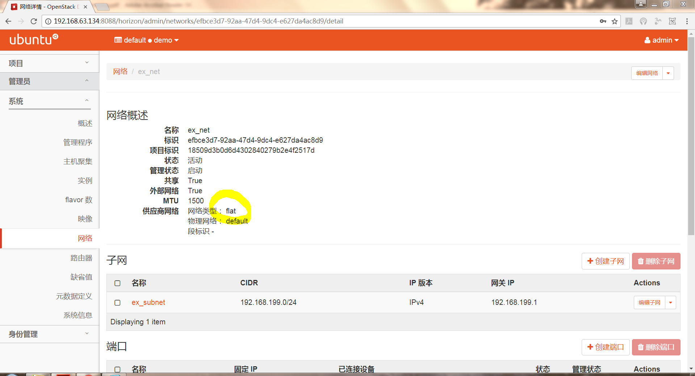
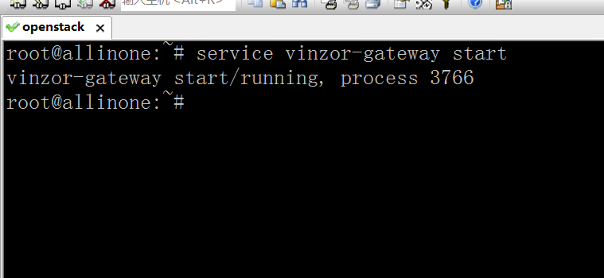
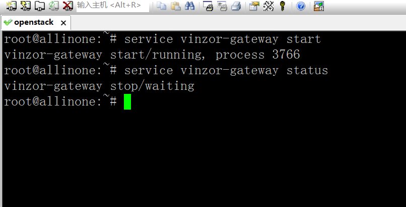
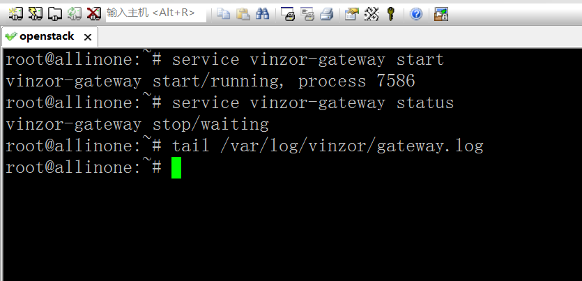

# 学习周报_4
## 本周具体工作计划
### 子任务1：虚拟网络部分配置
>虚拟机实例能够ping通外网<br />
能够用xshell或者putty或者SSH命令来连接实例

### 子任务2：镜像制作
>制作一个centos或者ubuntu或者windows镜像，镜像中创建一个文件，文件内容写入小组的branch名称<br />
要求开机就能启动镜像，无需重复安装过程，并且开启实例后可以看到之前创建的文件

### 子任务3：安装云桌面
>提供vindesk部署安装包，根据安装文档来安装<br />
安装完成无报错，并且能够打开系统并截图即为任务成功<br />
可以自行探索下相关的功能（重点操作下：如何创建一个课程桌面或者固定桌面）

## 本周主要工作内容
### 已完成工作
>完成预订任务

>对OpenStack的理解：目前为止，OpenStack给我的感觉就像是一个集成了“资产管理”和“虚拟化”的平台。“资产管理”是指OpenStack可以将多台PC的硬件资源（CPU、内存、外存等）揉和成一个“资源池”。我们可以对这些资源进行统一的监控和调度。“虚拟化”是指OpenStack可以利用“资源池”来生成虚拟网络设备、虚拟主机等实例。这些实例能融入到物理网络中，跟真实的网络设备和主机没太大区别。

### 未完成工作
无

### 问题与困难
### 1. 外部网络的网卡使用桥接模式后云主机还是ping不通物理网络
>其实上次通过枚举法配置两个网卡时我已经尝试过了各种组合方案。这周再试了一次eth0用NAT模式，eth1用网桥模式，不出所料还是不行。后来查资料深入学习了网桥模式的原理后，隐隐约约感到：问题很可能是出在了外部网络的类型上。不出所料把类型改成“flat”后就成功解决问题了。所以上次的尝试之所以都失败了应该就是因为外部网络的类型固定采用了“vxlan”类型。当然这些内容参杂了一些猜测的成分，毕竟还有其他可能的因素没有考虑，比如问题也有可能是出在虚拟机身上。

<br />

### 2. 不知道桌面网关是什么
>现阶段，在控制结点执行命令：
```
service vinzor-gateway start
```

<br />

>会显示成功打开，但是再执行：
```
service vinzor-gateway status
```

<br />

>又会显示处于"stop"状态。而且日志里也找不到任何错误信息：

<br />

>鉴于目前还完全不清楚桌面网关是指什么，网上也难以找到相关资料。所以，决定先观望。

## 下周工作计划
>vindesk简单功能使用
