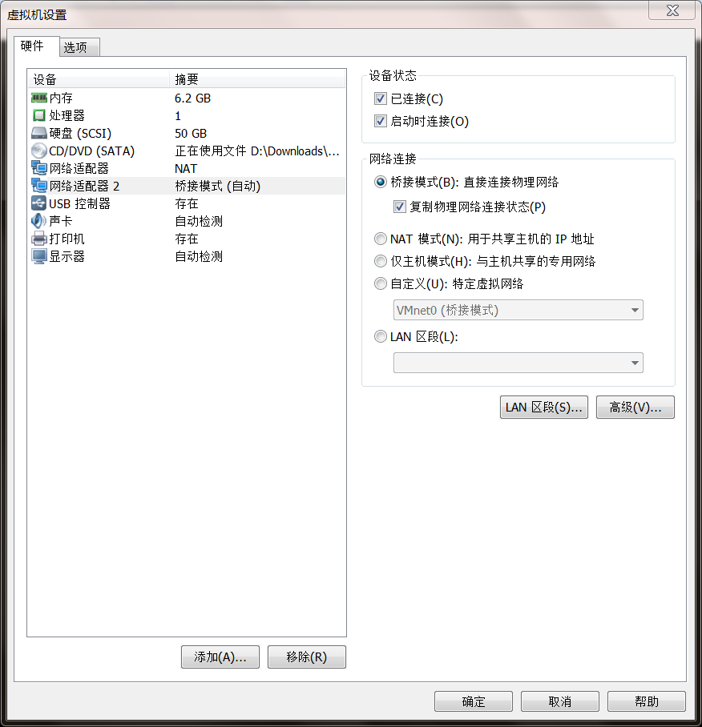
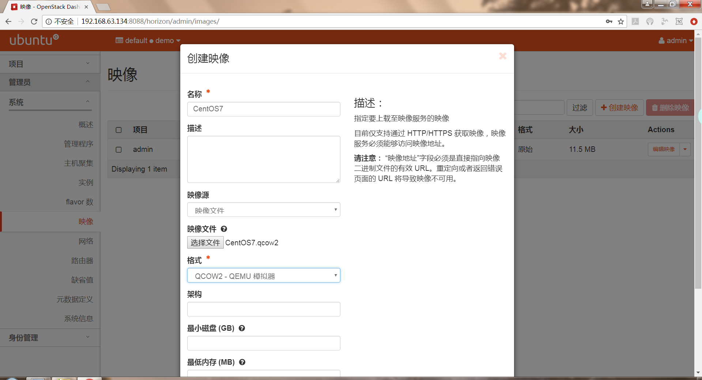

# 操作文档_4
## 1. 虚拟网络部分配置
### 1.1. 虚拟机网卡配置
>eth0采用NAT模式，eth1（作为外部网络的网卡）采用桥接模式。如下所示：

 

 

>查看网卡信息：

 

### 1.2. OpenStack网络配置
>外部网络信息：

 

>说明：因为外部网络的网卡采用桥接模式，所以网关IP信息（192.168.199.1）应由物理主机的网络信息获得：

 

>网络拓扑情况：

 

### 1.3. 云主机ping外网
>云主机信息：

 

>尝试ping百度：

 

### 1.4. 从外网连接云主机
>云主机绑定一个浮动IP：

 

>使用SecureCRT通过SSH连接云主机：

 

 

## 2. 镜像制作（CentOS7）
### 2.1. 获取镜像并启动一个KVM虚拟机实例（在3号端口开放VNC服务）
 

### 2.2. 在物理主机连接远程实例并完成安装
 

 

 

 

>完成安装后重启（-boot c）

 

>再做点简单配置：

 

 

>进入系统：

 

>创建一个文件，文件内容写入小组的branch名称：

 

### 2.3. 创建镜像
 

### 2.4. 验证
 

## 3. 安装云桌面
### 3.1. 根据文档完成安装
 

### 3.2. 查看服务状态
 

### 3.3. 验证
 

 

## 贡献度
>各自的文档
