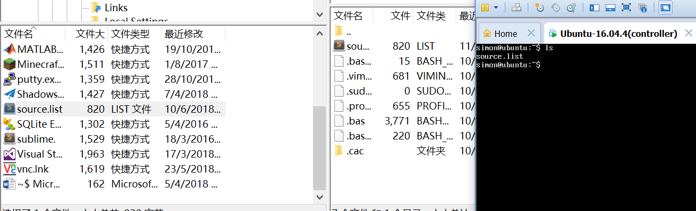
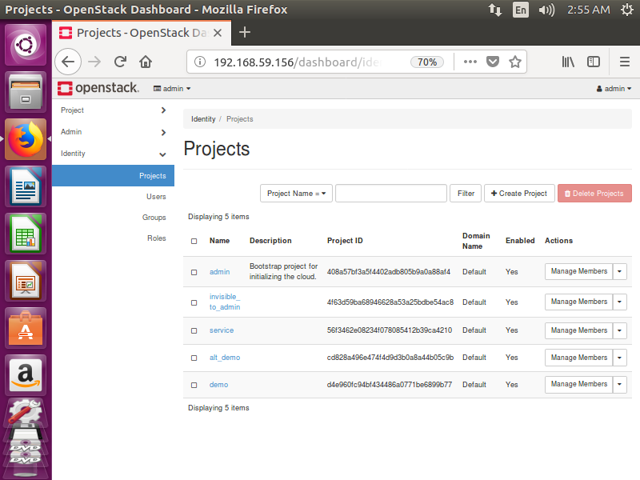

# OK,i need to install Openstack again because Vindesk do not support CentOS!
# I thought automatic installation will be a good chooise to reduce my workload, but...
# 1 Environment
-	VMware 10.0.7
-	System:ubuntu-16.04.3-server-amd64.iso  
(http://old-releases.ubuntu.com/releases/16.04.3/ubuntu-16.04.3-server-amd64.iso)
# 2 Before installation
## 2.1 Stop the firewall
- Commanded “sudo ufw disable” to stop firewall
- It is suitable that stop firewall to prevent it stop some operations when we installation and using Devstack/Openstack.
## 2.2 Set the static IP address
- Added above content in “/ete/network/interfaces”:
  ```
  auto ens33
  iface ens33 inet static
  address “your IP address”
  netmask 255.255.255.0
  gateway “your gateway”
  dns-nameservers 223.5.5.5 223.6.6.6
  ```
 
## 2.3 Download Openssh
- Commanded “sudo apt-get install openssh-server”
## 2.4 Changed the source of apt
- Some time, we get a low download speed in foreign source. Change source to domestic source can promote download speed.
- Commanded “cd /etc/apt/”
Commanded “cp source.list sources.list.bak” to back up the original source
- Create file source.list in your physical machine and copy above content to the file:  
  ```
  # 默认注释了源码镜像以提高 apt update 速度，如有需要可自行取消注释
  deb https://mirrors.tuna.tsinghua.edu.cn/ubuntu/ xenial main restricted universe multiverse
  # deb-src https://mirrors.tuna.tsinghua.edu.cn/ubuntu/ xenial main restricted universe multiverse
  deb https://mirrors.tuna.tsinghua.edu.cn/ubuntu/ xenial-updates main restricted universe multiverse
  # deb-src https://mirrors.tuna.tsinghua.edu.cn/ubuntu/ xenial-updates main restricted universe multiverse
  deb https://mirrors.tuna.tsinghua.edu.cn/ubuntu/ xenial-backports main restricted universe multiverse
  # deb-src https://mirrors.tuna.tsinghua.edu.cn/ubuntu/ xenial-backports main restricted universe multiverse
  deb https://mirrors.tuna.tsinghua.edu.cn/ubuntu/ xenial-security main restricted universe multiverse
  # deb-src https://mirrors.tuna.tsinghua.edu.cn/ubuntu/ xenial-security main restricted universe multiverse
  
  # 预发布软件源，不建议启用
  # deb https://mirrors.tuna.tsinghua.edu.cn/ubuntu/ xenial-proposed main restricted universe multiverse
  # deb-src https://mirrors.tuna.tsinghua.edu.cn/ubuntu/ xenial-proposed main restricted universe multiverse
  ```  
  (https://mirrors.tuna.tsinghua.edu.cn/help/ubuntu/)
- Translated source.list to virtual machine through FileZilla(make sure the openssh server opening)
  
- Commanded ”mv source.list /etc/apt/source.list” to cover the original file  
  Commanded ”sudo apt-get update” to update the source
## 2.5 Download pip
- Commanded ”sudo apt-get install python-pip” to download pip  
  Commanded ”sudo pip install –upgrade pip” to upgrade pip
## 2.6 Changed the source of pip
- Commanded “mkdir /root/.pip”  
  Commanded “vi /root/.pip/pip.conf” to create file and adds above content to the file:
  ```
  [global]
  index-url = http://pypi.douban.com/simple/
  trusted-host = pypi.douban.com
  ```
## 2.7 Download git
- Commanded ”sudo apt-get install git”
## 2.8 Created user “stack”
- Commanded “sudo useradd -s /bin/bash -d /opt/stack -m stack” to create a separate user “stack”  
  Commanded “echo "stack ALL=(ALL) NOPASSWD: ALL" | sudo tee /etc/sudoers.d/stack” to give “stack” sudo privileges
# 3 Download and configurate Devstack
## 3.1 Download devstack
- Commanded “sudo su - stack” change to user “stack”  
  Commanded “git clone https://git.openstack.org/openstack-dev/devstack -b stable/pike” to down devstack.
## 3.2	Created conf file local.conf
- Commanded “cd devstack/” enter the directory  
  Commanded “vi local.conf” to create the conf file and write above content:
  ```
  [[local|localrc]]
  GIT_BASE=http://git.trystack.cn
  NOVNC_REPO=http://git.trystack.cn/kanaka/noVNC.git
  SPICE_REPO=http://git.trystack.cn/git/spice/spice-html5.git

  RECLONE=True

  HOST_IP=”your IP address”

  DATABASE_PASSWORD=”any password”
  ADMIN_PASSWORD=”any password”
  SERVICE_PASSWORD=”any password”
  SERVICE_TOKEN=”any password”
  RABBIT_PASSWORD=”any password”
  ```
## 3.3	Changed file stackrc
- Some tine git protocol will blocked by environment
- Commanded “vi devstack/stackrc” to modify the file:
  ```
  from “GIT_BASE=${GIT_BASE:-git://git.openstack.org}”
  to    “GIT_BASE=${GIT_BASE:-https://git.openstack.org}”
  ```
 
# 4 Installation
## 4.1 Installation
- Commanded “cd devstack/”
- Commanded “./stack.sh” to begin install
- The time of installation during 1h to Nh depends on your network speed 
- login Openstack through Firefox  
  
## 4.2 Problems
- You will meet many problems during installing, many cased by network
- Some time, repeated run “./stack.sh” can solve problem
- “git call failed” is a frequent error during installation, repeat run “./stack.sh”
- Deleted all directory under user “stack” and redownload devstack is another way to solve problem
- Good luck and fuck devstack!!

