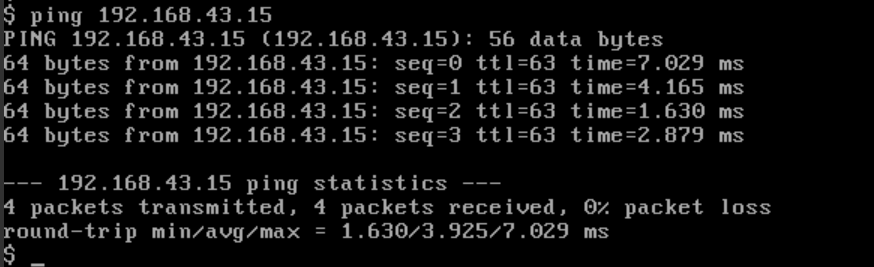

# 任务4
## 子任务1：镜像制作
### 本地制作Centos镜像并在内创建一个文件
- 按任务3的操作，在本机上创建镜像文件
- 在创建的镜像文件中创建一个小组branch名的文件
  

### 上传镜像至Openstack，并创建实例
- 将创建的镜像文件上传至Openstack
  
- 创建实例
  

## 子任务2：虚拟网络部分配置（基于OVS设置）
### 实验前准备
#### 增加桥接adapter
- 为实验虚拟机添加桥接adapter，作为Neutron外部网络连接的网卡
    
- 输入如下命令配置网卡信息：  
  ```
  sudo vi /etc/network/interfaces
  ```
    
#### 查看ovs的映射关系
- 输入如下命令查看ml2配置
  ```
  vi /etc/neutron/plugins/ml2/ml2_conf.ini
  ```  
    
  可以看到public:br-ex，public与br-ex对应起来  
#### attached外部网卡到br-ex桥
- 输入如下命令将eth1 attached到OVS外部网桥上面
  ```
  sudo ovs-vsctl add-port br-ex eth1
  ```  
    
  这样我们创建的Neutron外部网络就会透过br-ex，与物理网卡eth1相接了
#### 查看eth1网络信息
- 物理机必须要连接到个人路由器上（手机热点）
- 如果连接公共wifi（学校wifi），是不允许我们获取一段ip地址作为内部使用
- 查看主机的网络信息
    
  设置的Neutron外网要与这些信息相对应  

### 创建内外网络
- 创建flat类型的外部网络ext_net，并选择public（br-ex）
    
- 这里可以看到，外网的网段必须要跟我们的主机相同（因为这张网卡选的是桥接其实就是跟我们的路由器一致了）
- 创建vxlan类型内部网络vxlan1及vxlan2（网段随便设置）
    
- 创建router连接三个网络
    
- 查看路由器的信息
    
   外网ext_net的网关设在router1上：192.168.43.12  
   内网vxlan1及vxlan2透过接口192.168.59.2及10.0.0.1接在路由器上了  
- 增加security group：加入icmp及shh（允许ping及远程连接）
  
 
### 创建instances，认证各网络的连通性
- 分别在vxlan1创建test1及vxlan2创建test2，并分配floating ip
  
- 输入如下命令查看OVS桥的信息
  ```
  sudo ovs-vsctl show
  ```  
    
    
- 网络的逻辑结构
  
- instances间互ping
  
  
- instance ping物理主机
  
- 物理主机ping instance
  
- 利用putty进行远程登录instance
  

## 子任务3：安装云桌面
### 部署Vindesk
