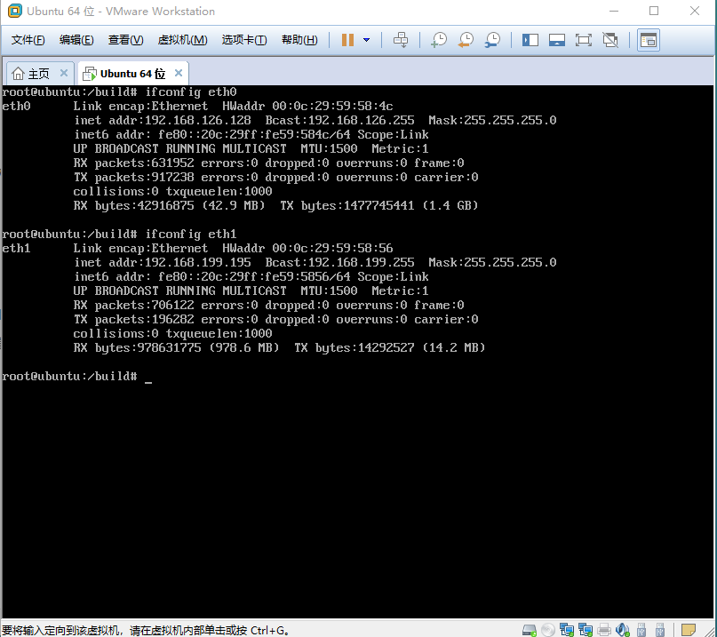

## 操作文档

### 1.虚拟网络部分配置

- 虚拟机实例能够ping通外网

  虚拟机配置两张网卡，eth0采用NAT模式，eth1桥接到物理机上的无线网卡上。

  

  网络配置如下：

  

  外部网络配置：

  

  路由器配置：

  

  实例ping通外网(右图为获得的百度ip，左图为实例ping通百度的例子)

  

  ​

- 能够用xshell或者putty或者ssh命令来连接实例

  有点困惑的是，我使用xshell6来连接实例，总是无法连接，报错为服务器发送了一个无效的主机密钥。网上没有很好的解决方式，尝试了很久也不知道如何解决。

  

  但使用ssh命令可以连接

  

### 2.镜像制作

- 制作一个centos的镜像，镜像中创建一个文件，文件内容写入小组的branch形成

  由于上次作业中提到了部分制作过程，因此下面只给出图片予以支持

  

  

  

- 要求开机就能启动镜像，无须重复安装过程，并且开启实例后可以看到之前创建的文件

  （制作镜像的时候忘记截图了，只留下实例中文件存在的记录)

  

### 3. 安装云桌面

- 提供vindesk部署安装包，根据安装文档来安装

  按照文档所提示进行安装

  

- 安装完成无报错，并且能够打开系统并截图

  由于起初为节省资源，下载了centos的最小安装版本，没有GUI界面。。。所以在实例里安装GUI界面异常缓慢。

  

  然后遭遇了。。未知的结果

  

  打算下周下载完整的centos7镜像来安装

  ​

