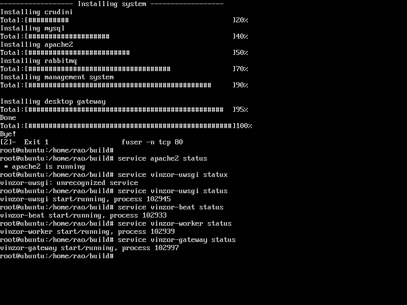
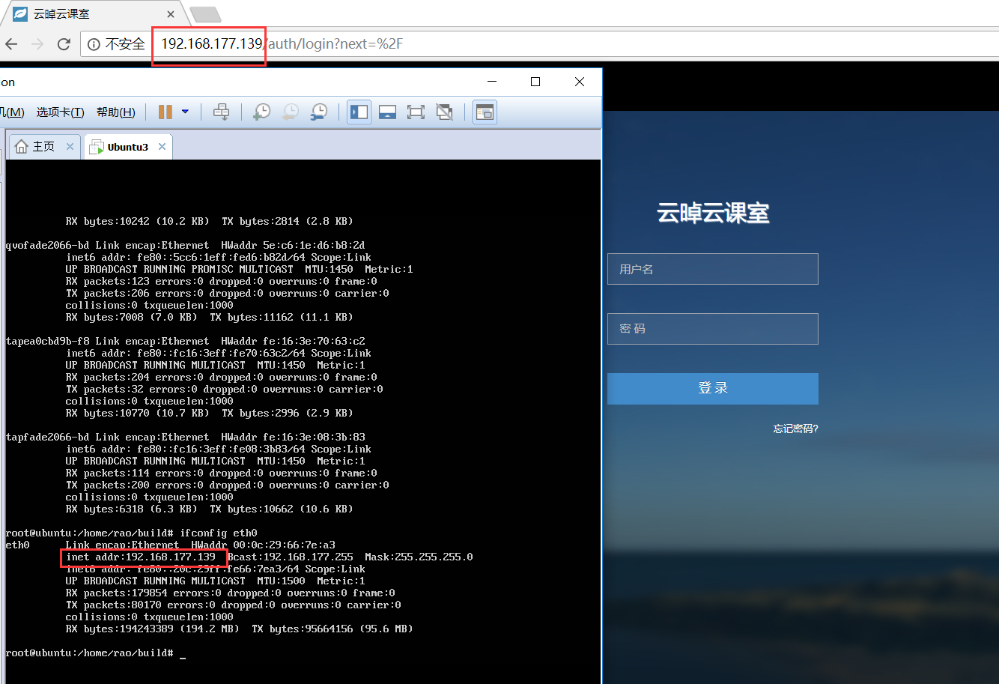
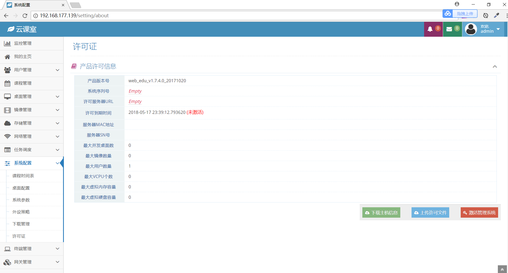
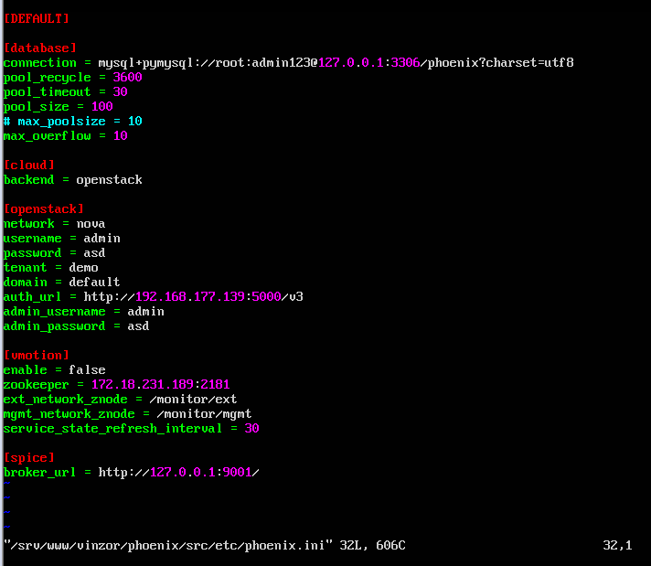

* [子任务1：虚拟网络部分配置](#子任务1)
* [子任务2：镜像制作](#子任务2)
* [子任务3：安装云桌面](#子任务3)

<h1 id="子任务1">子任务1：虚拟网络部分配置</h1>

虚拟机实例能够ping通外网 
能够用xshell或者putty或者SSH命令来连接实例 

## 1、设置外部网卡

- 设置外部网卡的网络连接方式为桥接模式

- 外部网卡的ip信息：

- 主机网络的ip信息：

## 2、配置外部网络

- 创建外部网络

- 配置外部网络的子网信息

## 3、创建私有网络

- 创建私有网络并完成配置配置私有网络的子网信息

- 配置私有网络信息

## 4、创建实例

- 启动实例并配置

- 为实例分配浮动ip

## 5、创建路由器
- 创建路由器并为路由器配置接口

## 6、检验实例

- 启动实例可以ping通外网：

- 启动xshell可以成功登陆：

<h1 id="子任务2">子任务2：镜像制作</h1>

制作一个centos或者ubuntu或者windows镜像，镜像中创建一个文件，文件内容写入小组的branch名称 
要求开机就能启动镜像，无需重复安装过程，并且开启实例后可以看到之前创建的文件 

制作净镜像的过程和之前的步骤是一样的，就不再赘述了。 
制作镜像完整过程：[task3部署文档](https://github.com/CourseCloudDesktop/cloudDesktop/blob/yxf-develop/task3/%E6%93%8D%E4%BD%9C%E6%96%87%E6%A1%A3.md)

可以发现最终的结果是在实例中可以发现之前创建的镜像：

<h1 id="子任务3">子任务3：安装云桌面</h1>

提供vindesk部署安装包，根据安装文档来安装 
安装完成无报错，并且能够打开系统并截图即为任务成功 

### 编辑localrc参数后运行 `./run.sh`
五分钟之后，安装成功。  
安装成功后检查管理系统服务状态。

### 在浏览器地址栏中输入控制节点IP

我们装的是allinone，控制节点和计算节点都在同一台服务器上。  
服务器IP为 `192.168.177.139`

输入用户名和密码： 
用户名`admin`，密码`admin123` 
点击进入云课室“我的主页”。

查看许可证。 
忽略“激活管理系统”部分。

修改系统配置文件。 

# 分工与贡献

两个人都完成了task4三个子任务的部署。部署文档是分工合作的。
