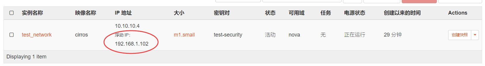
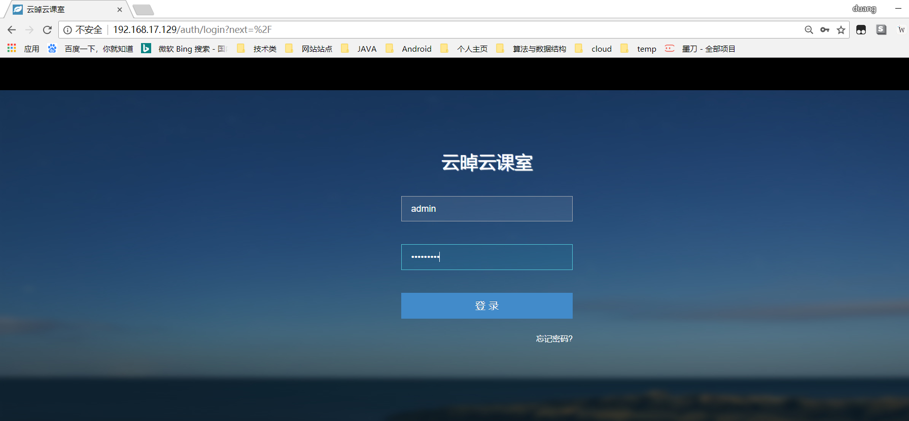

# task4部署文档

## 子任务1：虚拟网络部分配置

### 将外部网卡的网络适配器设置为桥接模式，保证外部网卡和物理机位于同一网段


物理机网络信息：


虚拟机外部网卡网络信息：


### 虚拟机的网卡网络设置如下，然后重启
```
auto eth0
iface eth0 inet static
address 192.168.17.129
netmask 255.255.255.0
gateway 192.168.17.2
dns-nameservers 10.8.8.8

auto eth1
iface eth1 inet dhcp
```

### 在openstack的 `horizon`中新建一个外部网络，是外部网络和`eth1`位于同一个网段


### 创建实例后为该实例关联一个上面创建外网的浮动IP



### 连接测试1：ping外网，成功


### 连接测试2：ssh登录，成功


## 子任务2：镜像制作

> 制作一个`ubuntu desktop 14.05`的镜像
> 
> 使用 `ubuntu-14.04.5-desktop-amd64.iso`

### 首先创建一个空镜像, 作为系统盘，查看其信息


### 将 `ubuntu-14.04.5-desktop-amd64.iso`通过`winscp`上传到虚拟机中，然后执行x系统安装，注意我操作的时候是把`iso`文件和创建的`qcow2`放在同一个目录下的。


### 在物理机安装vnc viewer软件，执行安装操作


### 安装好之后创建了一个`poi-develop`的文件


### 使用vnc viewer软件安装完系统之后再使用`winscp`将原目录下的`qcow2`文件传输到物理机，作为openstack安装实例的镜像，然后使用该镜像创建一个实例


### 实例创建好之后打开控制台，在无需再安装的情况下登入系统，可以看到之前使用vnc viewer创建的`poi-develop`文件


## 子任务3：安装云桌面
### 使用`winscp`将文件传输到虚拟机，设置好相关的参数之后执行'run.sh'运行安装脚本


### 检查管理系统服务状态


### 在浏览器窗口输入控制节点IP，访问云桌面


### 使用用户名`admin`、密码`admin123`登录


### 先创建好一个课程，这里可以到会使用到openstack上的一些配置


### 然后在操作中开始这节课，就可以创建一个课程桌面


## 小组成员贡献度
小组三个人一起参与完成的。