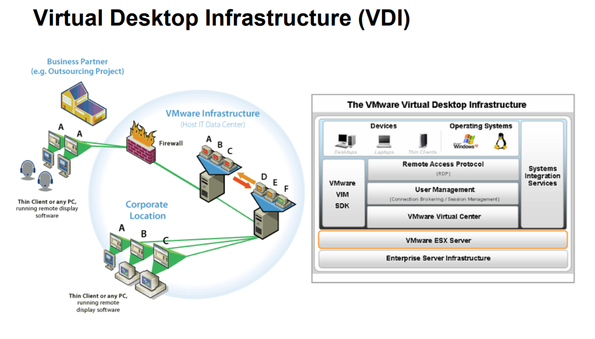
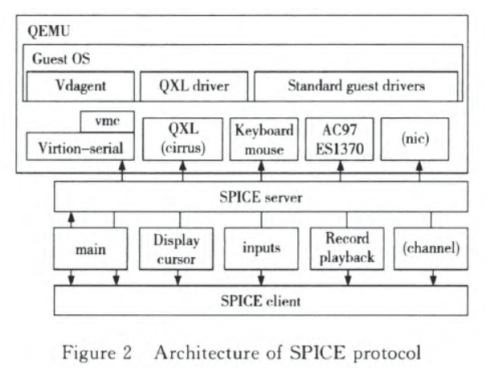
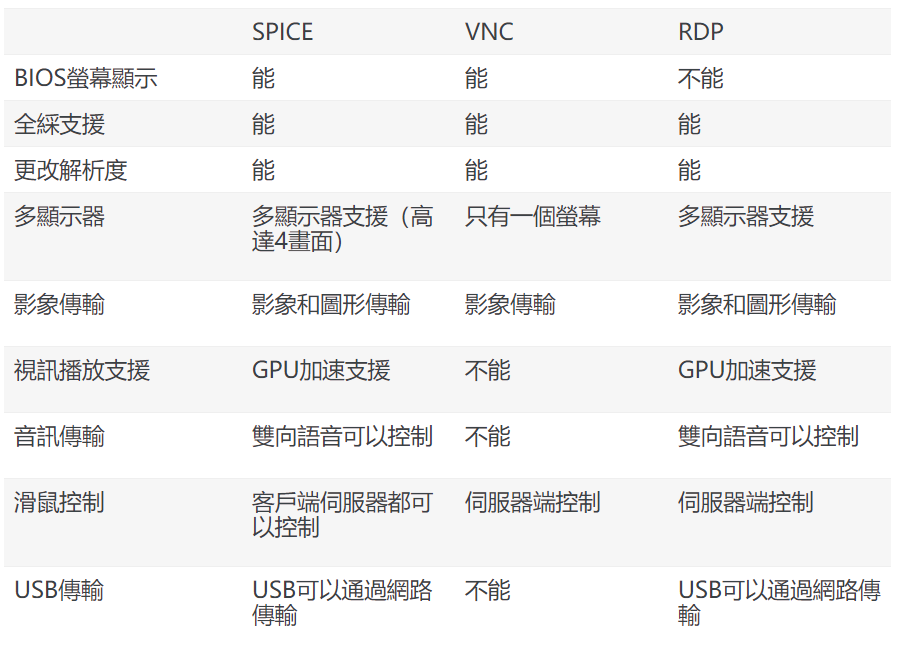
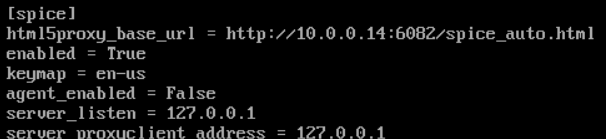

# 云桌面背景知识

## VDI概念解释以及实现原理
 
### VDI概念
即虚拟桌面基础架构，虚拟桌面架构采用"集中计算，分布显示"的原则，通过虚拟化技术，将所有客户端的运算合为一体，在企业数据中心内进行集中处理，而桌面用户采用瘦客户端或专用小型终端机的方式，仅负责输入输出与界面显示，不参与任何计算和应用。它不是给每个用户都配置一台运行 Windows XP 或 Vista 的桌面PC，而是通过在数据中心的服务器运行 Windows XP，将你的桌面进行虚拟化。
### VDI好处
- 没有兼容性方面的问题。在实际中，并不是所有的应用都与终端服务相兼容。在VDI环境下，每个用户虚拟机就是一个单独的工作站，因此你不用担心应用与终端服务的兼容性问题。
- 更好的安全性。由于每个用户都有自己独立的Windows XP虚拟机，所以你不必为加固用户session而担心。如果其中一个用户出错，不会影响到其他的用户。
- 后端服务器的可移植性。在VDI中，系统是建立在虚拟机技术之上的，你可以“暂停”单个虚拟机，然后将其从一台服务器移到另一台服务器上。这在维护系统时将会很方便。
- 降低运维成本，提高可管理性。在传统的公司中，每个员工都有自己的办公PC，这种分布式架构给IT工程师的维护工作带来很多不便。使用桌面虚拟化，所有桌面操作系统集中在服务器，方便管理，为员工分配一个新的 PC工作变成了仅仅需要部署一台新的虚拟机，并升级系统的操作可能变成了仅需要替换虚拟机模板；而且，服务器的故障率远低于普通PC，增加了桌面操作系统的稳定性。

## 实现的协议介绍（spice、vnc、rdp），进行对比
### 协议简介
#### spice
- SPICE是redhat开发的开源的专门的桌面虚拟化数据传输协议。 
- SPICE架构包括客户端、SPICE服务端和相应的QXL设备、QXL驱动等，如下图所示。客户端运行在用户终端设备上，为用户提供桌面环境。SPICE服务端以动态连接库的形  式与KVM虚拟机整合，通过SPICE协议与客户端进行通信。
    
#### vnc
- vnc是linux下用來訪問远程桌面的一种协议
- vnc是一种C/S架构的协议，所以需要客户端和服务端同时执行，在服务端监听5800,5801，5901等多个可能的端口，而客户端只需要向sever端发起连接请求，并输入账号密码即可访问
#### rdp
- rdp远程桌面协议，是一个多通道的协议，用户可用此协议连上提供微软终端机服务的电脑
### 协议对比
  
#### vnc
- 適用系統：windows、Linux
- 網路流量：較小，常用100k左右
- 適用場景：主要用於linux的伺服器的管理，由於無聲音和usb傳輸，不滿足於虛擬桌面的使用
#### spice
- 適用系統：linux
- 網路流量：較大，正常使用10-20M
- 適用場景：由於在色彩、音訊和usb方面，適用於虛擬桌面，主要用於虛擬機器的虛擬桌面應用
#### rdp
- 在windows上 rdp有兩種，remote，remotefx
- 適用系統：windows、linux
- 網路流量：較小，正常使用100-200k左右
- 適用場景：由於在色彩、音訊、usb及本地磁碟對映方面較好，非常適用於虛擬桌面

## 集成脚本修改了什么配置文件导致控制台可以直接用spice而不是用vnc？（请给出相关的配置文件截图）
- 打开nova.conf文件
     
  发现vnc_enabled=False  
- 查看SPICE的配置
     
  发现enabled = True
