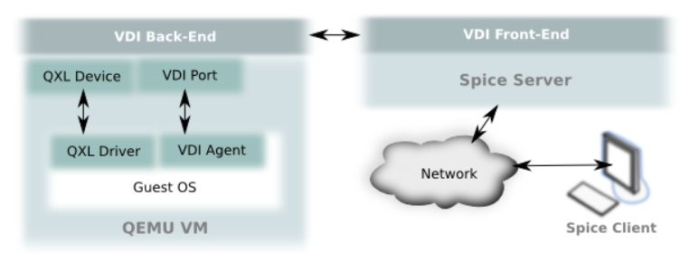
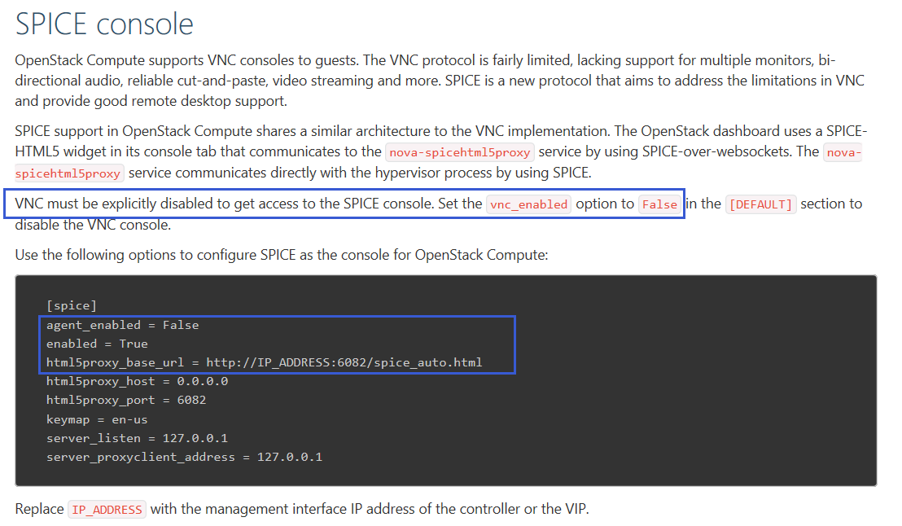

# 项目周报

项目名称：基于openstack的云桌面项目</br>
填写人：饶宇熹</br>
项目阶段：（5.27-6.08）云桌面系统功能体验</br>


## 本周具体工作计划

**云桌面系统功能体验**(小组，在操作文档中体现)
- 创建固定桌面
- 创建一个课程，并创建一个对应的课程桌面，课程名称请命名为自己的分支

**了解云桌面相关背景知识**(个人，在学习周报中体现，作为本次评分重点，请认真自学，不要复制黏贴)
- VDI概念解释以及实现原理（个人理解总结、工作流程，如果通过画图来体现，最好自己画图）
- 实现的协议介绍（spice、vnc、rdp），进行对比
- 集成脚本修改了什么配置文件导致控制台可以直接用spice而不是用vnc？（请给出相关的配置文件截图）


## 主要工作内容记录 

###  云桌面系统功能体验
详见[task5小组操作文档](https://github.com/CourseCloudDesktop/cloudDesktop/blob/yxf-develop/task5/操作文档.md)


### 了解云桌面相关背景知识

#### VDI概念解释以及实现原理

> VDI，英文全称Virtual Desktop Infrastructure，即虚拟桌面基础架构。
 
> 虚拟桌面架构采用"集中计算，分布显示"的原则，通过虚拟化技术，将所有客户端的运算合为一体，在企业数据中心内进行集中处理，而桌面用户采用瘦客户端或专用小型终端机的方式，仅负责输入输出与界面显示，不参与任何计算和应用。

比方说，VDI通过在数据中心的服务器运行Linux的，将你的桌面进行虚拟化。用户通过来自客户端设备（客户机或是家用PC）的客户计算协议与虚拟桌面进行连接，用户访问他们的桌面就像是访问传统的本地安装桌面一样。于是就不需要给每个用户都配置一台运行Linux的桌面PC。


1. 实现原理

大致流程：</br>
①用户通过VDI proxy请求一个桌面</br>
②VDI proxy从计算节点里寻找空闲桌面</br>
③如果有空闲桌面，计算节点将空闲桌面和用户数据返回给VDI proxy</br>
④VDI proxy将用户数据与桌面进行连接</br>
⑤VDI proxy将生成好的带用户数据的桌面返回给用户</br>

画了个示意简图：


2. 实现协议

有三种：

* spice
* vnc
* rdp


#### 实现的协议介绍（spice、vnc、rdp），进行对比

**1.spice**

从https://www.spice-space.org/ 上拉下来的spice架构示意图。



SPICE可分为4个不同的部分：协议、客户端、服务器和客户。</br>
协议是其他三个组件通信的规范。</br>
客户端运行在用户终端设备上，为用户提供桌面环境。客户端负责发送数据并将数据从虚拟机中传输出来，以便与之交互。</br>
SPICE服务端以动态连接库的形式与KVM虚拟机整合，通过SPICE协议与客户端进行通信。</br>
最后，客户机端是虚拟机中运行的所有软件，例如QXL驱动程序和SPICE VDAgent。


**2.vnc**

VNC(Virtual Network Computing)是基于RFB（Remote Frame Buffer）协议进行通信的，
是一个基于平台无关的简单显示协议的瘦客户系统。

VNC主要是由两部分组成的：VNC server和VNC viewer。用户需先将 VNC server安装在被远程操控的计算算机上后，才能在主控端执行VNC viewer 进行远程操控。 

VNC适用场景：主要用于Linux的服务器的管理，由于无声音和usb传输，不满足于虚拟桌面的使用。

VNC工作流程
（1） 在服务器端启动 VNC Server。</br>
（2） VNC客户端通过浏览器或 VNC Viewer 连接至VNC Server。</br>
（3） VNC Server传送一对话窗口至客户端，要求输入连接密码， 以及存取的VNC Server显示装置。</br>
（4） 在客户端输入联机密码后，VNC Server验证客户端是否具有存取权限。</br>
（5） 若是客户端通过 VNC Server 的验证，客户端即要求VNC Server显示桌面环境。</br>
（6） VNC Server通过X Protocol 要求X Server将画面显示控制权交由VNC Server负责。</br>
（7） VNC Server将来由 X Server 的桌面环境利用VNC通信协议送至客户端， 并且允许客户端控制VNC Server的桌面环境及输入装置。

**3.rdp**

RDP，远程显示协议（Remote Display Protocol），用于终端服务器和终端服务器客户端之间的通信。RDP 被封装并在 TCP 加密。 


#### 集成脚本修改了什么配置文件导致控制台可以直接用spice而不是用vnc？（请给出相关的配置文件截图）

1. [OpenStack官网](https://docs.openstack.org/nova/pike/admin/remote-console-access.html)介绍的配置过程：（哇找了好久，隐藏很深）



查看集成脚本中的`nova.conf`，看看是否和官网的配置相对应。


在vim里面```/vnc```和```/spice```定位到和vnc、spice有关的部分。


可以看到，[spice]的部分和官方建议的配置大体上是一致的。


2. 再对比一下用devstack部署的OpenStack下的`nova.conf`。


3. 总结来说，集成脚本修改了`nova.conf`配置文件中的以下部分：

```
# 必须显式地令 vnc_enabled=False，否则即使配置了spice，系统也仍然使用vnc
vnc_enabled = False

[spice]
# 主要是改以下三项
agent_enabled = False
enabled = True
html5proxy_base_url = http://IP_ADDRESS:6082/spice_auto.html
...


```


参考：[Better Me的博客](https://blog.csdn.net/tantexian/article/details/38728229)


**推荐一个MOOC**

李明宇的[OpenStack云平台实践](https://tsk.gaoxiaobang.com/#/courses/detail/14221)


