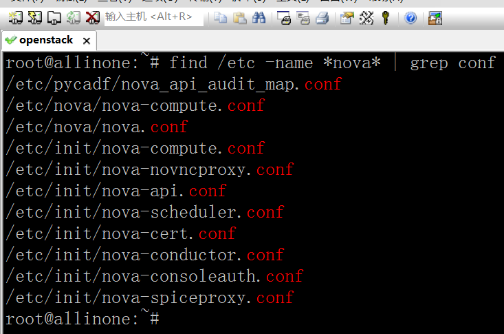
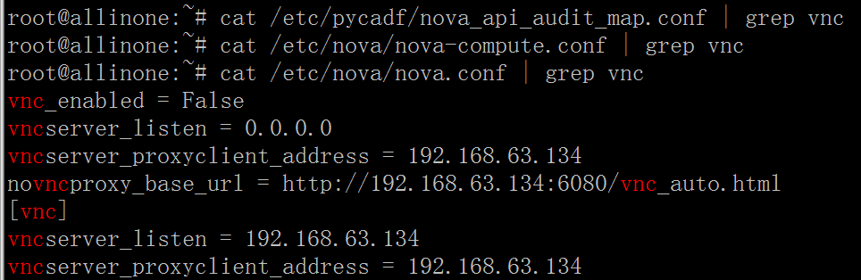
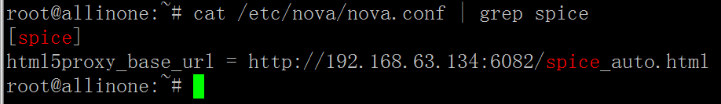
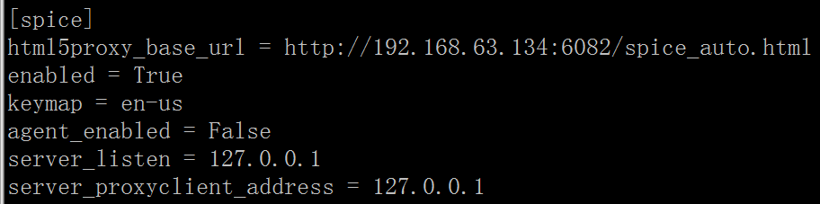

# 学习周报_5
## 本周具体工作计划
### 任务1：云桌面系统功能体验
- 创建固定桌面
- 创建一个课程，并创建一个对应的课程桌面，课程名称请命名为自己的分支

### 任务2：了解云桌面相关背景知识
- VDI概念解释以及实现原理（个人理解总结、工作流程，如果通过画图来体现，最好自己画图）
- 实现的协议介绍（spice、vnc、rdp），进行对比
- 集成脚本修改了什么配置文件导致控制台可以直接用spice而不是用vnc？（请给出相关的配置文件截图）

## 本周主要工作内容
### 已完成工作
### 任务1：云桌面系统功能体验
见操作文档

### 任务2：了解云桌面相关背景知识
### 1. VDI概念解释以及实现原理
### 1.1. 概念解释
>虚拟桌面基础架构（Virtual Desktop Infrastructure, VDI）将桌面环境和相关应用软件与用于访问它的物理客户端设备分离。VDI在数据中心的服务器上为每个用户（个人或特定群体）准备其专用的虚拟机并在其中部署用户所需的操作系统和应用。用户的客户端设备通过桌面显示协议（spice、vnc、rdp等）与虚拟桌面进行连接。用户操作虚拟桌面的方式与操作传统的本地桌面没有区别。

### 1.2. 实现原理（工作流程）
- 用户通过客户端设备向“桌面管理架构”请求桌面；
- “桌面管理架构”在“底层架构”（计算结点集群）寻找空闲桌面；
- 计算结点返回所请求的空闲桌面；
- 数据库服务器返回用户数据；
- “桌面管理架构”用用户数据来渲染桌面；
- “桌面管理架构”将渲染好的桌面返回给客户端设备。

### 2. 实现的协议介绍（spice、vnc、rdp），进行对比
### 2.1. SPICE
>SPICE（Simple Protocol for Independent Computing Environment）架构包括SPICE客户端、SPICE服务端和相应的QXL设备、QXL驱动等。SPICE客户端运行在用户终端设备上，为用户提供桌面环境。SPICE服务端以动态连接库的形式与KVM虚拟机整合，通过SPICE协议与客户端进行通信。QXL设备部署在KVM服务器虚拟化的Hypervisor中，用于处理各虚拟机发来的图形图像操作。QXL驱动部署在服务器侧、提供虚拟桌面服务的虚拟机中，用于接收操作系统和应用程序的图形命令，并将其转换为KVM的QXL图形设备命令。SPICE agent运行在客户机（虚拟机）操作系统中。SPICE服务端和SPICE客户端利用SPICE agent来执行一些需要在虚拟机里执行的任务。

### 2.2. VNC
>VNC（Virtual Network Computing）系统由客户端，服务端和一个协议组成。VNC的服务端目的是分享其所运行机器的屏幕，服务端被动的允许客户端控制它。VNC客户端（或Viewer）观察控制服务端，与服务端交互。VNC协议Protocol（RFB）是一个简单的协议，传送服务端的原始图像到客户端（一个X, Y位置上的正方形的点阵数据），客户端传送事件消息到服务端。

### 2.3. RDP
>RDP（Remote Desktop Protocol）是一个多通道（multi-channel）的协议。多通道技术通过在客户端和服务端之间增加更多通道来增加数据传输速率的技术。理论上这将数据速率乘以存在的通道数量。RDP让用户（客户端或称“本地电脑”）连上提供微软终端机服务的电脑（服务器端或称“远程电脑”）。大部分的Windows都有客户端所需软件。其他操作系统也有这些客户端软件，例如Linux、FreeBSD、Mac OS X。服务端电脑方面，则监听送到TCP 3389端口的数据。

### 2.4. 对比
1. SPICE和VNC能显示BIOS屏幕，而RDP不能。
2. SPICE和RDP支持多显示器，而VNC只有一个屏幕。
3. 对于视频播放，SPICE和RDP支持GPU加速，而VNC不支持。
4. 对于音频传输，SPICE和RDP可以控制双向语音，而VNC不能。
5. 对于鼠标控制，SPICE客户端和服务端都可以控制，而VNC和RPD就服务端可以控制。
6. 对于USB传输，SPICE和RDP可以通过网络传输USB，而VNC不能。

### 3. 集成脚本修改了什么配置文件导致控制台可以直接用spice而不是用vnc？（请给出相关的配置文件截图）
### 3.1. 定位到组件
>OpenStack有好几个组件，不同的组件都有自己的配置文件。所以首先应该定位是哪个组件在控制桌面显示协议。稍微了解过OpenStack的工作流程就不难发现，除了Keystone外，客户端只与Nova直接通信，其他组件通过Nova与客户端间接通信。在这种情况下，桌面显示协议的配置信息放在Nova是比较合理的。

### 3.2. 搜索配置文件
>Linux下的配置文件多放在/etc目录下，OpenStack的配置文件一般以.conf结尾。结合这两点来进行搜索：

>按顺序查找：

>初步认定配置文件是nova.conf文件。

### 3.3. 验证

>现在可以认定配置文件就是nova.conf文件。

### 3.4. 查看配置信息

>修改该配置项目可以开启SPICE，同时也要记得关闭VNC，这样，控制台就可以直接用SPICE而不是用VNC。 
注：[default]配置项可以不用管，它只是设置缺省的配置。[default]的配置信息会被下面其他配置项里的配置信息覆盖。

### 未完成工作
无

### 问题与困难
无

## 下周工作计划
未分配

## 建议与意见（如有）
>希望能够提供一些可靠的学习资料（高质量的博客、官方白皮书、相关的书籍等）。因为对于某些相对不是很常见的技术，网上的博客很多都是互相抄来抄去，翻来覆去实际上就那几个版本而且多数都是解释的不怎么清楚，可靠性也让人担忧。维基百科的内容也不够详尽，就比如RDP协议，维基百科上基本没有实现原理方面的内容。
