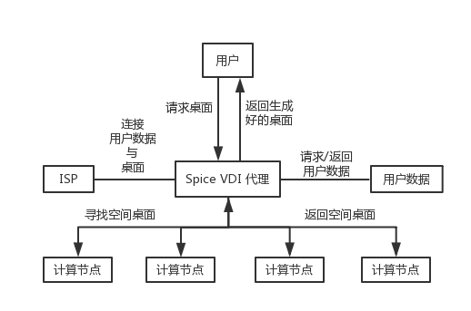

# 学习周报

## 1. 本周具体工作计划
了解云桌面相关背景知识
- VDI概念解释以及实现原理（个人理解总结、工作流程，如果通过画图来体现，最好自己画图）
- 实现的协议介绍（spice、vnc、rdp），进行对比
- 集成脚本修改了什么配置文件导致控制台可以直接用spice而不是用vnc？（请给出相关的配置文件截图）

## 2. 本周主要工作内容

### 2.1 VDI概念解释以及实现原理
- **概念**：
    虚拟桌面基础架构(Virtual Desktop Infrastructure)是将桌面环境和相关应用软件与用于访问它的物理客户端设备分离的软件技术。
- **用途**：
    VDI可以与应用程序虚拟化结合使用和用户档案管理系统，以提供一个全面的桌面环境管理系统。
- **优点**：
    VDI实现虚拟化桌面的所有组件，使桌面交付变得更灵活、更安全。因为所有组件基本都保存在数据中心并备份，这种方法支持更完整的桌面灾难恢复策略。数据不会随着用户的硬件丢失而丢失，同时，也不容易因用户设备丢失而被他人窃取数据。
- 实现原理
    
    VDI的基本原理相当于在虚拟机之前加了一层VDI Router的机制，底层协议取决于Router，Router负责拦截用户连接桌面的请求，寻找闲置的虚拟桌面，再将用户的私有数据进行还原，最后把双方连接起来。

### 2.2 实现的协议介绍
- 远程桌面协议(Remote Desktop Protocol)是一个多通道协议，让用户连上提供微软终端机服务器。终端机服务器运行的操作系统通常包含客户端所需的软件。服务端电脑则接收送到TCP 3389端口的数据。RDP曾经是windows流行的协议，但目前的趋势下spice更有前途。
- 虚拟网络计算机(Virtual Network Computing)是一款远程控制工具软件，是基于UNIX和Linux的免费的开源软件，远程控制能力强大，高效实用。
- spice包括3个组件: 
    - SPICE驱动器(SPICE Driver)：存在于每个虚拟桌面内的组件； 
    - SPICE设备(SPICE Device)：存在于红帽企业虚拟化Hypervisor内的组件； 
    - SPICE客户端(SPICE Client)：存在于终端设备上的组件，可以是瘦客户机或专用的PC，用于接入每个虚拟桌面。 

### 2.3 集成脚本修改了什么配置文件导致控制台可以直接用spice而不是用vnc
修改/etc/nova/nova.conf文件，将vnc_enabled制定为false，并配置spice
```
[default]
vnc_enabled=false
[spice]
html5proxy_host=172.16.8.100
html5proxy_port=6082
keymap=en-us
```

## 3. 下周工作计划

## 4. 建议与意见（如有）
