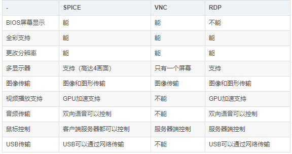
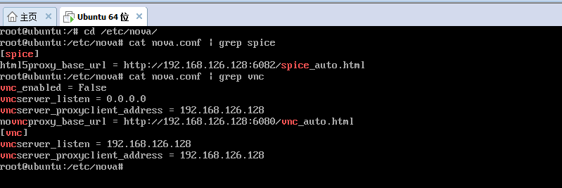
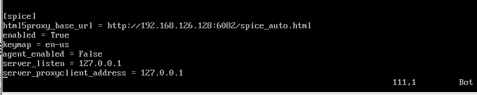

## 学习周报 5

### 本周主要工作内容

#### 1. VDI概念解释和实现原理

#### 概念解释:
VDI(Virtual Desktop Infrastructure)，即虚拟桌面基础架构，是基于早期的RDP协议和瘦客户机逐步演变而来的。VDI旨在为智能分布式计算带来出色的相应能力和定制化的用户体验，并给予服务器的模式提供管理和安全优势。能够为整个桌面映像提供集中化的管理，但同时也存在固有的一些问题：1. 因其利用硬件仿真及瘦协议，使得视频、Adobe Flash、VoIP以及其他计算或图形密集型应用不适用于该模式，而且VDI需要持久的网络连接所以不适用于离线移动性的场合。

#### 实现原理
虚拟桌面整体架构分为四层：
1. 终端接入层：用户的终端处于这个层面，虚拟桌面可以接受各种终端的接入

2. 接入网络层: 接入网络层负责保证用户安全接入，并为桌面云资源提供负载均衡

3. 桌面管理层：桌面管理层负责整个桌面系统的调度，如新虚拟桌面的注册以及将虚拟桌面的请求指向可用的系统，认证用户身份并为其授权可用的桌面，此外本层也承担负载均衡的作用

4. 资源池层： 资源池层负责对计算资源池、存储资源池、网络资源池的统一管理，按需分配部署、资源动态调度等。

#### 2. 云桌面实现的协议介绍(spice、vnc、RDP)，进行对比

1. SPICE协议(Simple protocol for independent computing environment)

SPICE架构包括客户端、SPICE服务端和相应的QXL设备、QXL驱动等。客户端运行在用户终端设备上，为用户提供桌面环境。SPICE服务端以动态链接库的形式与KVM虚拟机整合，通过SPICE协议与客户端进行通信。QXL驱动部署在服务器侧、提供虚拟桌面服务的虚拟机中，用于接受操作系统和应用程序的图形命令，并将其转换KVM的QXL图形设备命令。SPICE客户端：部署在用户终端上的软件、负责显示虚拟桌面。同时接受终端外设的输入。QXL设备：部署在KVM服务器虚拟化的Hypervisor中，用于处理各虚拟机发来的图形图像操作。SPICE协议最大的特点是其架构中添加的位于Hypervisor中的QXL设备，本质上是KVM虚拟化平台中提供软件实现的PCI显示设备，利用循环队列等数据结构提供虚拟化平台上的多个虚拟机共享实现了设备的虚拟化。核心技术包括自适应的图形处理和分类压缩技术。

2. VNC协议(Virtual Network Computing)

VNC是基于RFB(Remote Frame Buffer)协议进行通信的，是一个基于平台无关的简单显示协议的超瘦客户系统。RFB协议设计的重点在于减少对客户端的硬件需求。RFB协议对于客户端是无状态的。VNC的显示协议建立在“把像素数据放在一个由x,y定位的方框内”这单一图形基础上。客户端通过输入协议将客户端的输入发送到服务器端，经过服务器端的处理后，通过显示协议将处理的结果更新到客户端。也就是说，更新知识在服务器端相应客户端请求时发生的，这样使得协议更新质量是可变的，客户端/网络越慢，更新速度也就越慢。

3. RDP协议(Remote Display Protocol)

RDP，远程显示协议提供了客户和服务器之间的连接，是微软终端服务应用的协议，提供多通道通信，在客户端支持多种资源缓冲和图片数据的压缩处理，运用RDP协议的虚拟化平台有VMware、微软等。与远程桌面协议兼容的哭护短可以在多种操作系统上运行，许多Linux系统上将RDP客户端功能列为核心功能之一。此外，用户也不一定要有宽带网络才能连上远程电脑桌面，RDP即使在56K拨接网络下，还可以提供每秒更新5-6个画面的效果。

4. 对比

#### 3. 集成脚本修改了什么配置文件导致控制台可以直接用spice而不是用vnc？（请给出相关的配置文件截图）

寻找过程借鉴昌贵的文档。

结果如下

