# task5操作文档

项目阶段：（5.27-6.08）云桌面系统功能体验，创建固定桌面和课程 

## task4后续
task4中xshell无法登录问题已解决，启动xshell可以成功登录。 
解决方案已更新至[task4部署文档](https://github.com/CourseCloudDesktop/cloudDesktop/blob/yxf-develop/task4/部署文档.md)

## task5

**任务**
**云桌面系统功能体验**(小组，在操作文档中体现)
- 创建固定桌面
- 创建一个课程，并创建一个对应的课程桌面，课程名称请命名为自己的分支

**完成情况**

| 编号 | 工作内容 | 完成情况（％）| 备注
| :-------------- | :------------ | :------------ | :------------ |
| 1 | 创建固定桌面 | 100% | / |
| 2 | 创建课程 | 100% | / |
| 3 | 了解云桌面相关背景知识 | 100% | 见个人周报： [饶宇熹的task5个人学习周报](https://github.com/CourseCloudDesktop/cloudDesktop/blob/yxf-develop/task5/15331262_饶宇熹_学习周报.md)； [明友芬的task5个人学习周报](https://github.com/CourseCloudDesktop/cloudDesktop/blob/yxf-develop/task4/15331242_明友芬_学习周报.md) |

### 创建固定桌面过程

**1. 创建固定桌面**

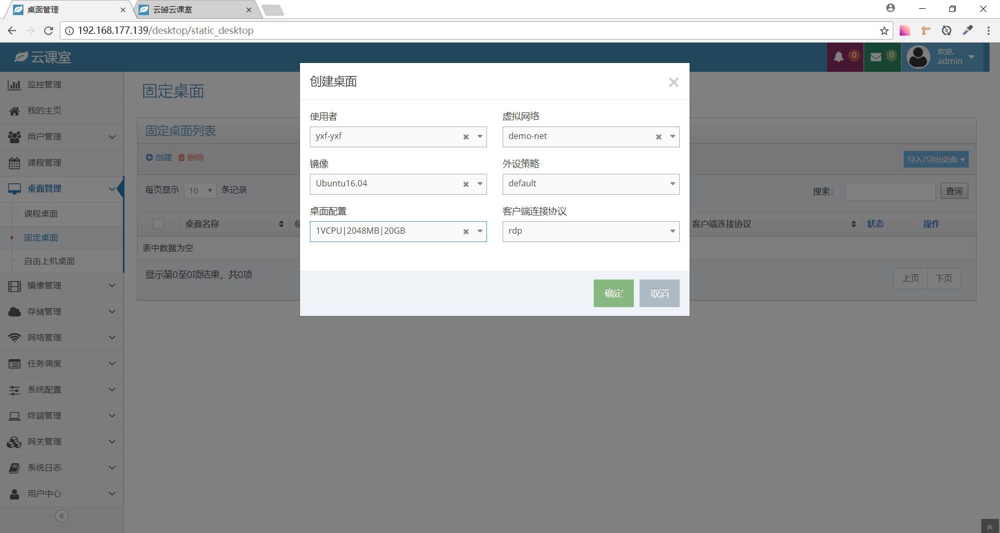

创建成功后，查看固定桌面管理列表：

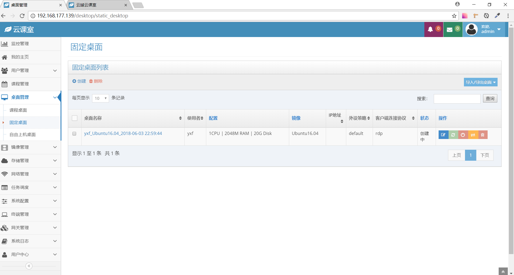

### 创建课程过程

**1. 创建教师**

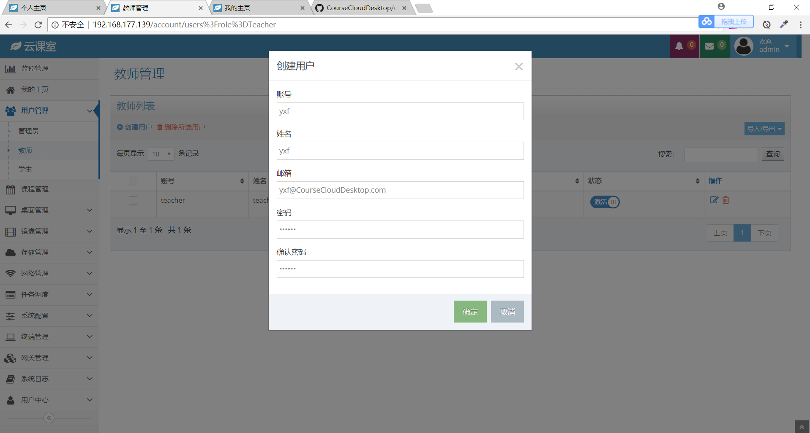

创建成功后，查看教师管理列表：

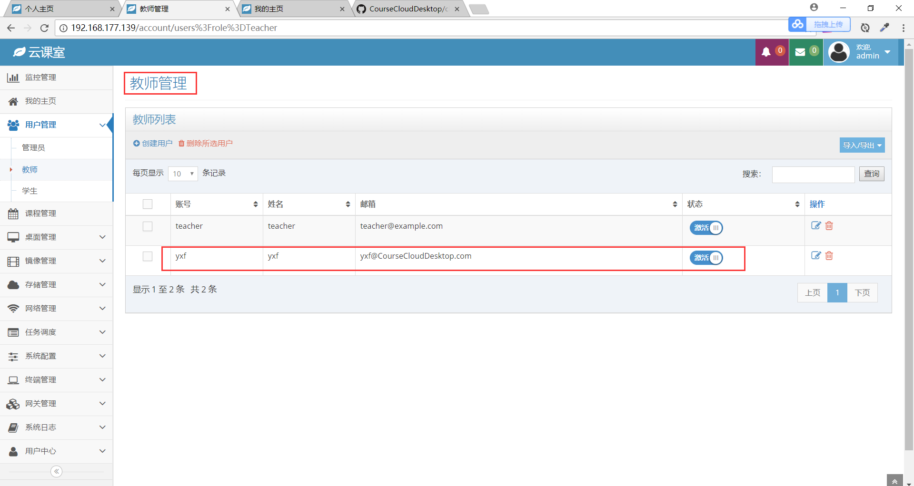

**2. 创建学生**

创建了5个学生，名字分别为stuA、stuB、stuC、stuD、stuE。创建过程略。

创建成功后，查看学生管理列表：

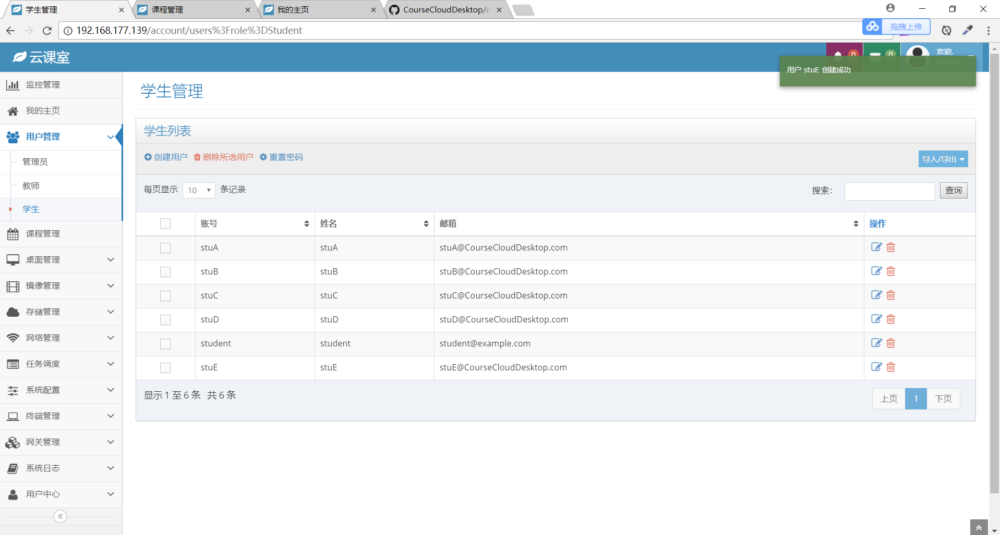

**3. 添加课程**

（1）填写课程基本信息。课程名称命名为`yxf-develop`：

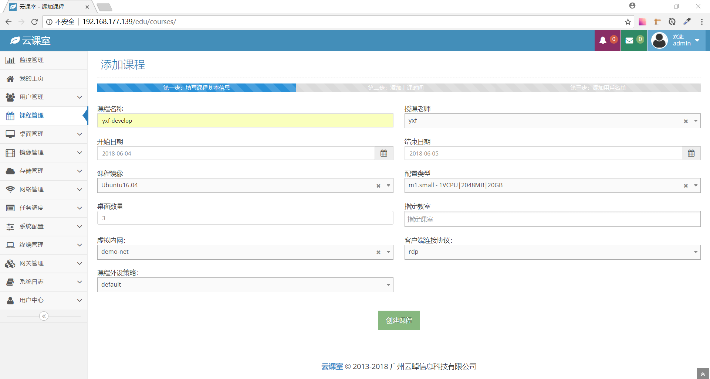

（2）添加上课时间：

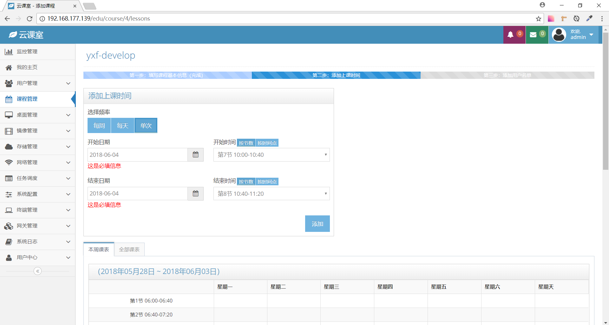

添加上课时间成功：

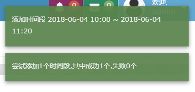

（3）添加用户名单：

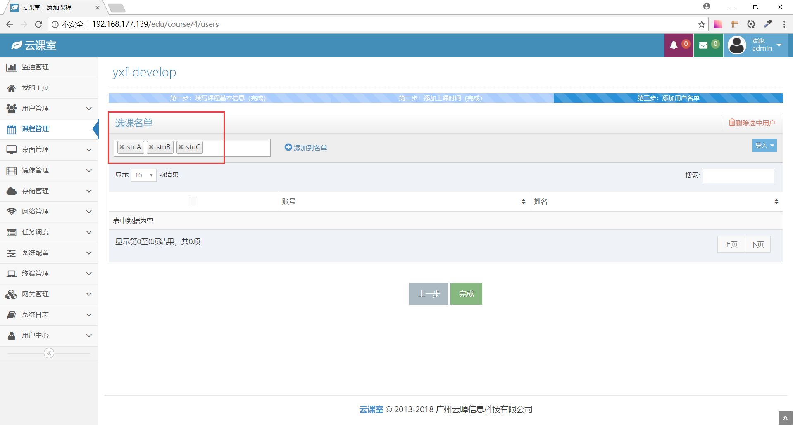

添加用户名单成功：

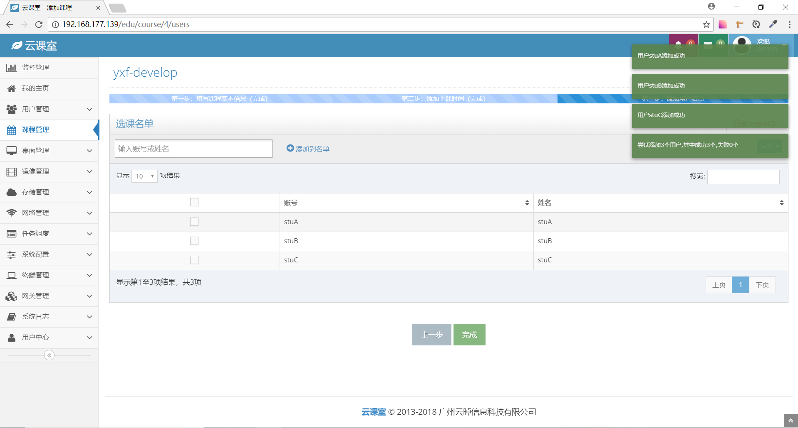

（4）添加课程成功，查看课程列表：

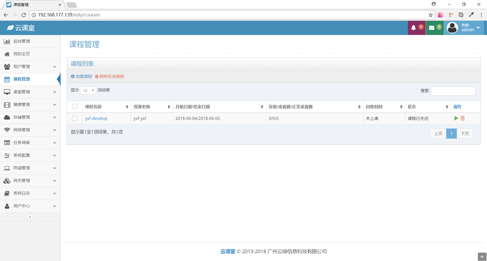

（5）在主页查看课程表，课程时间、上课时间段与刚刚添加的课程`yxf-develop`的信息一致：

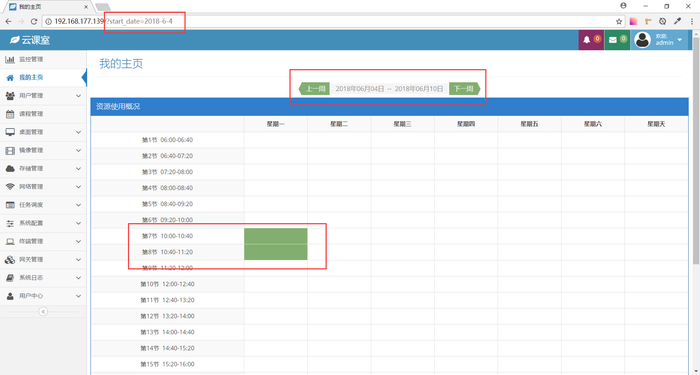

## 遇到的问题和解决方案

**Internal Server Error**

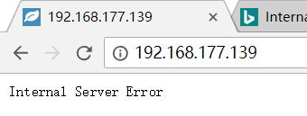

解决： 
按照网上的多种教程设置，还是不行。 
最后把iNode重启之后，好了。 
（我...有点想打人）

## 分工

两个人都完成了云桌面课程的创建。操作报告轮流写。
