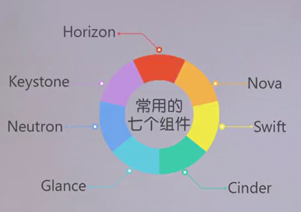
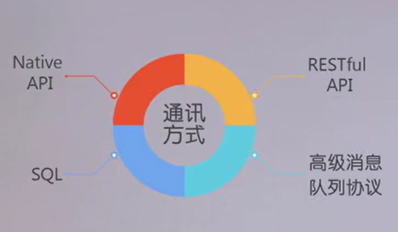
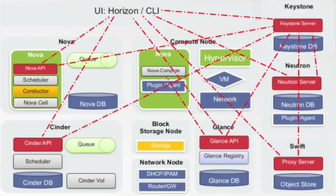
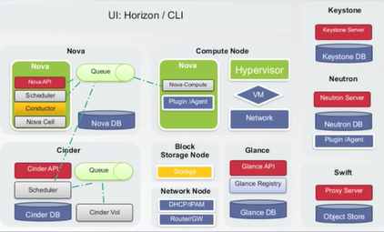
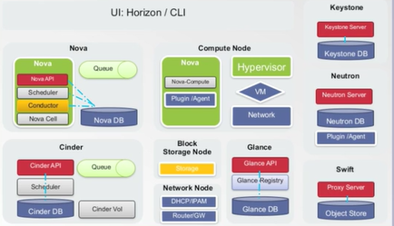
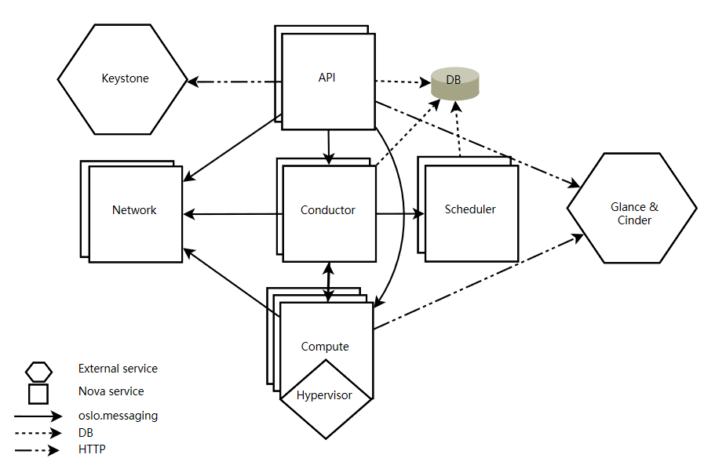
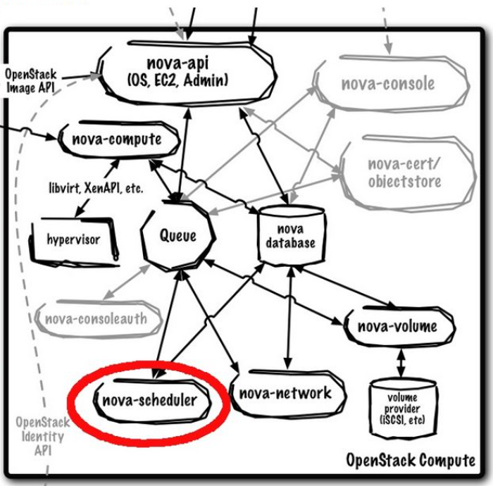
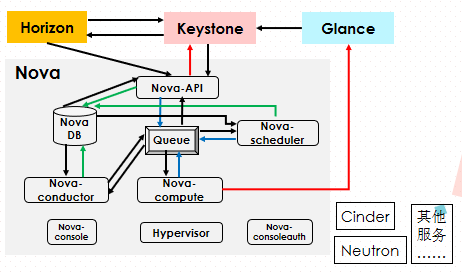
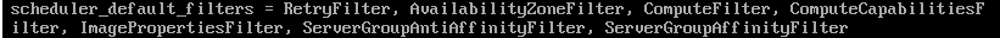

【目录】

1 OpenStack概况
* 1.1 OpenStack常用的七个组件
* 1.2 OpenStack中四种通信方式

2 什么是Nova
* 2.1 Nova的简介
* 2.2 Nova的架构及主要组件
* 2.3 Nova是怎样运作的

3 Nova-scheduler介绍
* 3.1 placement中的过滤机制
* 3.2 placement中的称重机制

4 Nova-scheduler源码分析
* 4.1 阶段一：nova-scheduler 接收 build_instances RPC 远程调用
* 4.2 阶段二：从 scheduler.rpcapi.SchedulerAPI 到 scheduler.manager.SchedulerManager
* 4.3 阶段三：从 scheduler.manager.SchedulerManager 到调度器 FilterScheduler
* 4.4 阶段四：从调度器 FilterScheduler 到过滤器 Filters
* 4.5 阶段五：Filters 到权重计算与排序

附录 分工与心得


# 1 OpenStack概况

## 1.1 OpenStack常用的七个组件

<div> </div>

* 负责虚拟机创建、管理和销毁，提供计算资源服务的Nova
* 提供对象存储服务的分布式存储Swift
* 提供块存储服务的Cinder
* 提供虚拟机镜像管理和存储服务的Glance
* 软件定义网络项目Neutron
* 提供身份认证和授权的Keystone
* 提供基于web的GUI的Horizon


## 1.2 OpenStack中四种通信方式


<div> </div>

四种通信方式为：
* 基于HTTP的RESTfull API的通信
* 基于高级消息队列的信息传输
* 基于数据库连接（基于SQL的通信）
* 基于第三方的通信（Native API）

最主要的是前三种，通信的组件关系如以下三图：

（1）通过http建立通信关系



（2）通过AMQP建立通信关系



（3）通过数据库建立通信关系




在一个虚拟机的创建过程中，需要各个组件通过上述四种通信方式进行交互，
依次完成虚拟机运行环境的准备、网络和存储的配置，
最后调用hypervisor或libvirt的API来创建虚拟机。


**在整个OpenStack体系结构中，我们小组决定着重学习Nova，并选择nova-scheduler来进行详细的介绍**


# 2 什么是Nova

* 学习OpenStack中的nova组件(总体结构)
* 选择nova-scheduler进行深入学习


## 2.1 Nova的简介


Nova是OpenStack项目，它提供了一种提供计算实例的方法。这样使得Nova成为一个负责管理计算资源、网络、认证、所需可扩展性的平台。 

Nova支持创建虚拟机、 baremetal 服务器（通过使用ironic），并且对系统容器的进行有限的支持。

Nova通过在现有的Linux服务器上运行一组守护进程的方式来提供服务，每个进程都执行不同的功能。面向用户的接口是REST API，而内部Nova组件通过RPC消息传递机制进行通信。

API服务器处理REST请求，这些请求通常涉及数据库读/写，可选地向其他Nova服务发送RPC消息，并生成对REST调用的响应。 大多数Nova组件可以在多个服务器上运行，并且有一个监听RPC消息的管理器。（例外是Nova-compute）。

Nova使用一个所有组件共享的中央数据库。

Nova需要以下OpenStack服务才能实现基本功能：              
* Keystone:这为所有OpenStack服务提供身份和身份验证。              
* Glance:这提供了计算图像存储库。所有的计算实例都是从浏览图像中启动的。              
* Neutron:它负责提供计算实例连接到启动时的虚拟或物理网络。              
 

四者的网络通信关系如下图所示：

<div> </div>

此外，Nova还可以与其他服务集成，包括：持久块存储、加密磁盘和baremetal计算实例。


## 2.2 Nova的架构及主要组件

官方给出的Nova架构图如下：

<div> </div>

* `Nova DB`：用于存储数据的SQL数据库。              
* `Nova-API`：接收HTTP请求的组件，通过osl.messaging队列或HTTP转换命令并与其他组件通信。              
* `Nova-scheduler`：决定哪个主机获得实例。                         
* `Nova-compute`：管理hypervisor和虚拟机之间的通信。              
* `Nova-conductor`：处理需要协调的请求，充当数据库代理，或处理对象转换。 
* `nova-console`和`nova-consoleauth`：通过VNC或SPICE客户端来访问虚拟机的界面。


## 2.3 Nova是怎样运作的

结合图进行讲解**创建和启动一台虚拟机**的过程中，Nova主要组件间的交互关系。

Nova中的各个组件基本上都是通过AMQP（RabbitMQ）来做的。



上图中，红色代表通过http建立通信关系，绿色代表通过数据库建立通信关系，蓝色代表通过AMQP建立通信关系。


主要步骤：
* Horizon向Keystone发起REST调用，发出用户名和密码
* Keystone对接受的用户名和密码进行验证，并生成token
* Horizon启动虚拟机操作的命令和将上一步生成的token转换成REST API发送给Nova-API
* Nova-API向Keystone验证token的合法性
* Nova-API通过AMQP向Nova-scheduler发送同步远程调用请求`rpc.call request`，等待获得新的虚拟机实例的条目和host ID
* Nova-scheduler从消息队列里取出上述请求
* Nova-scheduler与Nova DB交互，挑选出一台适合的宿主机来启动虚拟机（后面重点介绍这个过程）
* Nova-scheduler通过AMQP返回给Nova-API调用，发送宿主机的host ID
* Nova-scheduler通过消息队列向Nova-compute发出在上述宿主机上启动虚拟机的异步调用请求`rpc-cast`
* Nova-compute从消息队列里取出上述请求
* Nova-compute通过消息队列向Nova-conductor发送同步调用请求`rpc.call`，获取虚拟机信息（host ID、VM的内存、CPU、硬盘大小等配置信息）
* Nova-conductor从消息队列里取出上述请求
* Nova-conductor与Nova DB交互
* Nova-conductor返回Nova-compute请求的信息
* Nova-compute从消息队列里取出Nova-conductor返回的信息（至此同步调用结束）
* Nova-compute向Glance API发出带有token的REST请求，请求镜像数据
* Glance API向Keystone验证token的合法性

接下来的步骤是为虚拟机准备网络，在这里不详细讨论。


# 3 Nova-scheduler介绍

Nova对虚拟机的调度体现在两个方面：

**placement**
* 解决*把虚拟机放在哪个物理机上启动*的问题，选取一个最合适的计算节点来运行虚拟机
* 由**nova-scheduler**完成，从一堆宿主机（能运行nova-compute服务的机器）中选出一台去创建虚拟机

**migration**
* 解决*虚拟机启动后，运行过程中从哪个物理机迁移到哪个物理机*的问题

**nova-scheduler**主要负责**placement**部分，所以我们主要对**placement**进行讨论


## 3.1 placement中的过滤机制

配置文件`nova.conf`：用于记录和修改nova的配置信息。

通过修改nova.conf文件修改调度器的配置

Nova默认的调度器是filter scheduler


### 1. 选择[filter](https://docs.openstack.org/nova/latest/user/filter-scheduler.html)：
```
# 把所有的filter都用上
scheduler_available_filters=nova.scheduler.filters.all_filters

# 选择其中的一部分
scheduler_default_filters=ComputeFilter,AvailabilityZoneFilter,
	ComputeCapabilitiesFilter,ImagePropertiesFilter,
	ServerGroupAntiAffinityFilter,ServerGroupAffinityFilter

```

实际截图：




### 2. 分析RamFilter
```
class RamFilter(filters.BaseHostFilter):
    """Ram Filter with over subscription flag"""

    # 两个传入参数：host_state和filter_properties
    def host_passes(self, host_state, filter_properties):
        """Only return hosts with sufficient available RAM."""

	# 从filter_properties里面取出instance_type
        instance_type = filter_properties.get('instance_type')

	# 从instance_type里取出对虚拟机内存的需求
        requested_ram = instance_type['memory_mb']

	# 从host_state里取出目前空闲内存`free_ram_mb`
        free_ram_mb = host_state.free_ram_mb

	# 从host_state里取出总共的可用内存`total_usable_ram_mb
        total_usable_ram_mb = host_state.total_usable_ram_mb

	# 计算出实际这个host上可用内存的大小used_ram_mb
        used_ram_mb = total_usable_ram_mb - free_ram_mb

	# 选择过滤或留下该宿主机
        return total_usable_ram_mb * FLAGS.ram_allocation_ratio  - used_ram_mb >= requested_ram
```
首先，这个filter有两个传入参数：`host_state`和`filter_properties`
从`filter_properties`里面取出`instance_type`，再从`instance_type`里取出对虚拟机内存的需求

从`host_state`里取出目前空闲内存`free_ram_mb`和总共的可用内存`total_usable_ram_mb`，
再计算出实际这个host上可用内存的大小`used_ram_mb`。

可用内存的大小`used_ram_mb`和创建虚拟机时申请的内存大小作比较。
如果满足条件，则filter把该宿主机留下；否则，filter把该宿主机过滤掉。


### 3. 自己写一个filter

（1）仿照`RamFilter`写一段自定义filter代码。
如果一个compute结点满足条件就返回True，否则返回False。

```
# myFilter.py

class myFilter(filters.BaseHostFilter):
	def host_passes(self, host_state, filter_properties):
		free_ram = host_state.free_ram_mb
		requested_ram = filter_properties.get('instance_type')['memory_mb']
		# 如果一个compute结点满足条件就返回True，否则返回False。		
		if(free_ram > requested_ram ):
    			return True
		else:
    			return False
```

（2）添加自定义的filter

将`myFilter.py` 放到 `/usr/share/pyshared/nova/scheduler/filters/folder`目录下,
并建立软链接

（3）更filter选择

```
scheduler_available_filters=nova.scheduler.filters.all_filters
scheduler_default_filters=ComputeFilter,...,myFilter

```

## 3.2 placement中的称重机制

对filter筛选出的宿主机计算各个维度的开销（capacity），对虚拟机进行排序（weighting）

目标：
* 尽可能负载均衡
* 尽可能负载集中

与`ram_weight_multiplier`的值有关

`scheduler_host_subset_size`决定在哪台宿主机上启动哪台虚拟机


# 4 Nova-scheduler源码分析

对Nova-scheduler关键代码及其意义进行分析

`/nova/scheduler/driver.py`: 文件中最重要的就是 Scheduler 类，是所有调度器实现都要继承的基类，包含了调度器必须要实现的所有接口。
`/nova/scheduler/manager.py`: 主要实现了 SchedulerManager 类，定义了 Host 的管理操作函数，如：删除 Host 中的 Instance — delete_instance_info
`/nova/scheduler/host_manager.py`: 有两个类的实现，都是描述了跟调度器相关的 Host 的操作实现，类 HostState 维护了一份最新的 Host 资源数据。类 HostManager 描述了调度器相关的操作函数， EG._choose_host_filters/get_filtered_hosts/get_weighed_hosts
`/nova/scheduler/chance.py`: 只有 ChanceScheduler 类(随机调度器)，继承自 Scheduler 类，实现随机选取 Host Node 的调度器
`/nova/scheduler/client`: 客户端调用程序的入口
`/nova/scheduler/filter_scheduler.py`: 只有 FilterScheduler 类(过滤调度器)，继承自 Scheduler 类，实现了根据指定的过滤条件来选取 Host Node 的调度器 
`/nova/scheduler/filters` 和 `/nova/scheduler/weights`: 这两个目录下的内容分别对应 filter 和 weighting 的实现 。

## 4.1 阶段一：nova-scheduler 接收 build_instances RPC 远程调用

```
#nova.conductor.manager.ComputeTaskManager:build_instances()

    def build_instances(self, context, instances, image, filter_properties,
            admin_password, injected_files, requested_networks,
            security_groups, block_device_mapping=None, legacy_bdm=True):
        # TODO(ndipanov): Remove block_device_mapping and legacy_bdm in version
        #                 2.0 of the RPC API.

        # 获取需要创建的 Instance 的参数信息
        request_spec = scheduler_utils.build_request_spec(context, image,
                                                          instances)

        # TODO(danms): Remove this in version 2.0 of the RPC API
        if (requested_networks and
                not isinstance(requested_networks,
                               objects.NetworkRequestList)):
            # 请求 network 信息
            requested_networks = objects.NetworkRequestList(
                objects=[objects.NetworkRequest.from_tuple(t)
                         for t in requested_networks])
        # TODO(melwitt): Remove this in version 2.0 of the RPC API

        # 获取 flavor 信息
        flavor = filter_properties.get('instance_type')
        if flavor and not isinstance(flavor, objects.Flavor):
            # Code downstream may expect extra_specs to be populated since it
            # is receiving an object, so lookup the flavor to ensure this.
            flavor = objects.Flavor.get_by_id(context, flavor['id'])
            filter_properties = dict(filter_properties, instance_type=flavor)

        try:
            scheduler_utils.setup_instance_group(context, request_spec,
                                                 filter_properties)
            # check retry policy. Rather ugly use of instances[0]...
            # but if we've exceeded max retries... then we really only
            # have a single instance.
            scheduler_utils.populate_retry(filter_properties,
                instances[0].uuid)

            # 获取 Hosts 列表
            hosts = self.scheduler_client.select_destinations(context,
                    request_spec, filter_properties)

        except Exception as exc:
            updates = {'vm_state': vm_states.ERROR, 'task_state': None}
            for instance in instances:
                self._set_vm_state_and_notify(
                    context, instance.uuid, 'build_instances', updates,
                    exc, request_spec)
            return

        for (instance, host) in itertools.izip(instances, hosts):
            try:
                instance.refresh()
            except (exception.InstanceNotFound,
                    exception.InstanceInfoCacheNotFound):
                LOG.debug('Instance deleted during build', instance=instance)
                continue
            local_filter_props = copy.deepcopy(filter_properties)
            scheduler_utils.populate_filter_properties(local_filter_props,
                host)
            # The block_device_mapping passed from the api doesn't contain
            # instance specific information
            bdms = objects.BlockDeviceMappingList.get_by_instance_uuid(
                    context, instance.uuid)


            self.compute_rpcapi.build_and_run_instance(context,
                    instance=instance, host=host['host'], image=image,
                    request_spec=request_spec,
                    filter_properties=local_filter_props,
                    admin_password=admin_password,
                    injected_files=injected_files,
                    requested_networks=requested_networks,
                    security_groups=security_groups,
                    block_device_mapping=bdms, node=host['nodename'],
                    limits=host['limits'])

	    # nova-conductor 在调用 nova-scheduler 来获取能够创建 Instance 的 Host 的同时也获取了：requested_networks/flavor 等信息。	    

	    # 获取 Hosts 列表
            hosts = self.scheduler_client.select_destinations(context,
                    request_spec, filter_properties)
```


## 4.2 阶段二：从 scheduler.rpcapi.SchedulerAPI 到 scheduler.manager.SchedulerManager

rpcapi.py 中的接口函数会在 manager.py 中实现实际操作函数。 

跳转到 nova.scheduler.manager.SchedulerManager:select_destinations()


```
# nova.scheduler.manager.SchedulerManager:select_destinations()
class SchedulerManager(manager.Manager):
    """Chooses a host to run instances on."""

    target = messaging.Target(version='4.2')

    def __init__(self, scheduler_driver=None, *args, **kwargs):
        if not scheduler_driver:
            scheduler_driver = CONF.scheduler_driver
        # 可以看出这里的 driver 是通过配置文件中的选项值指定的类来返回的对象 EG.nova.scheduler.filter_scheduler.FilterScheduler
        self.driver = importutils.import_object(scheduler_driver)
        super(SchedulerManager, self).__init__(service_name='scheduler',
                                               *args, **kwargs)


    def select_destinations(self, context, request_spec, filter_properties):
        """Returns destinations(s) best suited for this request_spec and
        filter_properties.

        The result should be a list of dicts with 'host', 'nodename' and
        'limits' as keys.
        """
        dests = self.driver.select_destinations(context, request_spec,
            filter_properties)
        return jsonutils.to_primitive(dests)
```

## 4.3 阶段三：从 scheduler.manager.SchedulerManager 到调度器 FilterScheduler

修改配置文件：/etc/nova/nova.conf
```
scheduler_driver = nova.scheduler.filter_scheduler.FilterScheduler
```

从配置文件选项 scheduler_driver 的值可以知道，nova.scheduler.manager.SchedulerManager:driver 
是 nova.scheduler.filter_scheduler.FilterScheduler 的实例化对象。 
所以跳转到 nova.scheduler.filter_scheduler.FilterScheduler:select_destinations() 。

```
# nova.scheduler.filter_scheduler.FilterScheduler:select_destinations()

class FilterScheduler(driver.Scheduler):
    """Scheduler that can be used for filtering and weighing."""
    def __init__(self, *args, **kwargs):
        super(FilterScheduler, self).__init__(*args, **kwargs)
        self.options = scheduler_options.SchedulerOptions()
        self.notifier = rpc.get_notifier('scheduler')

    def select_destinations(self, context, request_spec, filter_properties):
        """Selects a filtered set of hosts and nodes."""
        self.notifier.info(context, 'scheduler.select_destinations.start',
                           dict(request_spec=request_spec))

        # 需要创建的 Instances 的数量
        num_instances = request_spec['num_instances']

        # 获取满足笫一次过滤条件的主机列表 List (详见上述的调度器过滤原理)
        # nova.scheduler.filter_scheduler.FilterScheduler:_schedule() ==> return selected_hosts
        selected_hosts = self._schedule(context, request_spec,
                                        filter_properties)

        # Couldn't fulfill the request_spec
        # 当请求的 Instance 数量大于合适的主机数量时，不会创建 Instance 且输出 'There are not enough hosts available.'
        if len(selected_hosts) < num_instances:
            # NOTE(Rui Chen): If multiple creates failed, set the updated time
            # of selected HostState to None so that these HostStates are
            # refreshed according to database in next schedule, and release
            # the resource consumed by instance in the process of selecting
            # host.
            for host in selected_hosts:
                host.obj.updated = None

            # Log the details but don't put those into the reason since
            # we don't want to give away too much information about our
            # actual environment.
            LOG.debug('There are %(hosts)d hosts available but '
                      '%(num_instances)d instances requested to build.',
                      {'hosts': len(selected_hosts),
                       'num_instances': num_instances})

            reason = _('There are not enough hosts available.')
            raise exception.NoValidHost(reason=reason)

        dests = [dict(host=host.obj.host, nodename=host.obj.nodename,
                      limits=host.obj.limits) for host in selected_hosts]

        self.notifier.info(context, 'scheduler.select_destinations.end',
                           dict(request_spec=request_spec))
        return dests


 def _schedule(self, context, request_spec, filter_properties):
        # 获取所有 Hosts 的状态
        hosts = self._get_all_host_states(elevated)

        selected_hosts = []

        # 获取需要创建的 Instances 数目
        num_instances = request_spec.get('num_instances', 1)

        # 遍历 num_instances，为每个 Instance 选取合适的主机
        for num in range(num_instances):
            # Filter local hosts based on requirements ...

            # 在 for 循环里，_schedule 的两个关键操作，get_filtered_hosts() 和 get_weighed_hosts()
            hosts = self.host_manager.get_filtered_hosts(hosts,
                    filter_properties, index=num)
            if not hosts:
                # Can't get any more locally.
                break

            LOG.debug("Filtered %(hosts)s", {'hosts': hosts})

            weighed_hosts = self.host_manager.get_weighed_hosts(hosts,
                    filter_properties)

            LOG.debug("Weighed %(hosts)s", {'hosts': weighed_hosts})

            scheduler_host_subset_size = CONF.scheduler_host_subset_size

            # 下面两个 if，主要为了防止 random.choice 调用越界
            if scheduler_host_subset_size > len(weighed_hosts):
                scheduler_host_subset_size = len(weighed_hosts)
            if scheduler_host_subset_size < 1:
                scheduler_host_subset_size = 1

            # 在符合要求的weigh过的host里进行随机选取
            chosen_host = random.choice(
                weighed_hosts[0:scheduler_host_subset_size])
            LOG.debug("Selected host: %(host)s", {'host': chosen_host})
            selected_hosts.append(chosen_host)

            # Now consume the resources so the filter/weights
            # will change for the next instance.
            chosen_host.obj.consume_from_instance(instance_properties)
            if update_group_hosts is True:
                if isinstance(filter_properties['group_hosts'], list):
                    filter_properties['group_hosts'] = set(
                        filter_properties['group_hosts'])
                filter_properties['group_hosts'].add(chosen_host.obj.host)
        # 循环为每一个实例获取合适的主机后，返回选择的主机列表
        return selected_hosts

```

上述的函数有三个非常关键的操作函数：
* get_filtered_hosts：使用 Filters 过滤器将第一个函数返回的 hosts 进行再一次过滤。
* _get_all_host_states: 获取所有的 Host 状态，并且将初步满足条件的 Hosts 过滤出来。
* get_weighed_hosts：通过 Weighed 选取最优 Host。

(1)host_manager.get_filtered_hosts() 中，host_manager 是 nova.scheduler.driver.Scheduler 的成员变量。
如下：

```
# nova.scheduler.driver.Scheduler:__init__()

# nova.scheduler.filter_scheduler.FilterScheduler 继承了 nova.scheduler.driver.Scheduler
 class Scheduler(object):
     """The base class that all Scheduler classes should inherit from."""

     def __init__(self):
         # 从这里知道 host_manager 会根据配置文件动态导入
         self.host_manager = importutils.import_object(
                 CONF.scheduler_host_manager)
         self.servicegroup_api = servicegroup.API()

```

(2)scheduler.filter_scheduler.FilterScheduler:_schedule() 中获取 Hosts 状态的函数 _get_all_host_states() 实现如下：

```
# nova.scheduler.host_manager.HostManager:get_all_host_states()

 def get_all_host_states(self, context):

        service_refs = {service.host: service
                        for service in objects.ServiceList.get_by_binary(
                            context, 'nova-compute')}

        # 获取 Compute Node 资源
        compute_nodes = objects.ComputeNodeList.get_all(context)
        # nova.object.__init__()
        #     ==> nova.object.compute_node.ComputeNodeList:get_all
        seen_nodes = set()
        for compute in compute_nodes:
            service = service_refs.get(compute.host)

            if not service:
                LOG.warning(_LW(
                    "No compute service record found for host %(host)s"),
                    {'host': compute.host})
                continue
            host = compute.host
            node = compute.hypervisor_hostname
            state_key = (host, node)
            host_state = self.host_state_map.get(state_key)

            # 更新主机信息
            if host_state:
                host_state.update_from_compute_node(compute)
            else:
                host_state = self.host_state_cls(host, node, compute=compute)
                self.host_state_map[state_key] = host_state
            # We force to update the aggregates info each time a new request
            # comes in, because some changes on the aggregates could have been
            # happening after setting this field for the first time
            host_state.aggregates = [self.aggs_by_id[agg_id] for agg_id in
                                     self.host_aggregates_map[
                                         host_state.host]]
            host_state.update_service(dict(service))
            self._add_instance_info(context, compute, host_state)
            seen_nodes.add(state_key)

        # remove compute nodes from host_state_map if they are not active
        # * 移除 not active 的节点
        dead_nodes = set(self.host_state_map.keys()) - seen_nodes


for state_key in dead_nodes:
            host, node = state_key
            LOG.info(_LI("Removing dead compute node %(host)s:%(node)s "
                         "from scheduler"), {'host': host, 'node': node})
            del self.host_state_map[state_key]

        return six.itervalues(self.host_state_map)
# get_all_host_states主要用来去除不活跃的节点
```


(3)获取 Compute Node 资源信息函数 objects.ComputeNodeList.get_all(context) 的实现。

```
# nova.object.compute_node:get_all()

    @base.remotable_classmethod
    def get_all(cls, context):
        # 调到了 nova.db.api.compute_node_get_all()
        db_computes = db.compute_node_get_all(context)


        return base.obj_make_list(context, cls(context), objects.ComputeNode,
                                  db_computes)


#nova.db.api:compute_node_get_all()

def compute_node_get_all(context):
    """Get all computeNodes.

    :param context: The security context

    :returns: List of dictionaries each containing compute node properties
    """
    return IMPL.compute_node_get_all(context)
```

nova-scheduler 不能够对数据库进行写操作，但是却可以从数据库中读取 Host 资源数据并缓存在进程的内存中，通过这种方法更新主机信息。
这样就可以在保证了 nova-scheduler 能使用最新的 Host 资源信息，同时下降低了对数据库的 I/O 请求。

```
# nova.scheduler.host_manager.HostState:__init__()
class HostState(object):
    """Mutable and immutable information tracked for a host.
    This is an attempt to remove the ad-hoc data structures
    previously used and lock down access.
    """

    def __init__(self, host, node, compute=None):
        self.host = host
        self.nodename = node

        # Mutable available resources.
        # These will change as resources are virtually "consumed".
        self.total_usable_ram_mb = 0
        self.total_usable_disk_gb = 0
        self.disk_mb_used = 0
        self.free_ram_mb = 0
        self.free_disk_mb = 0
        self.vcpus_total = 0
        self.vcpus_used = 0
        self.pci_stats = None
        self.numa_topology = None

        # Additional host information from the compute node stats:
        self.num_instances = 0
        self.num_io_ops = 0

        # Other information
        self.host_ip = None
        self.hypervisor_type = None
        self.hypervisor_version = None
        self.hypervisor_hostname = None
        self.cpu_info = None
        self.supported_instances = None
```


## 4.4 阶段四：从调度器 FilterScheduler 到过滤器 Filters

上面的代码中调用了 Filters 函数：get_filtered_hosts()，实现如下：

```
# nova.scheduler.host_manager.HostManager:get_filtered_hosts()
    def get_filtered_hosts(self, hosts, filter_properties,
            filter_class_names=None, index=0):
        """Filter hosts and return only ones passing all filters."""
        # 下面定义了若干局部函数，先省略掉
        def _strip_ignore_hosts(host_map, hosts_to_ignore):
            ignored_hosts = []
            for host in hosts_to_ignore:
        # 返回经过验证的可用的过滤器；
        filter_classes = self._choose_host_filters(filter_class_names)
            # 调用了get_filtered_objects
            return self.filter_handler.get_filtered_objects(filters,
                        hosts, filter_properties, index)


# 继续跳转到 get_filtered_objects()
 def get_filtered_objects(self, filters, objs, filter_properties, index=0):
        list_objs = list(objs)
        LOG.debug("Starting with %d host(s)", len(list_objs))
        part_filter_results = []
        full_filter_results = []
        log_msg = "%(cls_name)s: (start: %(start)s, end: %(end)s)"
        for filter_ in filters:
            if filter_.run_filter_for_index(index):
                cls_name = filter_.__class__.__name__
                start_count = len(list_objs)
                # 关键的一句话
                objs = filter_.filter_all(list_objs, filter_properties)
                if objs is None:
                    LOG.debug("Filter %s says to stop filtering", cls_name)
                    return
                list_objs = list(objs)
                end_count = len(list_objs)
                part_filter_results.append(log_msg % {"cls_name": cls_name,
                        "start": start_count, "end": end_count})
                if list_objs:
                    remaining = [(getattr(obj, "host", obj),
                                  getattr(obj, "nodename", ""))
                                 for obj in list_objs]
                    full_filter_results.append((cls_name, remaining))
        return list_objs


# objs 的 return 又调用了 filter_.filter_all(list_objs, filter_properties)
def filter_all(self, filter_obj_list, filter_properties):
        for obj in filter_obj_list：
            if self._filter_one(obj, filter_properties):
                # 符合规则 生产一个obj
                yield obj


# 继续调用 _filter_one()
def _filter_one(self, obj, filter_properties):
        # 如果符合 Filter 过滤器，就返回 TRUE，否则返回 FALSE
        return self.host_passes(obj, filter_properties)

```

经过一连串的调用跳转，Filter 的过滤工作就完成了。


## 4.5 阶段五：Filters 到权重计算与排序

```
# nova.scheduler.host_manager.HostManager:get_weighed_hosts（）
    def get_weighed_hosts(self, hosts, weight_properties):
        """Weigh the hosts."""
        return self.weight_handler.get_weighed_objects(self.weighers,
                hosts, weight_properties)


# nova.weights.BaseWeightHandler:get_weighed_objects（）
class BaseWeightHandler(loadables.BaseLoader):
    object_class = WeighedObject

    def get_weighed_objects(self, weighers, obj_list, weighing_properties):
        """Return a sorted (descending), normalized list of WeighedObjects."""
        weighed_objs = [self.object_class(obj, 0.0) for obj in obj_list]

        if len(weighed_objs) <= 1:
            return weighed_objs

        for weigher in weighers:
            weights = weigher.weigh_objects(weighed_objs, weighing_properties)

            # Normalize the weights
            weights = normalize(weights,
                                minval=weigher.minval,
                                maxval=weigher.maxval)

            for i, weight in enumerate(weights):
                obj = weighed_objs[i]
                obj.weight += weigher.weight_multiplier() * weight

        # 进行排序
        return sorted(weighed_objs, key=lambda x: x.weight, reverse=True)
```

# 5 分工
