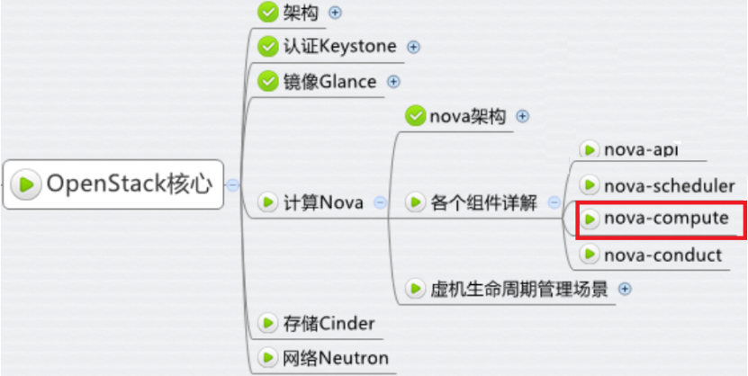
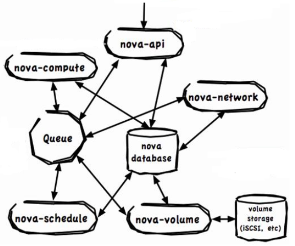

# OpenStack各个服务总体架构：

<div align=center> </div>

## OpenStack常用的七个组件

<div align=center> </div>

* 负责虚拟机创建、管理和销毁，提供计算资源服务的Nova
* 提供对象存储服务的分布式存储Swift
* 提供块存储服务的Cinder
* 提供虚拟机镜像管理和存储服务的Glance
* 软件定义网络项目Neutron
* 提供身份认证和授权的Keystone
* 提供基于web的GUI的Horizon


## 四种通信方式

<div align=center> </div>

* 基于HTTP的RESTfull API的通信
* 基于高级消息队列的信息传输
* 基于数据库连接（基于SQL的通信）
* 基于第三方的通信（Native API）


（解释图）


在一个虚拟机的创建过程中，需要各个组件通过上述四种通信方式进行交互，
依次完成虚拟机运行环境的准备、网络和存储的配置，
最后调用hypervisor或libvirt的API来创建虚拟机。


我们小组决定着重学习nova，并选择nova-scheduler来进行深入的介绍


# Nova是怎样运作的

* 学习openstack中的nova组件(总体逻辑结构)
* 选择nova-scheduler进行深入学习


## Nova的架构


（一段官方的介绍，还没来得及翻译）

https://docs.openstack.org/nova/pike/index.html

它需要以下OpenStack服务才能实现基本功能：              
* Keystone:这为所有OpenStack服务提供身份和身份验证。              
* Glance:这提供了计算图像存储库。所有的计算实例都是从浏览图像中启动的。              
* Neutron:它负责提供计算实例连接到启动时的虚拟或物理网络。              
 

四者的网络通信关系如下图所示：


（解释图）


此外，Nova还可以与其他服务集成，包括：持久块存储、加密磁盘和baremetal计算实例。

https://docs.openstack.org/nova/pike/user/architecture.html


官方给出的Nova架构图如下：



结合图进行讲解创建和启动一台虚拟机的流程时，主要组件和组件的交互关系。

Nova中的各个组件基本上都是通过AMQP（RabbitMQ）来做的。

* Horizon向Keystone发起REST调用，发出用户名和密码
* Keystone对接受的用户名和密码进行验证，并生成token
* Horizon启动虚拟机操作的命令和将上一步生成的token转换成REST API发送给Nova-API
* Nova-API向Keystone验证token的合法性
* Nova-API通过AMQP向Nova-scheduler发送同步远程调用请求`rpc.call request`，等待获得新的虚拟机实例的条目和host ID
* Nova-scheduler从消息队列里取出上述请求
* Nova-scheduler与Nova DB交互，挑选出一台适合的宿主机来启动虚拟机（后面重点介绍这个过程）
* Nova-scheduler通过AMQP返回给Nova-API调用，发送宿主机的host ID
* Nova-scheduler通过消息队列向Nova-compute发出在上述宿主机上启动虚拟机的异步调用请求`rpc-cast`
* Nova-compute从消息队列里取出上述请求
* Nova-compute通过消息队列向Nova-conductor发送同步调用请求`rpc.call`，获取虚拟机信息（host ID、VM的内存、CPU、硬盘大小等配置信息）
* Nova-conductor从消息队列里取出上述请求
* Nova-conductor与Nova DB交互
* Nova-conductor返回Nova-compute请求的信息
* Nova-compute从消息队列里取出Nova-conductor返回的信息（至此同步调用结束）
* Nova-compute向Glance API发出带有token的REST请求，请求镜像数据
* Glance API向Keystone验证token的合法性

接下来的步骤是为虚拟机准备网络，在这里不详细讨论。


补充：
 `nova-console`和`nova-consoleauth`的作用：通过VNC或SPICE客户端来访问虚拟机的界面。


## Nova对虚拟机的调度

体现在两个方面
* placement
* migration

### placement
* 解决*把虚拟机放在哪个物理机上启动*的问题，选取一个最合适的计算节点来运行虚拟机
* 由**nova-scheduler**完成，从一堆宿主机（能运行nova-compute服务的机器）中选出一台去创建虚拟机

（友芬在cloudman那里看的东西可以放这里）


通过修改nova.conf文件修改调度器的配置

Nova默认的调度器是filter scheduler


**1. 选择[filter](https://docs.openstack.org/nova/latest/user/filter-scheduler.html)：** 
```
# 把所有的filter都用上
scheduler_available_filters=nova.scheduler.filters.all_filters

# 选择其中的一部分
scheduler_default_filters=ComputeFilter,AvailabilityZoneFilter,ComputeCapabilitiesFilter,ImagePropertiesFilter,ServerGroupAntiAffinityFilter,ServerGroupAffinityFilter

```

实际截图：


**2. 分析RamFilter** 
```
class RamFilter(filters.BaseHostFilter):
    """Ram Filter with over subscription flag"""

    # 两个传入参数：`host_state`和`filter_properties`
    def host_passes(self, host_state, filter_properties):
        """Only return hosts with sufficient available RAM."""
        instance_type = filter_properties.get('instance_type')
        requested_ram = instance_type['memory_mb']
        free_ram_mb = host_state.free_ram_mb
        total_usable_ram_mb = host_state.total_usable_ram_mb
        used_ram_mb = total_usable_ram_mb - free_ram_mb
        return total_usable_ram_mb * FLAGS.ram_allocation_ratio  - used_ram_mb >= requested_ram
```
首先，这个filter有两个传入参数：`host_state`和`filter_properties`
从`filter_properties`里面取出`instance_type`，再从`instance_type`里取出对虚拟机内存的需求

从`host_state`里取出目前空闲内存`free_ram_mb`和总共的可用内存`total_usable_ram_mb`，
再计算出实际这个host上可用内存的大小`used_ram_mb`。

可用内存的大小`used_ram_mb`和创建虚拟机时申请的内存大小作比较。
如果满足条件，则filter把该宿主机留下；否则，filter把该宿主机过滤掉。


**3. 自己写一个filter** 

（能写就写，不能写就跳过）

**4. 对虚拟机进行排序（weighting）** 

对filter筛选出的宿主机计算各个维度的开销（capacity）

目标：
* 尽可能负载均衡
* 尽可能负载集中

与`ram_weight_multiplier`的值有关

scheduler_host_subset_size决定在哪台宿主机上启动哪台虚拟机


### 2.migration
* 虚拟机启动后，运行过程中从哪个物理机迁移到哪个物理机


## 怎样去配置、使用Nova

配置文件`nova.conf`：用于记录和修改nova的配置信息

### 配置和二次开发
