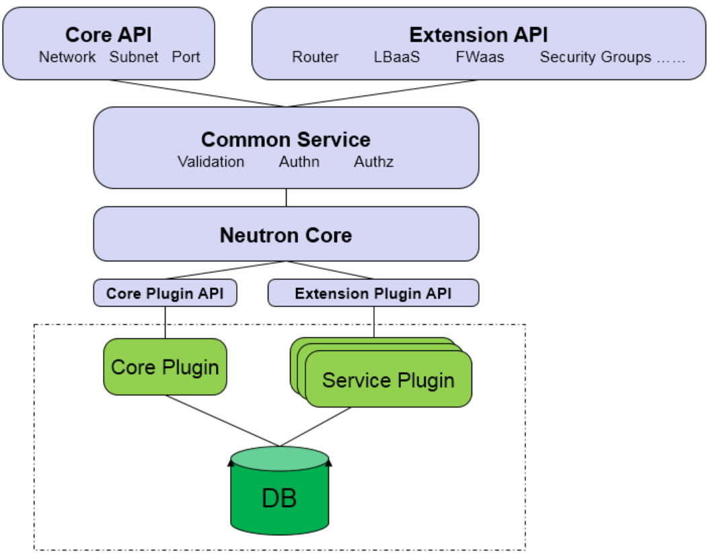
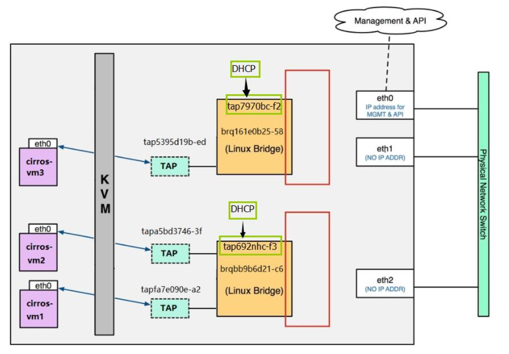
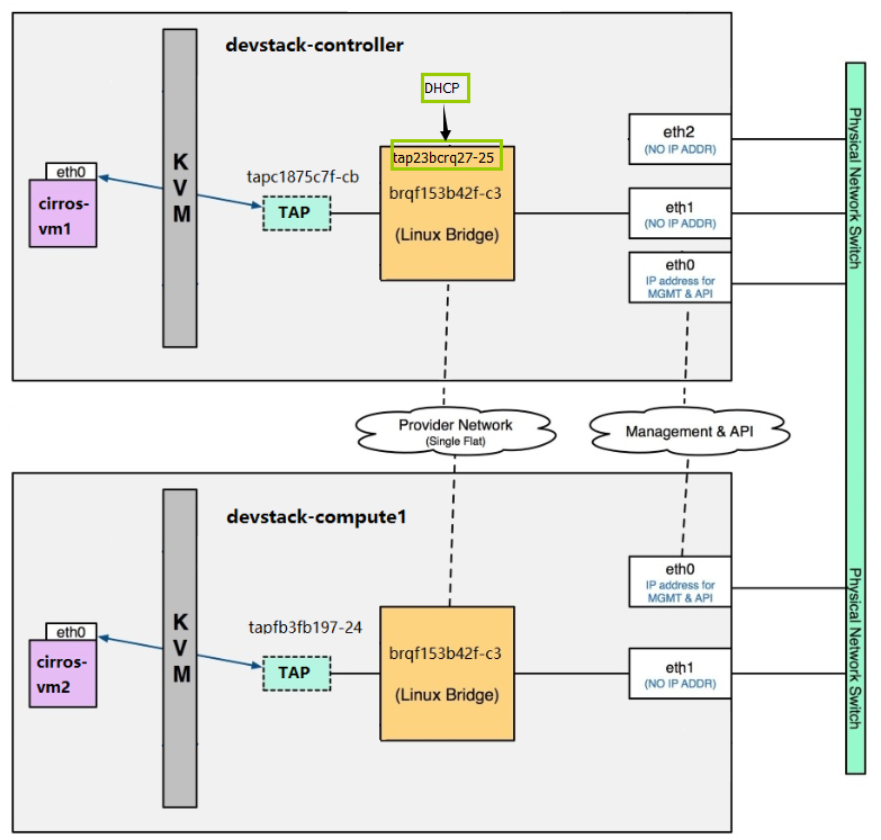
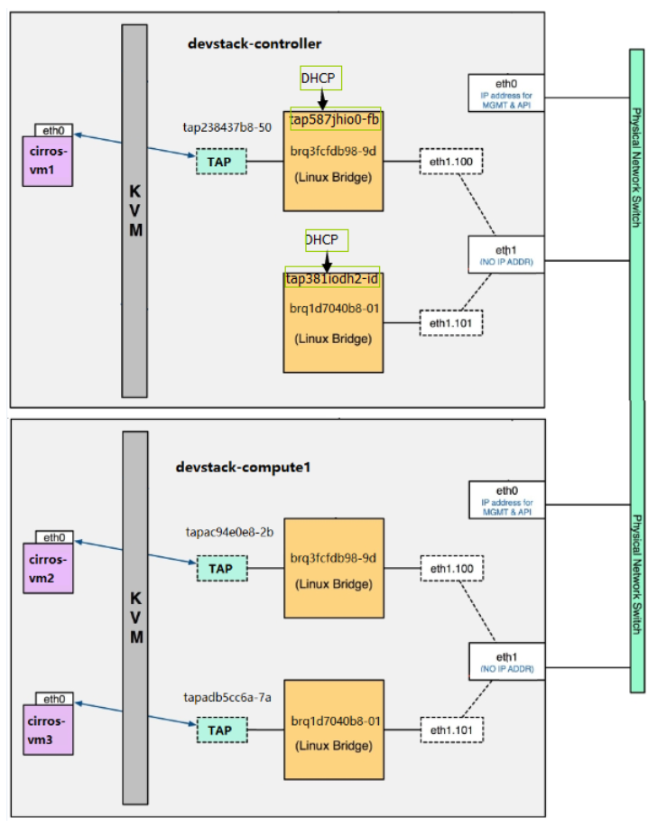
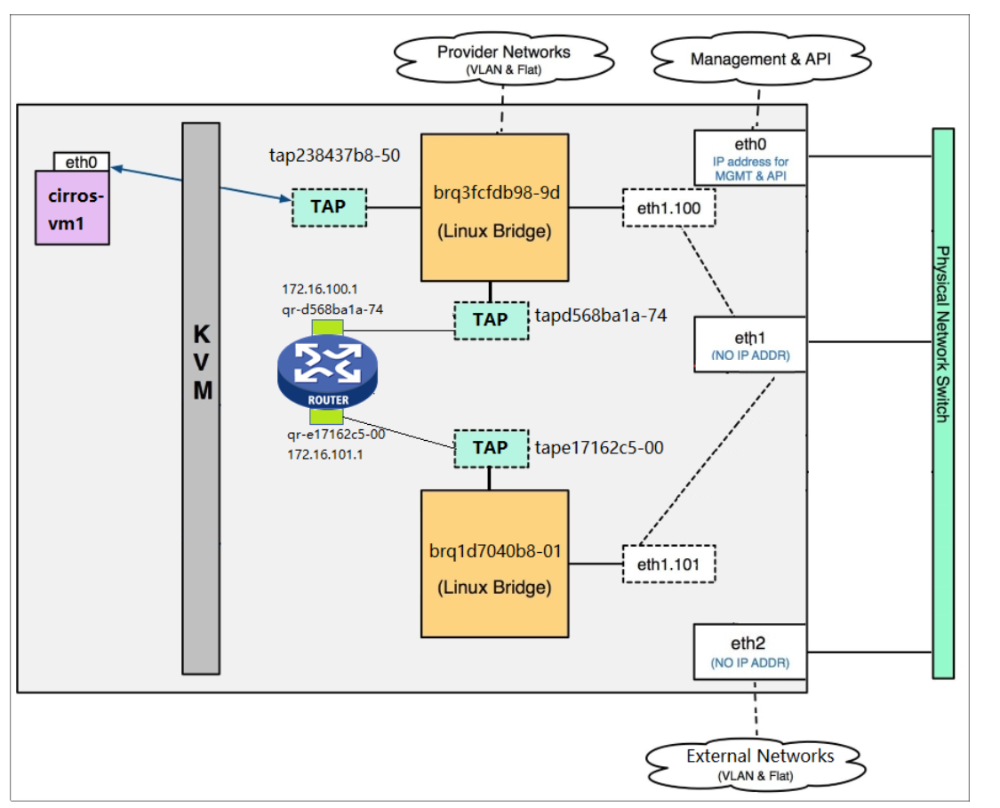
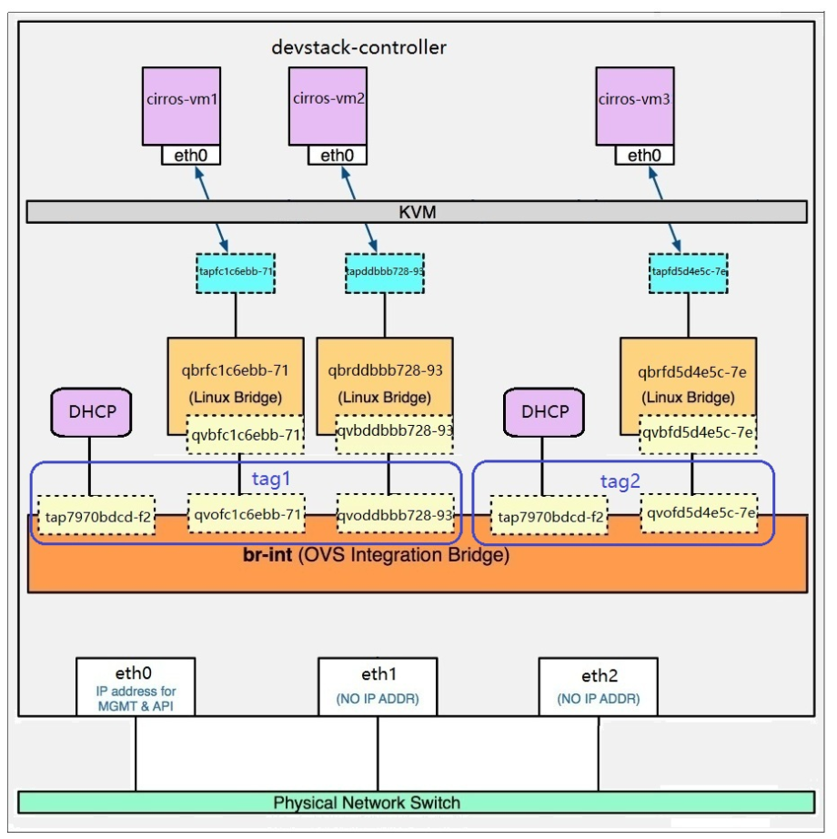
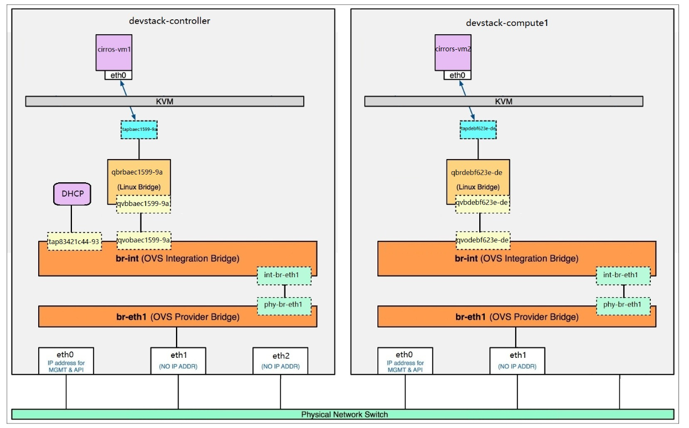
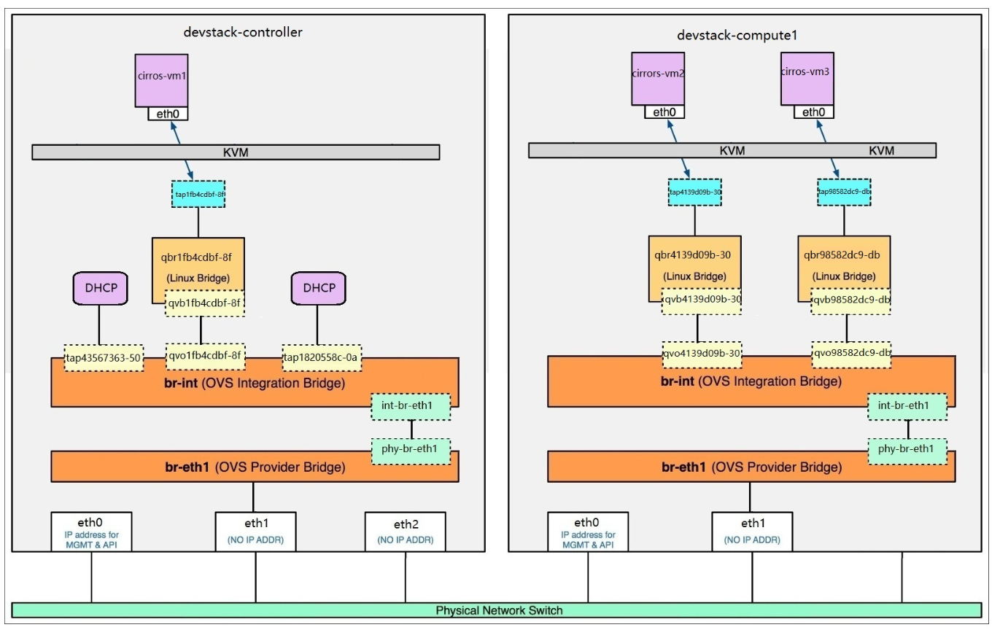
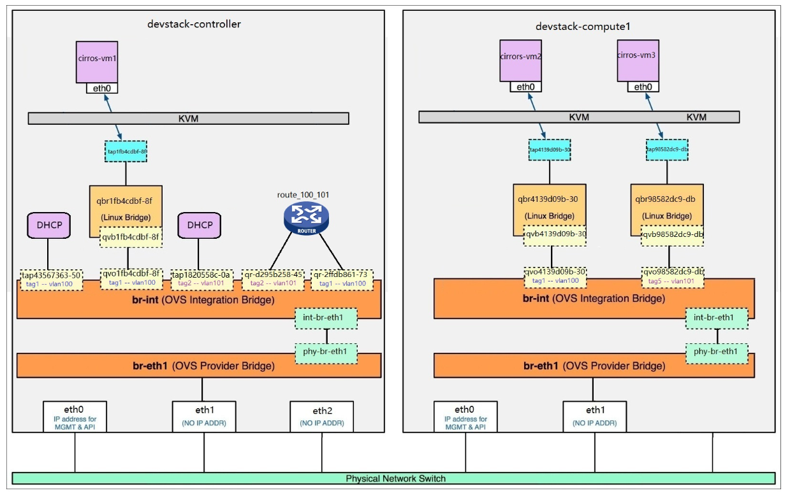

# Neutron学习
## Neutron功能
- 二层交换：透过linux bridge或OVS虚拟出交换机，创建出局域网
- 三层路由：透过虚拟出路由器，实现网络间的互通
- 实现网络隔离：在同一网络下的虚拟机接受同一样的广播信息，不同网络之间不可见
- 提供三层服务：提供防火墙、dhcp、NAT等的三层服务

## Neutron架构
### Neutron server
- 向上提供API，接受来至Horizon(用户)、Nona的请求
- 向下透过Queue与Neutron plugin交互，提供实现网络的细节

### Neutron plugin
- 透过监听Queue，接受Neutron server的信息，确认网络结构，并将信息存在Neutron DB里
- 透过Queue向Neutron agent发送命令，实现网络部件的虚拟化
### Neutron agent
- 透过监听Queue，接受Neutron plugin的信息，确认要创建虚拟化部件命令
- 透过向Neutron DB读取要创建部件的细节(接口名字，网段号等)
- 实现网络部件的虚拟化
### Network provider
- 虚拟网络下的结构及其结构下的元件
- 主要的network provider为：linux bridge及OVS

## linux-bridge
### linux-bridge下的local网络
- 处于该网络下的虚拟机能互相访问
- 网络对外及寄宿主机不可见
- 现实中的应用不多，多用于个人的测试机小数场景

### linux-bridge下的flat网络
- 每一个vlan网络必须要跟一张物理网卡绑定
- 现实中应用不多，因为当该网络数目很大时，往往不能提供同能数量物理网卡

### linux-bridge下的vlan网络
- 同一张的物理网卡可对应多个的vlan
- 透过为网络挂载vlan interface，实现多个网络的识别
- 挂载在同一张物理网卡下的不同vlan之间并不可互相访问

### linux-bridge下的lay3网络
- 透过l3-agent，虚拟出router
- 将多个vlan接到router，实现跨网络的通讯

### linux-bridge下访问外网
- 透过新创建一个linux-bridge，并将物理网卡attached到其上面
- 将该外网linux-bridge与过router与内网linux-bridge连接，实现vm对外的访问
- 添加floating ip，将外网ip段绑定到router上，再透过router进行NAT，实现将外网ip与内网ip的映射

## OpenVSwitch(OVS)
### 名词解释
- br-int：OVS网桥，用于连接内网的vms
- br-ex：OVS网桥，用于连接外网
- br-tun：用于用同vlan但跨物理机部署的vms通信
- qvo/qvb：理解为一条网线，用于连接linux-bridge和Ovs-bridge
- int/phty-br-eth：理解为一条网线，用于连接br-int和br-ex
- tap：

### OVS下的local网络
- vm透过linux-bridge与br-int连接，实现同内网下的vms通信
- 加入linux-bridge是因为要透过linux-bridge实现iptables功能的支持（OVS目前并不支持）
- 不同内网可接到同一br-int上，但它们之间并不可通信（br-int透过为每个内网打上tap，进行网络隔离）
- 同样，该网络下的vms不能与外网通信

### OVS下的flat网络
- 加入br-ex，将物理网卡attached到其上面
- 透过int/phty-br-eth连接br-int/ex

### OVS下的vlan网络
- 结构与flat网络相同，不同的内网透过br-ex，只需要绑定到一张物理网卡上面
- OVS透过流规程，进行不同内网的隔离

### OVS下访问外网
- 透过了l3-agent虚拟出router，并将其attached到br-int上
- 与linux-bridge不同，ovs的所有东西都统一attached到br-int上（router，dhcp，vlan）

