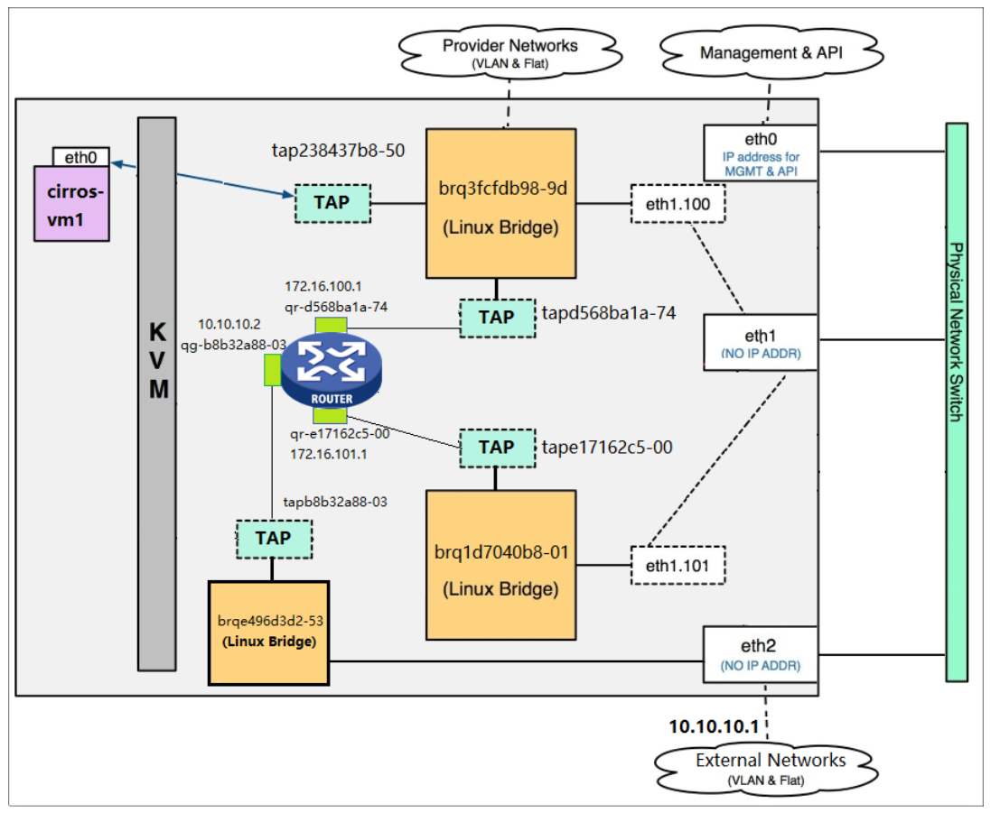

# Neutron学习
## Neutron功能
- 二层交换：透过linux bridge或OVS虚拟出交换机，创建出局域网
- 三层路由：透过虚拟出路由器，实现网络间的互通
- 实现网络隔离：在同一网络下的虚拟机接受同一样的广播信息，不同网络之间不可见
- 提供三层服务：提供防火墙、dhcp、NAT等的三层服务

## Neutron架构
### Neutron server
- 向上提供API，接受来至Horizon(用户)、Nona的请求
- 向下透过Queue与Neutron plugin交互，提供实现网络的细节

### Neutron plugin
- 透过监听Queue，接受Neutron server的信息，确认网络结构，并将信息存在Neutron DB里
- 透过Queue向Neutron agent发送命令，实现网络部件的虚拟化
### Neutron agent
- 透过监听Queue，接受Neutron plugin的信息，确认要创建虚拟化部件命令
- 透过向Neutron DB读取要创建部件的细节(接口名字，网段号等)
- 实现网络部件的虚拟化
### Network provider
- 虚拟网络下的结构及其结构下的元件
- 主要的network provider为：linux bridge及OVS

## Linux bridge
### Linux bridge下的local网络

### Linux bridge下的flat网络

### Linux bridge下的vlan网络

### Linux bridge下的lay3网络

### Linux bridge下访问外网

## OpenVSwitch(OVS)
### OVS下的local网络

### OVS下的flat网络

### OVS下的vlan网络

