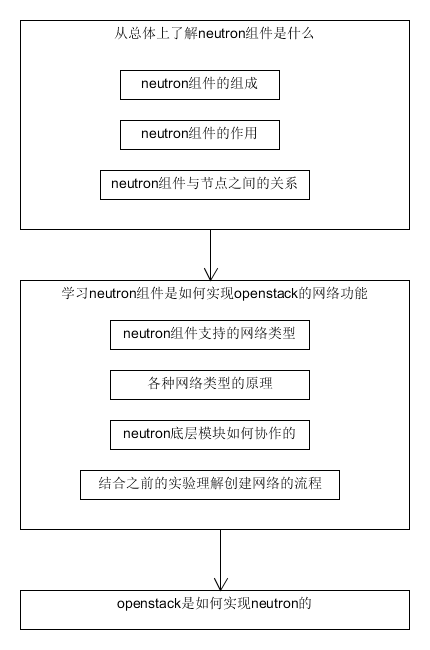
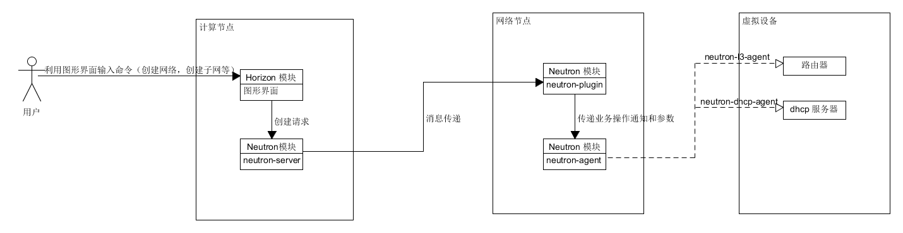

# 最终考核学习周报
15331044 陈再兴
# 一. 总体情况
# 1. 考核任务中的工作量
- 学习neutron组件的总体逻辑架构
- 学习创建network流程中，用到的底层模块如何协作
# 2. 学习路线图规划

# 3. 问题解决
在学习过程中遇到的问题基本都可以通过各种博客找到答案
---
# 二. 学习内容总结
# 1. 介绍openstack中的neutron组件
## 1.1 neutron组件概述
neutron组件管理openstack中的网络，允许创建、插入接口设备，插件式的实现可以容纳不同的网络设备和软件，为openstack架构与部署提供了灵活性。
## 1.2 neutron组件的作用
- neutron管理openstack环境中所有的虚拟网络基础设施（VNI），物理网络基础设施（PNI）的接入层
- 允许用户可以按照自己的需求来自行设定虚拟网络拓扑，像Firewall这种高级的虚拟网络拓扑也能实现
- neutron支持安全组，允许管理员在安全组中定义防火墙规则，使在运行中的实例可以包含一个或多个安全组。这些安全组控制端口的开关和允许实例使用的通信协议
- neutron允许各种合适的openstack的网络插件，以满足不同用户对openstack的不同需求
## 1.3 neutron组件的构成
neutron组件由三大模块组成，每个大模块之下又由多个小模块组成
- neutron-server
  - 接受和路由API请求到合适的openstack网络插件，以达到预想的目的
- openstack网络插件和代理
  - 负责插拔端口，创建网络或子网，并提供IP寻址
- 消息队列
  - 用于在neutron-server和各种各样的代理进程间路由信息，也为某些特定的插件扮演数据库的角色，以储存网络状态
## 1.4 neutron组件与节点间的关系
neutron组件的多个模块分布在三个节点上：
- 控制节点
  - neutron-server，用于接受api请求创建网络，子网，路由器等，然而创建的这些东西仅仅是一些数据结构在数据库里面
- 网络节点

  在网络节点中的模块主要是负责构建虚拟的网络设备，如路由器，交换机和dhcp服务器
  - neutron-l3-agent，用于创建和管理虚拟路由器，当neutron-server将路由器的数据结构创建好，它是做具体的事情的，真正的调用命令行将虚拟路由器，路由表，namespace，iptables规则全部创建好
  - neutron-dhcp-agent，用于创建和管理虚拟dhcp server，每个虚拟网络都会有一个dhcp server，这个dhcp server为这个虚拟网络里面的虚拟机提供ip
  - neutron-openvswith-plugin-agent，这个是用于创建虚拟的L2的switch的，在network节点上，router和dhcp server都会链接到二层的switch上
- 计算节点
  - neutron-openvswith-plugin-agent，这个是用于创建虚拟的L2的switch的，在network节点上，router和dhcp server都会链接到二层的switch上
> **注意** openstack的组件和节点其实是两个不同的概念，每个组件都是提供了单一的服务，而节点则是这些服务的组合。比如neutron组件为openstack项目提供了网络服务，但是并不只是用于网络节点中的，当其他节点也需要使用到网络服务的时候，也会包含neutron组件的一些模块

## 1.5 neutron组件支持的网络类型
neutron组件支持三种不同的组网模型来连接openstack的不同虚拟机实例和将虚拟机与外部网络相连
- Flat，所有虚拟机共用一个网段，IP地址（由虚拟的dhcp服务器进行分配）在虚拟机启动时注入到虚拟网卡中。在该网络下，虚拟机之间的通信直接通过网桥转发，公网流量在该网段的网关上进行NAT。

- VLAN，该模型引入了多租户机制，虚拟机可以使用不同的私有IP网段，一个租户可以拥有多个ip网段，虚拟机ip通过dhcp消息获取ip地址，网络内部虚拟机的通信直接通过网桥转发，同一租户跨网通信通过网关路由，不同租户通过网关上的acl进行隔离，公网流量在该网段的网关上进行nat

- Overlay模型（主要包括GRE和Vxlan隧道技术），实在VLAN模型的基础上进行改进得到的，对比VLAN模型主要有以下改进：
  - 支持的虚拟机数量从4k增加到16million
  - 虚拟机实例通信可以跨越任意IP网络，支持虚拟机任意迁移
  - 每个虚拟机实例逻辑上都有一个网关实例，IP地址可以在租户间进行复用
  - 能够结合sdn技术对流量进行优化

  
我们在实验创建网络的过程中选择的网络类型是vxlan，实际上就是用了overlay模型。我们实验中创建的external net的子网ext_subnetnet就对应图中的External Net，创建的虚拟路由就对应Tenant Router，而demo net的子网demo_subnet就对应图中的各种Tenant-Private Net
# 2. 介绍创建一个network的流程，用到的底层模块如何协作
这里介绍如何创建一个内部网络的流程
## 2.1 创建一个network的主要流程及底层模块协作：
- 在网络上创建一个demo_net网络
- 给demo_net网络创建一个demo_subnet子网
- 创建一个router给路由器，将demo_net与外部网络连接起来
openstack内部对这些创建步骤的处理方式都是一样的
- 首先，控制节点中的neutron=server模块收到创建网络的命令，会将跟这个网络相关的参数信息（比如网络名称，网络类型等）储存到数据库中，并不真正创建网络。然后给网络节点的neutron-plugin模块发送消息，消息的传递是通过消息队列来实现的。
- neutron-plugin接收到neutron-server传过来的消息之后，读取数据库中的数据然后将这些信息传给自身对应的neutron-agent
- neutron-agent接收到neutron-plugin通知的业务操作和参数，并转换为具体的设备级操作（创建路由器，将网络与路由器相连等操作），以指导设备的动作。neutron组件包含了多种neutron-agent分别实现不同的功能，如neutron-l3-agent用于创建和管理虚拟路由器，neutron-dhcp-agent用于创建和管理虚拟dhcp server

**一张根据我的理解画出来的示意图**

